# Optimizing the Netezza Data Warehouse Cost

> Note that the data used in this lab is generated and does not in any way reflect the stock market movement.

## Table of content

- [Optimizing the Netezza Data Warehouse Cost](#optimizing-the-netezza-data-warehouse-cost)
  - [Table of content](#table-of-content)
  - [Prerequisites](#prerequisites)
  - [1. Objective:](#1-objective)
  - [2. Solution Approach:](#2-solution-approach)
  - [3. Netezza data schema](#3-netezza-data-schema)
  - [4. 🚀 Lab Flow](#4--lab-flow)
    - [4.1 - Check Netezza data source](#41---check-netezza-data-source)
    - [4.2 - Create New schema and tables in watsonx.data](#42---create-new-schema-and-tables-in-watsonxdata)
    - [4.3 - Insert Historic Data into watsonx.data](#43---insert-historic-data-into-watsonxdata)
    - [4.4 - Review the Data in watsonx.data](#44---review-the-data-in-watsonxdata)
    - [4.5 - Run Analytical Queries using the Presto engine](#45---run-analytical-queries-using-the-presto-engine)
  - [5. Review the Explain Plan](#5-review-the-explain-plan)

## Prerequisites

- Completed [Environment Setup](/env-setup/README.md)

## 1. Objective:

The objective of this lab is to demonstrate how to reduce the operational cost of running the Data Warehouse environment. In-addition to reducing the operations cost of the Data Warehouse the data will be unified in the Open Hybrid Lakehouse, watsonx.data platform for Analytical and AI applications.

## 2. Solution Approach:

In this lab the historic data will be off loaded from the Netezza Data Warehouse (DW) database, `INVESTMENTS` and schema `equity_transactions` into watsonx.data iceberg_catalog catalog. The historic data is identified based on the transacations that took place prior to 2024. By reducing the volume of data in the Netezza DW the expensive block storage cost is reduced by using the Cloud Object Storage.

The current year data is left in the data warehouse to minimize disruption to the existing applications. We will be using the presto query engine to run federated queries that allows aggregating the data that exists in Netezza and watsonx.data.

The whole lab will be executed in **watsonx.data UI** interface in the back-end techzone environment.

## 3. Netezza data schema

[Dataset description](./Data-description.md)

Due to the limitations of the lab environment, we will:

1. Run federated presto queries to offload the data from Netezza DW.
2. Use a separate schema `equity_transactions_ly` instead of deleteing historic data from the DW which is a recommended approach of production environment.
3. Run federated queries against the current data in Netezza `equity_transactions_ly` schema that holds the current year data and historic data in watsonx.data.


## 4. 🚀 Lab Flow

```mermaid
graph TD
    A(🔌 Step 1: Check connection <br>to NZ)
    A --> B(🗂️ Step 2 :Create  New schema <br> and tables)
    B --> C(📥 Step 3: Data insertion)
    C --> D(🔍 Step 4: Review data)
    D --> E(🧠  Step 5: Combined query)
```



- **Step 1 - Netezza connection**: Check Netezza Connection;
- **Step 2 - New schema and tables**: Create new schema and tables in the iceberg_catalog catalog for data offload;
- **Step 3 - Data insertion**: insert data into newly created tables from Netezza INVESTMENTS schema, for historic transactions prior to 2025;
- **Step 4 - Review data**: check data samples and number of records in the newly created tables;
- **Step 5 - Combined query**: Execute querys that combine the data from the iceberg tables in watsonx.data and the current year schema, `equity_transactions_ly` in Netezza.

### 4.1 - Check Netezza data source

- From IBM Cloud `Resource List` <https://cloud.ibm.com/resources>
- Select the watsonx.data instance (Under Databases) in `wxdata-`
- Open web console
- From the Hamburger menu in the top left, select `Infrastructure Manager` and verify check that Netezza is added as a data source
- 
- From the Hamburger menu in the top left, select `Data manager`
- Browse the netezza and verify the Netezza schemas `equity_transactions` and `equity_transactions_ly` are available.


### 4.2 - Create New schema and tables in watsonx.data

1. From the Hamburger menu in the top left, go to `Query workspace` where you will be executing SQL queries.
   

2. Create schema for Netezza offload and tables in watsonx.data iceberg catalog where you will offload data on transactions from Netezza `EQUITY_TRANSACTIONS`.

   - Modify the SQL command below with your `<SCHEMA_DWH_OFFLOAD>` and `WXD_BUCKET` values in your environment file and paste into the `Query Workspace` (values should be unique accross Cloud Account so you will have a different one).
   - For the bootcamp, the convention for <SCHEMA*DWH_OFFLOAD> is `netezza_offload*<YourName_First3LettersOfSurname>`

```sql
CREATE SCHEMA IF NOT EXISTS iceberg_catalog.<SCHEMA_DWH_OFFLOAD> WITH (location = 's3a://<WXD_BUCKET>/<SCHEMA_DWH_OFFLOAD>');
```

3. Check that query execution was successful:
   

4. Create tables in the newly added schema.

   - Modify the SQL command below with your `<SCHEMA_DWH_OFFLOAD>` value and paste into the `Query Workspace`.

```sql

-- dim_account
CREATE TABLE iceberg_catalog.<SCHEMA_DWH_OFFLOAD>.dim_account (
    account_id INTEGER,
    account_type VARCHAR,
    status VARCHAR,
    opening_date DATE,
    risk_level VARCHAR,
    balance DECIMAL(18, 2),
    margin_enabled BOOLEAN,
    trading_experience VARCHAR
)
WITH (
    format = 'PARQUET'
);

-- dim_stock
CREATE TABLE iceberg_catalog.<SCHEMA_DWH_OFFLOAD>.dim_stock (
    stock_id INTEGER,
    stock_symbol VARCHAR,
    stock_name VARCHAR,
    sector VARCHAR,
    industry VARCHAR,
    market_cap DECIMAL(18, 2)
)
WITH (
    format = 'PARQUET'
);

-- dim_exchange
CREATE TABLE iceberg_catalog.<SCHEMA_DWH_OFFLOAD>.dim_exchange (
    exchange_id INTEGER,
    exchange_name VARCHAR,
    country VARCHAR,
    timezone VARCHAR,
    currency VARCHAR
)
WITH (
    format = 'PARQUET'
);

-- dim_date
CREATE TABLE iceberg_catalog.<SCHEMA_DWH_OFFLOAD>.dim_date (
    date_id INTEGER,
    transaction_date DATE,
    year INTEGER,
    quarter INTEGER,
    month INTEGER,
    week INTEGER,
    day_of_week INTEGER,
    is_weekend BOOLEAN
)
WITH (
    format = 'PARQUET'
);

-- fact_transactions
CREATE TABLE iceberg_catalog.<SCHEMA_DWH_OFFLOAD>.fact_transactions (
    transaction_id INTEGER,
    account_id INTEGER,
    stock_id INTEGER,
    date_id INTEGER,
    exchange_id INTEGER,
    order_type VARCHAR,
    quantity INTEGER,
    price DECIMAL(10,2),
    total_value DECIMAL(18,2)
)
WITH (
    format = 'PARQUET'
);
```

5. After creating tables, refresh `iceberg_catalog` catalog and check that schema and tables exist in the schema for data offload

<br>


### 4.3 - Insert Historic Data into watsonx.data

1. Insert data into created tables for Netezza filtered by year by using presto federated query

   - Modify the SQL command below with your `<SCHEMA_DWH_OFFLOAD>` value and paste into the `Query Workspace`.

```sql
-- Insert into dim_date
INSERT INTO iceberg_catalog.<SCHEMA_DWH_OFFLOAD>.dim_date
SELECT *
FROM netezza.equity_transactions.dim_date dt
WHERE dt.year < year(CURRENT_DATE);

-- Insert into fact_transactions (filtered by dim_date)
INSERT INTO iceberg_catalog.<SCHEMA_DWH_OFFLOAD>.fact_transactions
SELECT ft.*
FROM netezza.equity_transactions.fact_transactions ft
JOIN iceberg_catalog.<SCHEMA_DWH_OFFLOAD>.dim_date d ON ft.date_id = d.date_id;

-- Insert into dim_account (using filtered fact_transactions)
INSERT INTO iceberg_catalog.<SCHEMA_DWH_OFFLOAD>.dim_account
SELECT DISTINCT a.*
FROM netezza.equity_transactions.dim_account a
JOIN iceberg_catalog.<SCHEMA_DWH_OFFLOAD>.fact_transactions ft ON a.account_id = ft.account_id;

-- Insert into dim_stock (using filtered fact_transactions)
INSERT INTO iceberg_catalog.<SCHEMA_DWH_OFFLOAD>.dim_stock
SELECT DISTINCT s.*
FROM netezza.equity_transactions.dim_stock s
JOIN iceberg_catalog.<SCHEMA_DWH_OFFLOAD>.fact_transactions ft ON s.stock_id = ft.stock_id;

-- Insert into dim_exchange (using filtered fact_transactions)
INSERT INTO iceberg_catalog.<SCHEMA_DWH_OFFLOAD>.dim_exchange
SELECT DISTINCT e.*
FROM netezza.equity_transactions.dim_exchange e
JOIN iceberg_catalog.<SCHEMA_DWH_OFFLOAD>.fact_transactions ft ON e.exchange_id = ft.exchange_id;
```

### 4.4 - Review the Data in watsonx.data

1. Generate SELECTs to view data sample in some tables

   <br>

1. Count the number of rows transferred from Netezza

   - Modify the SQL command below with your `<SCHEMA_DWH_OFFLOAD>` value and paste into the `Query Workspace`.

```sql
SELECT 'transactions_count', COUNT(*) AS count
FROM  "iceberg_catalog"."<SCHEMA_DWH_OFFLOAD>"."fact_transactions" as ft

UNION

SELECT 'dates_count', COUNT(*) AS count
FROM "iceberg_catalog"."<SCHEMA_DWH_OFFLOAD>"."dim_date" as dd

UNION

SELECT 'stock_count', COUNT(*) AS count
FROM "iceberg_catalog"."<SCHEMA_DWH_OFFLOAD>"."dim_stock" as ds

UNION

SELECT 'exchanges_count', COUNT(*) AS count
FROM "iceberg_catalog"."<SCHEMA_DWH_OFFLOAD>"."dim_exchange" as de

UNION

SELECT 'accounts_count', COUNT(*) AS count
FROM "iceberg_catalog"."<SCHEMA_DWH_OFFLOAD>"."dim_account" as da;
```

Expected output:


Due to the lab limitations (we have only one Netezza instance for all participants) => we will use `equity_transactions_ly` where only current year (2025) data exists. The same schema and table definitions are identical to `equity_transactions` schema that we've offloaded in previous steps 4.3.

### 4.5 - Run Analytical Queries using the Presto engine

Now the data has be prepared and ready to be consumed by the business users and data scientists for analytical and AI purpose. Let's develop some queries that will answer business questions listed below.

**Tip :**

1. Use the `iceberg_catalog.<SCHEMA_DWH_OFFLOAD>` schema for the historic data and `netezza.equity_transactions_ly` for the current data.
2. Make sure you are working from the `Query workspace`.
   

**Questions**:

1. Calculate top 10 accounts by the volume of traded per year.
2. Identify the Top 10 accounts by transaction value per year.
3. Determine the Average transaction price for each of the stocks, including current year (2025) trades.
4. Determine the Number of transactions the took place in each of exchange by year.
5. List all of the stocks traded by account_id, 215 during the year 2024 and 2025.

[**Solution Queries**](./Solution.md)

## 5. Review the Explain Plan

- From the watsonx.data left navigation menu select `Query History`.
- Select one of the query that you like to analyze
- Review the content in the Logical Execution Plan, Distributed Execution and Explain analyze tabs.
