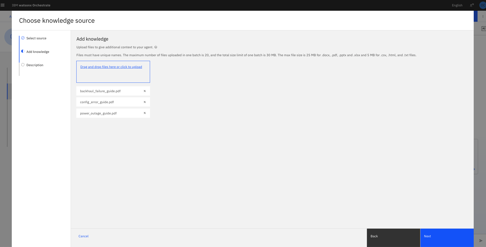

# Agentic AI Lab: Network Supervisor Assistant 


This use case is about an AI-powered assistant supporting a Network Supervisor in managing service disruptions. The Supervisor is responsible for monitoring the health of regional networks, diagnosing incidents, coordinating across infrastructure and communications, and ensuring timely remediation to minimize downtime. We apply an agentic solution based on watsonx Orchestrate and watsonx.ai to optimize these processes.  

---

<details open id="use_case_details">
<summary><h2>Use Case Details</h2></summary>
In this lab, we will configure a set of 4 agents and 1 supervisor agent inside **Watsonx Orchestrate**. Each agent has a distinct responisbility and a unique toolset to comeplete a specific role in the incident response agentic system. The **Supervisor Agent** coordinates work among the agents by orchestrating requests to the appropriate agent. Below you will find an outline of all the agents we will build during this lab.

## The Problem  

A large telecommunications provider faces frequent challenges in its Network Operations Center (NOC). Supervisors often deal with fragmented monitoring tools, siloed logs, and manual processes when diagnosing and resolving service disruptions. This results in long mean-time-to-resolution (MTTR), delayed communications to field teams, and occasional gaps in incident handovers. The manual coordination between teams further slows down operations, leading to increased costs and customer dissatisfaction.  

---

## Architecture  


- ##### Network Status Agent:

  - **Purpose**: Answers queries about the operational status of the network — including regions, sites, nodes, and active incidents.
  - **Tooling**: This agent connects to a **get_data tool** provided through an OpenAPI JSON file, enabling retrieval of up-to-date network data.
  - **Usage**: Handles queries like "What is the status of site S002?" or "Are there any ongoing outages in the Northeast region?"

  ##### Communications Agent

  - **Purpose**: Drafts professional and concise email updates for internal or external stakeholders about incidents or operational changes.
  - **Tooling**: This agent integrates with **Outlook** using an imported **OpenAPI JSON tool**, which enables it to send notification emails automatically.
  - **Usage**: When the Supervisor requests an incident update for the "Los Angeles AT&T Network team," this agent generates the email body and sends it through Outlook.

  ##### Incident Diagnosis Agent

  - **Purpose**: Analyzes incident logs, identifies the most likely **root cause**, and recommends a **resolution plan**.
  - **Tools**: Connects to a log analysis tool.
  - **Knowledge Sources**: Uses an incident resolution knowledge base for remediation steps.
  - **Output**: Always provides both the error type and the recommended resolution plan.

  ##### Server Status Agent

  - **Purpose**: Verifies whether a specific server or URL is currently online and reachable.
  - **Tools**: Uses a server check tool to confirm availability.
  - **Usage**: Handles requests like "Check if ATT.com is up."

  ##### Supervisor Agent

  - **Purpose**: Acts as the **routing agent**, interpreting user queries and delegating tasks to the right specialized agent.
  - **Collaborators**:
    - **Network Status Agent** → for network/site health checks.
    - **Server Status Agent** → for server reachability.
    - **Incident Diagnosis Agent** → for log analysis and remediation.
    - **Communications Agent** → for drafting and sending updates.
  - **User Experience**: Provides a natural language interface for the Supervisor, serving as the single entry point for all incident-related queries.

  Together, these agents form the backbone of the **Supervisor Assistant**. The Supervisor Agent orchestrates their interactions so that complex workflows (incident detection → diagnosis → remediation → communication) can be completed in a seamless conversational flow. Lets get started!

---

</details>

<details open id="instructions">
<summary><h2>Step-by-step Instructions</h2></summary>
In this lab, we will configure a set of 4 agents and 1 supervisor agent inside **Watsonx Orchestrate**. Each agent has a distinct responisbility and a unique toolset to comeplete a specific role in the incident response agentic system. The **Supervisor Agent** coordinates work among the agents by orchestrating requests to the appropriate agent. Below you will find an outline of all the agents we will build during this lab.

<details open id="step1">
<summary><h2>Step-1: Launch watsonx Orchestrate</h2></summary>

Watsonx Orchestrate is IBM's platform for creating, managing, and running AI-driven digital workers and agentic flows. In this bootcamp, you will be provided an IBM Cloud SaaS instance of Orchestrate. Follow the steps below to start your Orchestrate Instance:

1. **Access your Orchestrate Instance**
   - In the **IBM Cloud Dashboard navigate to the Resource List using the hamburger menu on top left.** 
     
   - Under AI/ML click on **watsonx Orchestrate** and launch the application.
     
     
   
   - If you don't see any resources under AI/ML in your IBM Cloud Account kindly reachout to an instructor for assistance.
   - Once you have access to an Orchestrate instance you may continue to the next section

</details>

<details open id="lab-1-create-your-first-agent">
<summary><h2>Step-2: Create 4 Agents and Tools</h2></summary>

Navigate to the Watsonx Orchestrate home page. In the left-hand navigation menu, click on build to expand the menu and click on "**Agent Builder**". Agents depend on tools to perform their functions. When you define an agent, you specify which tools it can use in the tools section. The system needs the tools to exist before it can validate and import an agent that references them. 


<details open id="the-network-status-agent">
<summary><h3>Agent #1: The Network Status Agent</h3></summary>
The Network Status Agent answers questions about network health (regions, sites, nodes, active incidents).
In this lab, it does not use a knowledge base. Instead, it calls a `get_data` tool defined via an OpenAPI JSON so responses are fetched live from the source.
#### **Step 1.** **Create the  `get_data`tool by importing  OpenAPI spec files (.json)**

- We will first import an external REST API as a tool. To do this we will import an OpenAPI Spec into WXO
  1. Navigate to the Agent Builder tab.
  
     
  
     
  
     
  
  2. Create tool → Add from file or MCP server"→ Upload the OpenAPI (assets/tools/get_data_openapi.json) → Select the "Get Data" operation → Done
  
     
     
     
     
     
  
  3. Verify you see an entry for `get_data` tool under the tools homepage.
  
  4. If you're using a shared environment change the name of your tool not to overwrite other users work.
     

#### **Step 2.** **Create Network Status Agent**

- Now we will create our first agent. We will add the tool above into it's toolset and test the results.

  1.  Navigate to the Agent Builder tab.
  2.  To create a new agent click on **All agents → Create Agent → Enter name and description for your agent → Create**

      
      

  3. Give your agent a name. `network_status_agent_(with initials)`
  4.  Add the following description for your agent.
      ```
      The Network Status Agent specializes in answering inquiries about the current operational status of AT&T's network. It has access to up-to-date data about nodes sites, and services—such as cell towers, routers, and backhaul links—summarizes ongoing incidents, and provides a concise overview to the user.
      ```
  5.  Click Create
  
- Take some time to fully Explore the Agent screen
  

  #### **Step 3: Adding the tool to the Agent**
  
  1.  Scroll down to the **Toolset** section and click on "Add Tool".
  2.  Since we have already added the `get_data` tool to our local instance, we can select and add it to the agent.
      
      
      
  
- Lastly we must add instructions for our agent. **This will explain to the LLM what to do**, and how to utilize its tools to acomplish the goal. It is crucial to provide instructions to let agents perform effectively. It decides the behavior of the agent and provides context for how to use its tools and agents.

  1.  Scroll down to the **Behavior** section and **add the following instructions.** 

      ```
      Answer questions about the operational status of AT&T's network based on the provided site and node data.This includes information about nodes, incidents, and overall health of regions or specific locations.
      
      Provide your answer as a concise summary. If a location, site ID, or region is mentioned, filter your response accordingly.
      ```


#### **Step 4.** **Now its time to test our agent**

- In the chat ask `What is the status of site S003?`The agent should call `get_data` behind the scenes.
- **Click on the resoning tab** and explore what it did to retrive the answer.
- `Can you provide me a table of all the cell towers in the system with their relevant status?`
- `Why is site S004 down?`

### Congratulations! You've just completed building your first Agent!

The **Network Status Agent** is ready. It will now route natural-language queries to the `get_data` tool to return live network status.

</details>

<details open id="the-communication-agent">
<summary><h3>Agent #2: The Communication Agent</h3></summary>
The **Communications Agent** is responsible for drafting clear and professional notification emails about network incidents or operational updates.

#### Step 1: Import the Outlook Email Tool

This tool provides the functionality for the agent to draft and (if configured) send emails via the Outlook Mail Server API.

- We will first import the **Send Outlook Email tool**. To do this we will import an OpenAPI Spec into WXO
  1.  Navigate to the Agent Builder tab.
      
  2.  Create tool → Add from file or MCP server"→ Upload the OpenAPI (wxo_assets/tools/outlook_email_openapi.json) → Select the "Send Email Outlook" operation → Done
      
      
      
      
      
  3.  If you're using a shared environment change the name of your tool not to overwrite other users work.
      
      

#### Step 2: Create the Communications Agent

- Now we will create the Communications Agent.

  1. Navigate to the Agent Builder tab.

  2. To create a new agent click on **All agents → Create Agent → Enter name and description for your agent → Create**

  3. Give your agent a name. `communications_agent_(with initials)`

  4. Add the following description for your agent.

     ```
     The Communications Agent specializes in drafting internal or external notification emails and messages regarding network incidents or operational updates.
     ```

  5. Click Create

     
     

  

  6. Assign the `Send Email Outlook` Tool to the Communications Agent

     - Scroll down to the **Toolset** section and click on "Add Tool". 

     - Since we have already added the `Send Email Outlook` tool to our instance, we can select and add it to the agent.

       

     - 
        

  7. Lastly add following instructions to the **Behavior** section and add the following instructions.

  ```
  - Your response **must strictly follow this format** when asked to draft an email:
  - Write a concise and professional message about a network incident or operational update.
  - Start with the subject line on the first line, then the message body on the next line.
  - Use actual line breaks (press Enter) — do not output \n as text.
  - Do not include preambles, labels, or extra formatting.
  - Tailor the message to the relevant team or stakeholder group if specified (e.g., Network Ops,     Engineering, External Vendor).
  - Do not ask for the recipient email address during drafting.
  - Only use the 'Send Email Outlook' tool when the user explicitly asks to send an email.
  - When using the Send email tool ensure to convert the drafted email into HTML for the content field.
  - If the user asks to send an email but does not provide a recipient email address, do not send the email under any circumstances until the user inputs "email" field
  - Immediately ask the user: "What is the recipient's email address?"
  - Wait for the user to provide the email. Do not proceed until the user explicitly enters it.
  - *Strictly follow this**: After the user provides recipient email address: Display it back to the user and ask: "Please confirm if this is correct: [email]".
  - Do not ask unrelated follow-up questions.
  - Respond only with the information requested.
  
  Tool Access:
  Use the `Send Email Outlook` to send the email to the email provided

- Ask the agent: `Draft an email invite about an Agentic AI bootcamp in New York around October.`

- The agent should generate a professional email body.

- If the Outlook tool is configured, you can also instruct it to send the email directly by asking `Send the above email to {email_id}`.

</details>

<details open id="the-incident-diagnosis-agent">
<summary><h3>Agent #3: The Incident Diagnosis Agent</h3></summary>
The Incident Diagnosis Agent  responsible for analyzing incident logs, tagging them with the most likely root cause, and suggesting a resolution plan. It relies on a Python tool to parse logs and a knowledge base of resolution guides for remediation steps.
#### **Step 1.** **Import Incident Diagnosis Tool**

This tool provides log analysis capabilities so the agent can extract error patterns and classify incidents.

**Important Note:** The instructions to import this tool requires ADK and Pthon file provided in repo (diagnose_incident_tool.py) and IDE like VS Code to edit the python file. For this "UI Only" instructions, we will skip those steps and use the already imported tool withing our wxo instance. Fot detailed instructions see the instructions version with ADK and Python. 

We will now move to creating the agent and then add the tool that is already imported to the agent.

#### **Step 2.** **Create Incident Diagnosis Agent**

1. Navigate to the Agent Builder tab.

2. To create a new agent click on **All agents → Create Agent → Enter name and description for your agent → Create**

   

   3. Give your agent a name. `incident_diagnosis_agent_(with initials)`

   4. Add the following description for your agent.

   ```
   The Incident Diagnosis Agent analyzes incident logs and tags them with the most likely root cause and can also provide a resolution plan based on the knowledge source. 
   ```

   5. Click Create

   

   #### **Step 3.** **Adding the Tool to Incident Diagnosis Agent**

Now that we've created our Agent, we can add the incident diagnosis tool. 
1. Scroll down to the **Toolset** section and click on **Add Tool**.

2. Since it is already imported for us, locate the `incident_diagnosis_OC` tool using "**Add from local instance**" option and add it to the agent.
   

   You can use search bar to find the tool easily, start trying "incident" and locate the "diagnosis_incident_log_OC" tool. 

   Check the box and click to Add to Agent button.

   

Now, you should be able to see the newly added "diagnosis_incident_log_OC" tool to your Agent as shown below. 


- Lastly scroll down to the **Behavior** section and **add the following instructions.** 

  ```
    Your final response **must strictly follow this format**:
    error_type: "insert error type exactly as returned by the tool (Backhaul Failure, Power Outage, Configuration Error)"
    resolution_plan: "insert resolution plan based on knowledge base content"
  ```


#### **Step 4. Import the Incident Resolution Knowledge Base**

Knowledge Bases refer to Vector Stores that allow your Agents to query unstructured data such as documents. You can use the WXO interal Knowledge Base or connect your own vector store externally. 
- The knowledge base in our case provides mappings from error types to recommended resolution plans. The agent consults it after the tool has identified the root cause.

- Create a Knowledge Base
  1. Scroll down to the Knowledge section and click `Choose Knowledge`
      
  
  2. Select **Upload Files** (last option at the end) and upload `/wxo_assets/knowledge_bases/backhaul_failure_guide.pdf`, `/wxo_assets/knowledge_bases/config_error_guide.pdf`, and `/wxo_assets/knowledge_bases/power_outage_guide.pdf`
      
  
      
  
  3. Add the following as a description:
  
     - `Troubleshooting documentation for resolving common network incident root causes.
     Covers backhaul failures, power outages, and configuration errors.`
  
  4. Click Save. **This may take 1 min or two.**
  
      #### Step 5. Configure the Knowledge Base
  
  i. Scroll down to the Knowledge section and click `Edit knowledge settings`
  
  
  ii. Modify the retrieval criteria and save
  

#### **Step 6. Test the Agent**

- Test your agent with the following prompt: `Here is the log: "UPS unit failed at site S002. Generator did not auto-start. Site running on battery only."`
- The agent should respond with both the **error type** and the **resolution plan**.  

</details>

<details open id="the-server-status-agent">
<summary><h3>Agent #4: The Server Status Agent</h3></summary>
The Server Status Agent checks whether a given server or URL is reachable.  
This is useful for quickly validating if a service endpoint is online when an incident is reported.
**Step 1.** **Import Check Server Status Tool**

This tool allows the agent to test HTTP/HTTPS endpoints and return whether they are up or down.

**Important Note:** The instructions to import this tool requires ADK and Pthon file provided in repo (diagnose_incident_tool.py) and IDE like VS Code to edit the python file. For this "UI Only" instructions, we will skip those steps and use the already imported tool withing our wxo instance. Fot detailed instructions see the instructions version with ADK and Python. 

We will now move to creating the agent and then add the tool that is already imported to the agent.

#### **Step 1.** **Create Server Status Agent**

1. Navigate to the Agent Builder tab.

2. To create a new agent click on **All agents → Create Agent → Enter name and description for your agent → Create**

   

   3. Give your agent a name. server_status_agent_(with initials)`

   4. Add the following description for your agent.

   ```
   The Server Status Agent checks if a given HTTP/HTTPS server is currently online and reachable.
   ```

   5. Click Create

   

   #### **Step 2.** **Adding the Tool to Server Status Agent**

​	Now that we've created our Agent, we can add the incident diagnosis tool. 
1. Scroll down to the **Toolset** section and click on **Add Tool**.

2. Since it is already imported for us, locate the `check_server_status_OC` tool using "**Add from local instance**" option and add it to the agent.
   

   You can use search bar to find the tool easily, start trying "check" and locate the "check_server_status_OC" tool. 

   Check the box and click to Add to Agent button.

   

Now, you should be able to see the newly added "check_server_status_OC" tool to your Agent as shown below. 


- Lastly scroll down to the **Behavior** section and **add the following instructions.** 

  ```
  - When the user provides a server URL or address, call the `check_server_status` tool.
  - If the tool responds saying the URL is UP then respond back to the user saying the provided URL is UP and running
  ```


#### **Step 3. Test the Agent**

- Ask: "Check if ATT.com is up"
- The agent should call the `check_server_status` tool and return whether the server is reachable.
- If no response or an error occurs, confirm the tool is present and correctly linked to the agent.

The **Server Status Agent** is now ready. It can be queried directly or invoked by the Supervisor Agent to check server availability in real time.

</details>

</details>

<details open id="the-supervisor-agent">
<summary><h2>Step 3: Creating The Orchestrator/Supervisor Agent</h2></summary>


The **Supervisor Agent** acts as the routing brain for this use case. It interprets a user's request and delegates the task to the correct specialist agent:

- **Network Status Agent** → network/site health questions
- **Server Status Agent** → server/URL reachability
- **Incident Diagnosis Agent** → log analysis and remediation recommendations
- **Communications Agent** → drafting/sending stakeholder updates

This section wires up the Supervisor so it can orchestrate the end-to-end flow from detection → diagnosis → remediation → communication.

#### **Step 1.** **Create NOC Supervisor Agent**

1. Navigate to the Agent Builder tab.

2. To create a new agent click on **All agents → Create Agent → Enter name and description for your agent → Create**

   

   3. Give your agent a name. noc_supervisor_agent_(with initials)`

   4. Add the following description for your agent.

   ```
   The NOC Supervisor Agent is responsible for routing user requests to the most relevant operational agent.
   It interprets queries from NOC engineers and delegates tasks to specialized agents like Network Status, Communications, Incident Diagnosis, or Server Status.
   ```

   5. Click Create

   

####  **Step 2: Add Collaborator Agents to the NOC_Supervisor_Agent**

- Go to Manage Agents - > Click on NOC_Supervisor_Agent
- Click on Toolset -> Add the Agents as shown in screenshot below
  
- Choose "Add from Local Instance" option
  
- Check the 4 Agents you created as shown below:
  - network_status_agent
  - server_status_agent
  - incident_diagnosis_agent
  - communications_agent
- Click on Add to Agent
  


####  **Step 3. Add Agent instructions to Behavior section**

- Lastly scroll down to the **Behavior** section and **add the following instructions.** 

  ```
  Based on the user question, route the question to one of the below agents.
  
  - Use the **network_status_agent** for any question about network status, operational health of sites, nodes, or active incidents.
  - Use the **communications_agent** for any request to draft internal or external notifications about incidents, maintenance, or operational updates.
  - Use the **incident_diagnosis_agent** when the user provides an incident log and needs root cause analysis or a resolution plan.
  - Use the **server_status_agent** when the user wants to check if a specific server or URL is up or reachable.
  
  DO's
  - Display the output of the agent to the user 
  
  DONT's
  - DO NOT invoke multiple agents for a single question, 1 question should be routed to only 1 agent
  ```


The **NOC Supervisor Agent** is now ready. It provides a single conversational entry point and automatically delegates tasks to the right agent, enabling an end-to-end incident flow.

#### Step 4: Test the NOC Supervisor Agent (routing behavior)

Try these natural-language prompts to validate routing:

- "**What's the status of site S002?**" → should route to **Network Status Agent** (calls `get_data`)
- "**Check if ATT.com is up.**" → should route to **Server Status Agent** (calls `check_server_status`)
- "**Here's an incident log 'BGP session dropped due to incorrect neighbor settings in config push from NOC.' what's the root cause and fix?**" → should route to **Incident Diagnosis Agent** (uses `diagnose_incident_log`, consults resolution guides if configured)
- "**Draft a clear email addressing the above issue and the resolution steps involved.**" → should route to **Communications Agent**
- "**Send the above email to {email_id}**" → (send via Outlook if configured)

</details>

</details>

<details id="summary">
<summary><h2>Summary</h2></summary>

In this lab, we explored the use case of a Supervisor managing network incidents with the help of an agentic AI solution. We began by creating specialized agents for network status checks, server availability, incident diagnosis, and stakeholder communications. Each agent was connected to the right tools and data sources — for example, the Network Status Agent used an OpenAPI tool to fetch live site data, while the Communications Agent leveraged Outlook integration to send updates.

Finally, we brought everything together through the **Supervisor Agent**, which serves as the main conversational entry point. From this single interface, the Supervisor can ask natural language questions and the system will automatically route the request to the appropriate agent.

This exercise provides a reference implementation to help you understand how multiple specialized agents can be orchestrated in **watsonx Orchestrate**. Some aspects are simulated, and in a production environment you would extend the integrations with real systems of record, monitoring platforms, and communication services. A truly agentic solution would go further by adding reasoning and planning capabilities, allowing the system to autonomously investigate, resolve, and communicate about incidents end-to-end.

Our goal here is to give you a starting point and spark ideas about how to apply agentic AI in real operational contexts. With these foundations, you can begin experimenting with automating parts of your own workflows and consider where autonomous AI decision-making could add the most value.

</details>
