# watsonx.data intelligence

- [watsonx.data intelligence](#watsonxdata-intelligence)
  - [1. Introduction](#1-introduction)
  - [2. Prerequisites:](#2-prerequisites)
  - [3. Create Catalog in watsonx.data Intelligence](#3-create-catalog-in-watsonxdata-intelligence)
  - [4. Create Data Quality SLA Rules](#4-create-data-quality-sla-rules)
    - [4.1 Review and Edit the Existing SLA rules](#41-review-and-edit-the-existing-sla-rules)
    - [4.2 To create a data quality SLA rule](#42-to-create-a-data-quality-sla-rule-if-needed-in-the-future)
  - [5. Data Curation And Enrichment](#5-data-curation-and-enrichment)
    - [5.1 Import Metadata](#51-import-metadata)
    - [5.2 Enrich Data for Imported Asset](#52-enrich-data-for-imported-asset)
  - [6. Verify Data Quality SLA compliance information](#6-verify-data-quality-sla-compliance-information)
  - [7. Create Data Protection Rule in Cloud Pak for Data](#7-create-data-protection-rule-in-cloud-pak-for-data)
  - [8. Add Service Integration in watsonx.data to watsonx.data Intelligence](#8-add-service-integration-in-watsonxdata-to-watsonxdata-intelligence)
  - [9. Add restricted user access to watsonx.data](#9-add-restricted-user-access-to-watsonxdata)
    - [9.1 Add access to Infrastructure Components](#91-add-access-to-infrastructure-components)
    - [9.2 Add Policy to iceberg data](#92-add-policy-to-iceberg-data)
  - [10. Verify Data Protection Rule is being enforced (Demonstration)](#10-verify-data-protection-rule-is-being-enforced-demonstration)

<h2>1. Introduction</h2>

This lab will take you through the high level steps below to demonstrate how to implement data protection rule enforcement in watsonx.data.

Because we are working in a shared watsonx.data intelligence (wxi) environment, some of the steps were done for you in advance (steps in dark blue).

<h2>2. Prerequisites:</h2>

- <strong>Note:</strong> The instructor had already created Enablement Catalog, imported business glossary and created data protection rules.

**Access watsonx.data Intelligence service**

[Service](https://dataplatform.cloud.ibm.com/home2?context=cpdaas)

<h2>3. Create Catalog in watsonx.data Intelligence</h2>

<strong>⚠️ Warning:</strong> For the enablement session, the catalog has been created for you and will be shared by all students. For this reason, it's important that the connections and assets that we add in the lab are uniquely named.

The Catalog is the place where we will make watson.data connections and
data assets available to the business users.

When creating a catalog it's required to enable the option to `Enforce data protection and data location rules` if data protection rules will be used between the two services

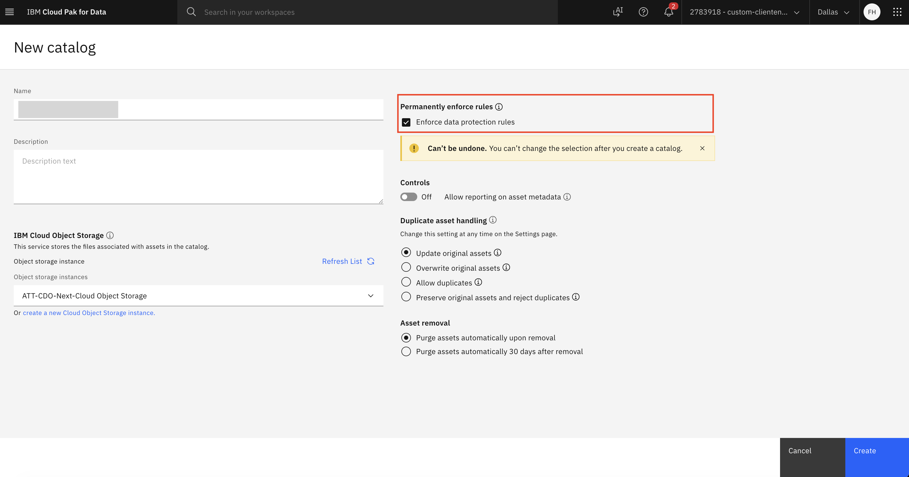 

For the enablement, the catalog has been created for you and will be shared by all students. For this reason, it's important that the connections and assets that we add in the lab are uniquely named.

We will do this by prefixing `FirstInitial+Lastname` for content we add to the catalog.

<h2>4. Create Data Quality SLA (Service Level Agreement) Rules</h2>

Data quality SLA rules monitor the quality of critical data elements, such as data that is essential for regulatory reporting, and can initiate remediation tasks when quality issues are identified. Whenever you run metadata enrichment with the "Monitor data quality with SLA rules" option or a data quality rule, asset scores are evaluated against the SLA rules. If violations occur, configured workflows can trigger remediation tasks.

Since this step has already been set up for you in the shared environment, you can skip the creation process but you have to edit already created SLA rules to add your dataset to the existing rules.

<h3 id="41-review-and-edit-the-existing-sla-rules">4.1 Review and Edit the Existing SLA rules</h3>

1. Open the **Hamburger menu**, then select `Governance` > `Rules`.
2. Search for `SLA-customer-id` and `SLA-overall-score`, and preview the SLA rules that have already been created.
3. To add you data asset for `SLA-overall-score` click on the `SLA-overall-score`.
4. Click on the `Edit rule` button.

   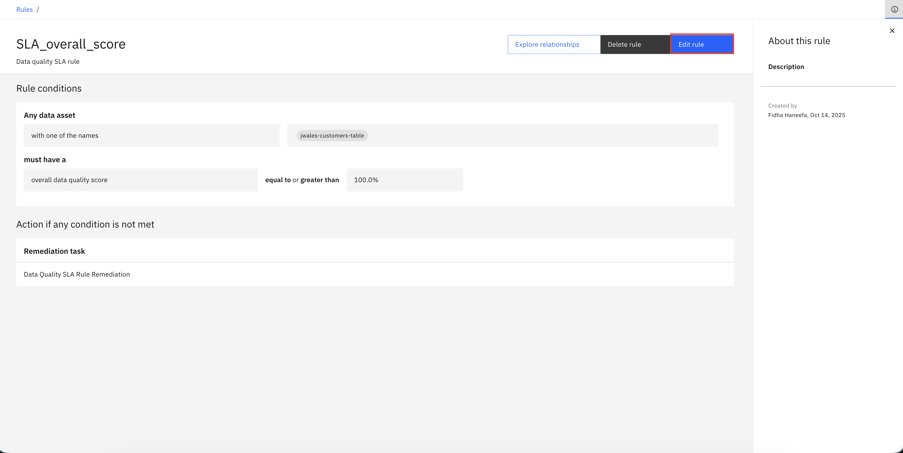 

5. Click `Next`

   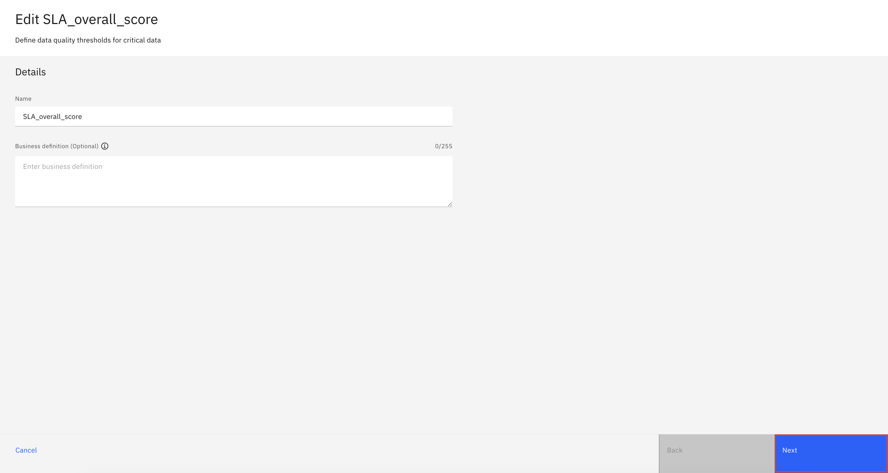 

6. In the field next to `Any data asset` add you asset name after entering comma.

   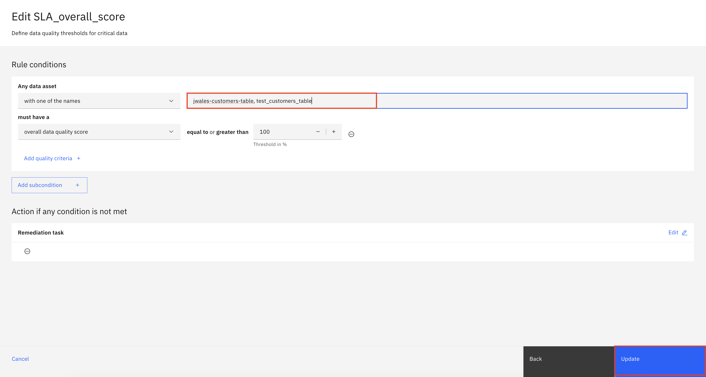 

7. Click `update` button

<h3 id="42-to-create-a-data-quality-sla-rule-if-needed-in-the-future">4.2 To create a data quality SLA rule (if needed in the future)</h3>

- From the **Hamburger menu**, select `Governance` > `Rules` and click `Add rule` > `New data quality SLA rule`.

  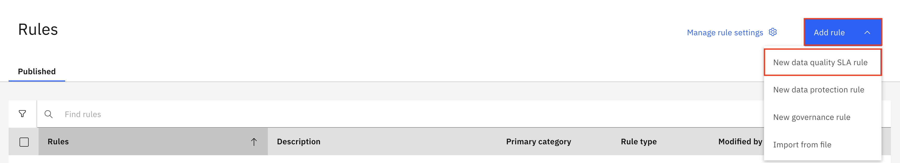 

- Provide a rule name. Optionally, provide a description of what the rule does in the **Business definition** field. In this case, we will create an SLA rule for the `customer_id` column.

  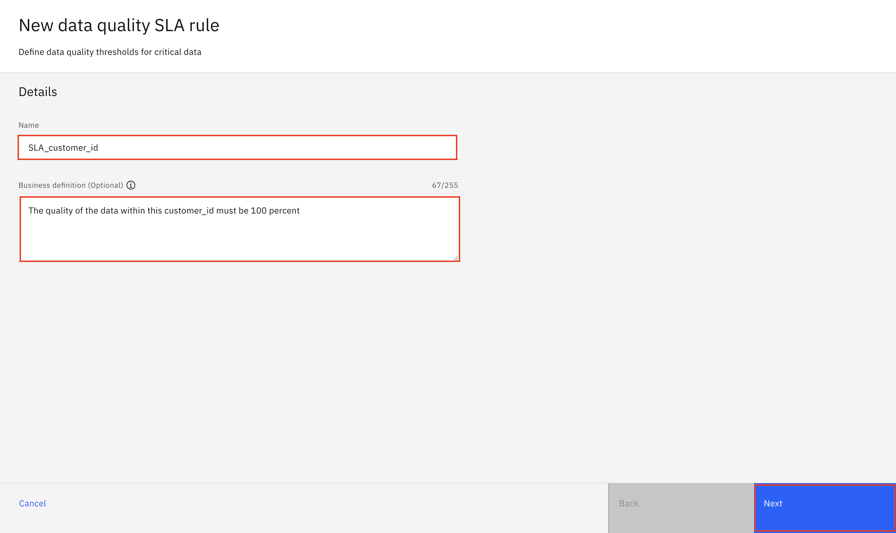 

- Under **Asset selection**, choose `with one of the names` for `Any Data Asset`, then type `customer_id` in the asset name field and press **Enter**.
- Click on the **Add data quality criteria +** button.

   

- For **must have a**, select `overall data quality score`. For **equal to or greater than**, type `100`.
- Under **Action if any condition is not met**, click on the **select** button.

  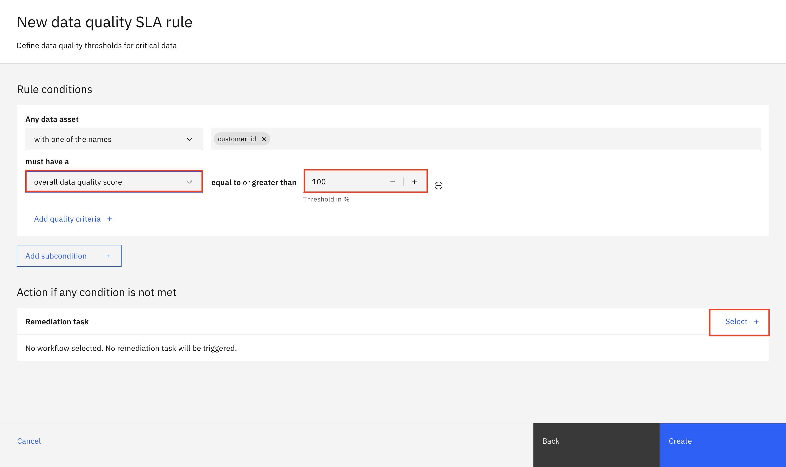 

- From the **Remediation action configurations**, select `Data Quality SLA Rule Remediation`.

   

- Click **Create** to finalize the rule.

  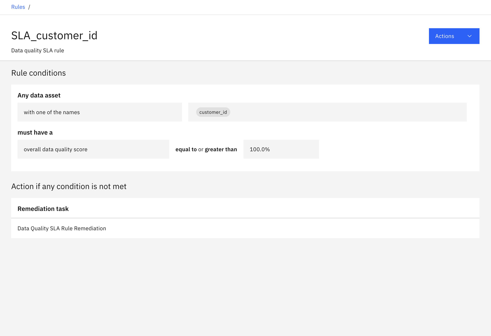 

**Note**: Data quality SLA rules are essential for maintaining the integrity of critical data. They ensure that data quality issues are identified and addressed promptly through remediation workflows.

<h2>5. Data Curation And Enrichment</h2>

As mentioned above, for this lab, the instructor has already defined business vocabulary along with a set of published governance artifacts.

Now the data curation process can begin.

Data curation is the process of discovering and adding data assets to a project or a catalog, enriching them by assigning classifications, data classes, and business terms, and analyzing and improving the quality of the data.

Curation can be a very labor intensive and time consuming process, and for a lot of organizations, it's mostly done manually where data assets are curated one at a time. Advanced data curation, which is included with the Data Governance component of watsonx.data intelligence, and what will be used in this lab, is primarily an automated process where many of the curation tasks are completed automatically for multiple data assets simultaneously.

Depending on the curation tasks performed, the curation of the data assets can happen in a project, a catalog, or both, before the data is ready for use by data consumers. This lab will perfom the curation process in the project.

<h3 id="51-import-metadata">5.1 Import Metadata</h3>

**Choose your project**

- From the Hamburger menu, select `Projects`, `View all Projects`.
- Select the project which has your name as the suffix.

**Creating Metadata Import**

In this step, you will create the Metadata Import to import the Customer data asset from the Watsonx.Data's connection into the project.

- In order to create Metadata Import, click on `New Asset`.

  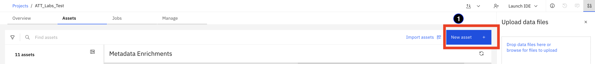 

- Select the <Strong>Prepare data</Strong> goal from the menu on the left.

- Select the <Strong>Import metadata</Strong> for data assets task.

  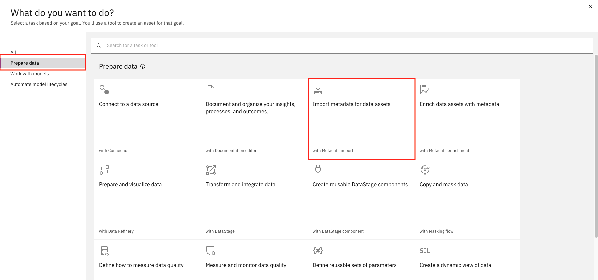 

- Enter the name `customer_table_YourFirstnameLast3LettersLastName_MDI` and click `Next`.

  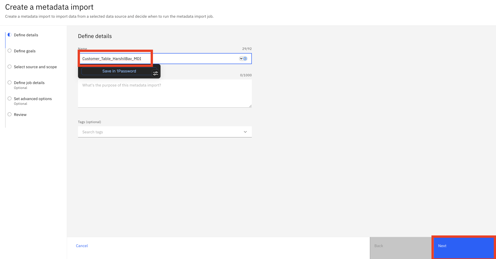 

- Select the checkbox for the <Strong>Import asset metadata</Strong> and click `Next`.

  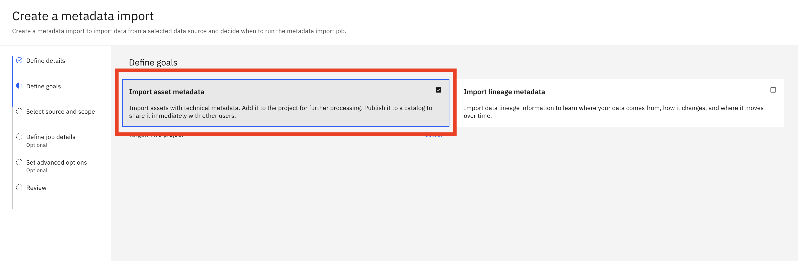 

- Click on `Select` for `Connection`.

  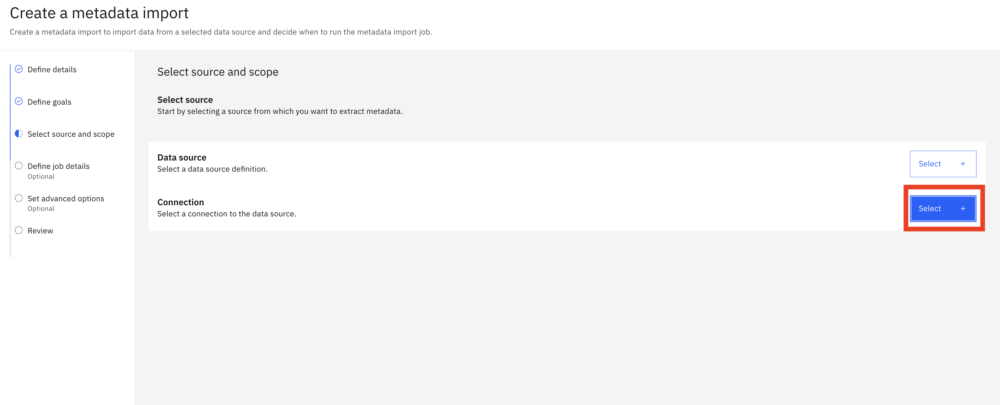 

- Choose `ATT_Enablement_watsonx_data_presto` connection and click `Select`.

  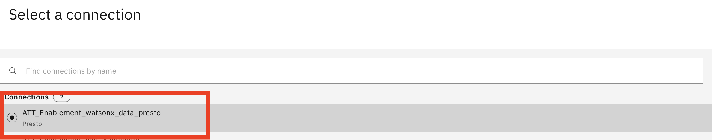 

- Click on `Select` under `Scope` Section.

  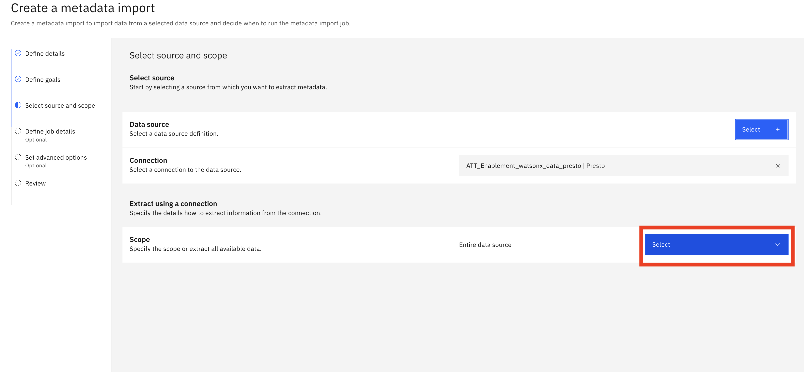 

- Select the `Select Assets` menu item.

  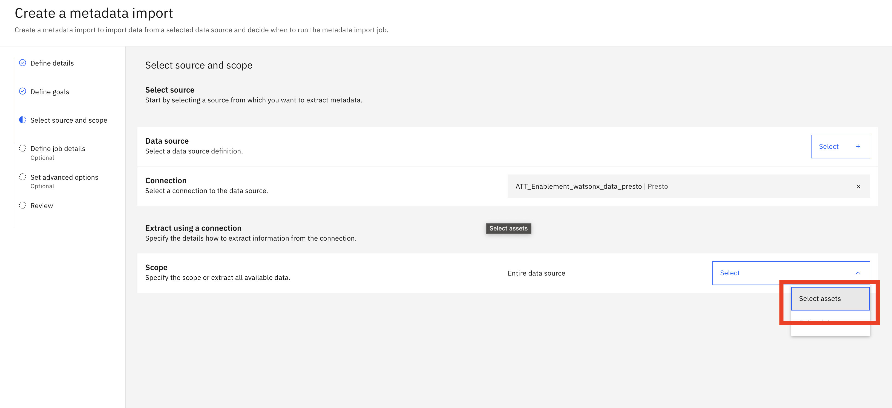 

- Click on the arrow next to `postgres_catalog`.

  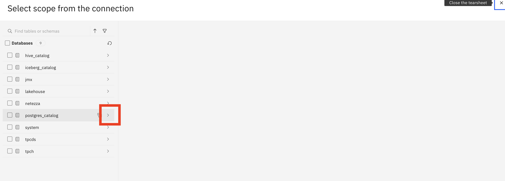 

- Click on the arrow next to `bankdemo`.

  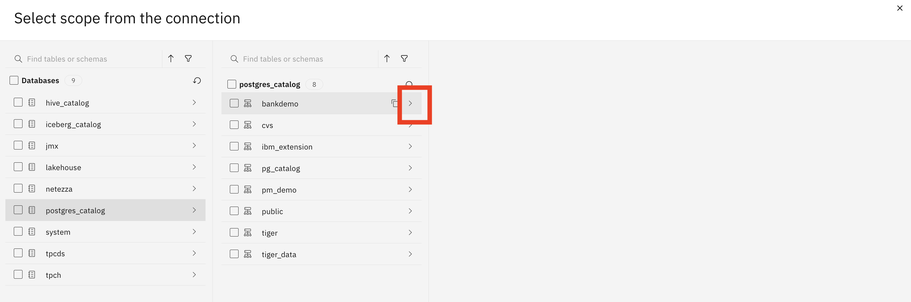 

- Click on `customers_table`and click `Select`.

  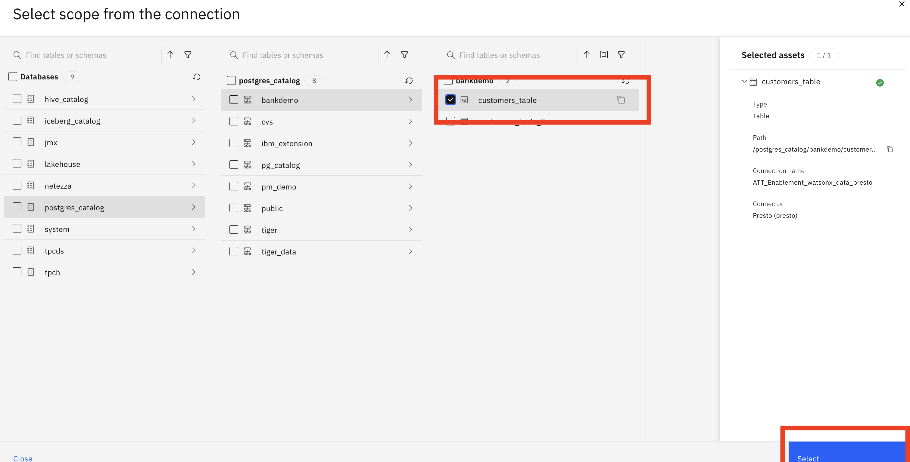 

- Click `Next`

  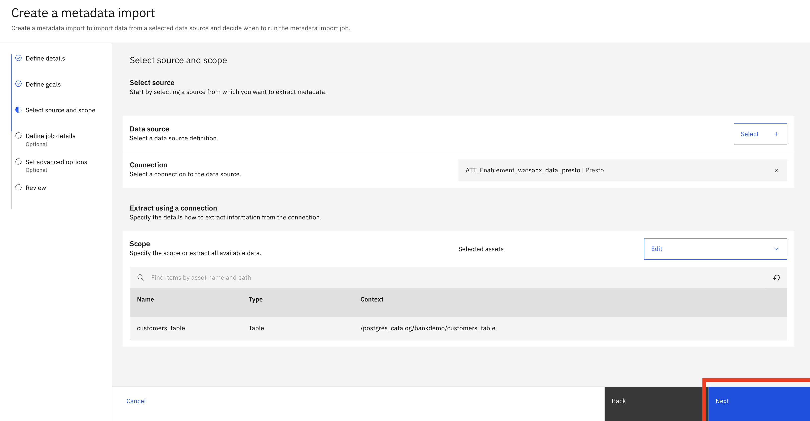 

- Click `Next`

  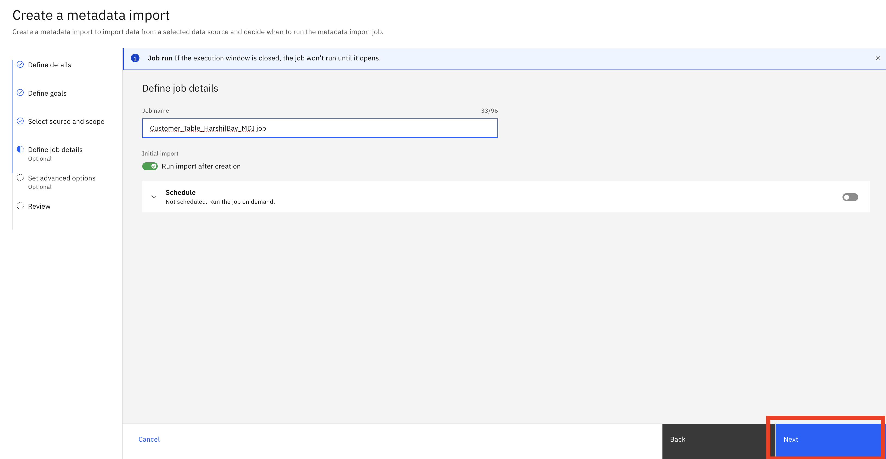 

- Click `Next`

  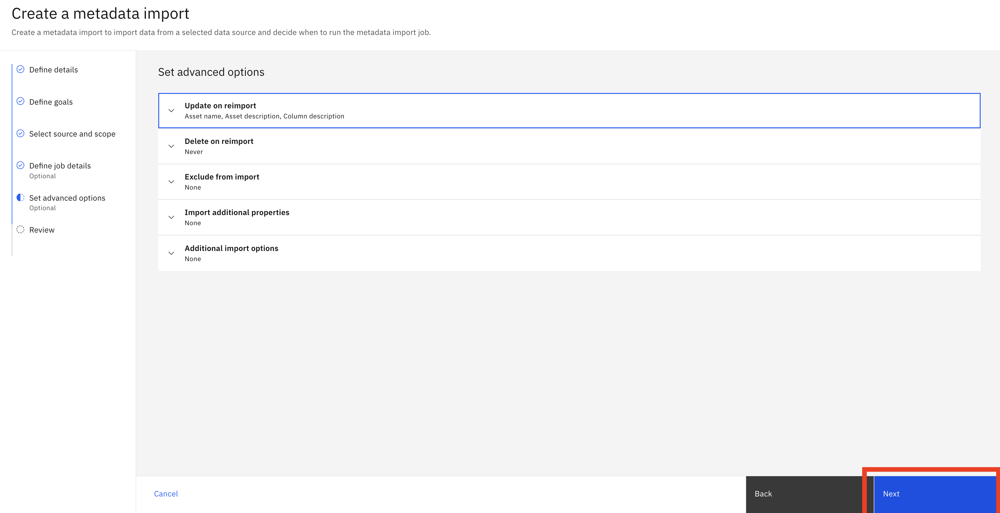 

  Take a minute to review the import before creating it. The Source and scope is importing 1 data asset from the watsonx.data presto connection into this project as the target and the import will be run after creation.

- Click `Create`

  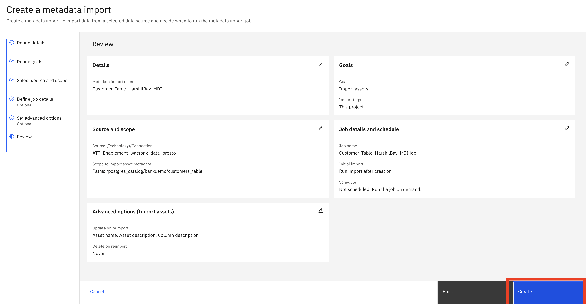 

  The import process should run quickly. In a few seconds, the import process will begin adding the data assets selected in the import to the Imported assets list. To update the results, click on the Refresh button at the top of the page.

  When the import is complete, a message will appear at the top of the page: Metadata import complete. 1 assets were processed successfully. The data asset will appear in the Imported assets list and is now added to the project.

<h3 id="52-enrich-data-for-imported-asset">5.2 Enrich Data for Imported Asset</h3>

This section uses the Data Governance automated Metadata enrichment tool to enrich the data assets that were discovered and imported during the Metadata import processes that was just completed. Metadata imports can be used as input into Metadata enrichment processes to automatically profile the data, analyze and assess data quality, and assign data classifications and business terms by leveraging governance artifacts defined in the business glossary.

This is where all the work that was done up front building out a complete, meaningful, and cross-referenced business glossary, to establish a business ready governance foundation, pays dividends. Metadata enrichment can now leverage the data classes and business terms and automatically assign them and make suggestions during the metadata enrichment process. This saves organizations a tremendous amount of time and resources by alleviating the manual effort that would have been involved to accomplish the same result.

**Set Enrichment Options**

- Set Enrichment Options by clicking `Manage` tab in your project. Then choose `Metadata enrichment`, and scroll down to Term assignment methods and select:

  - Machine learning (A machine learning model is used to assign terms.)
  - Data-class-based assignments (Terms are assigned based on the data class assignment for a column)
  - Name matching (Terms are assigned based on the similarity between a term and the name of the asset or column.)
  - Gen AI based term assignment (Semantic Enrichment) With Gen AI based term assigment, domain-specific business terms are assigned and suggested by using the slate.30m.semantic-automation.c2c model. The model takes into account names and descriptions of assets and columns, and semantically matches terms with that metadata, assigning terms even if they aren't exact matches.

  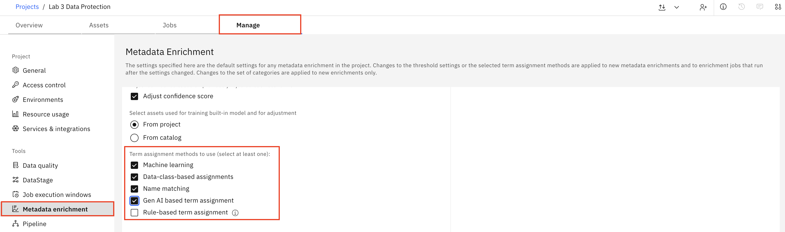 

**Create Metadata Enrichment Job**

- Switch back to the `Assets` Tab
- Select `New Asset`
- Select `Enrich data assets with metadata`
- Enter Name: `Customer MDE` and select `Next`
- If prompted to generate API key click `Generate key` to generate.

   

- Select `Select data from project`
- Under Asset types, select `Metadata import`, choose the Metadata Import you created in the previous step, select the data asset under it by clicking the checkbox and `Select`

  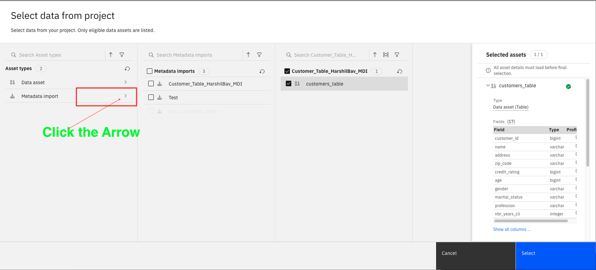 

- Your asset should be selected. Select `Next`
- Set Enrichment Objectives by enabling the following options:

  - Profile Data
  - Expand Metadata
  - Assign terms and classifications
  - Identify data quality checks
  - Run data quality analysis
  - Monitor Data quality with SLA rules

   

  - Scroll down, Select `Select categories + `
  - Select [uncategorized] and `Customer Information` and `Select`

   

- Keep defaults for Sampling, Schedule enrichment Job and click `Next`

  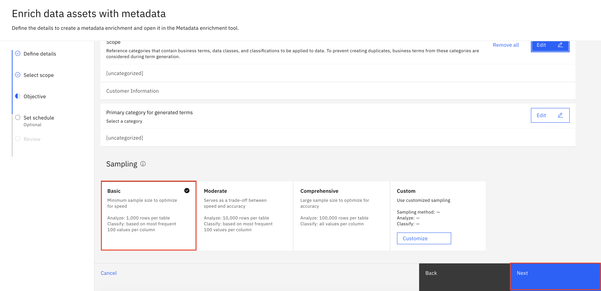 

- Keep defaults to run the job now and click `Next`

  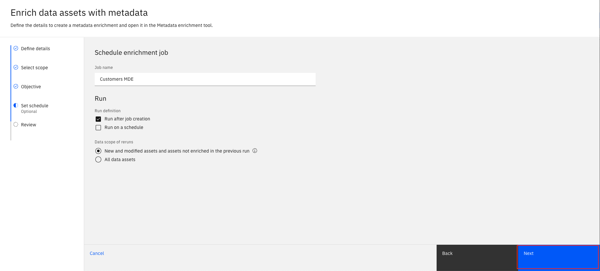 

- Enrichment options will be displayed. Select `Create` to start job

   

The Data Scope will be analyzing one data asset imported from watsonx.data with an enrichment objective to Profile the data, analyze quality and assign terms across 2 categories using the Basic sampling method.

The enrichment process will take approximately 2-3 minutes to complete.
The status will change from `Not analyzed` to `In progress` to `Finished`.

**Review Enrichment Results**

Based on the enrichment scope and objectives, the Metadata enrichment tool automatically profiled the data, analyzed and assessed data quality, assigned and suggested business terms, and assigned data classes to all columns for the data assets included in the metadata enrichment job.

As the data steward, you will now review the proposed enrichment before publishing to the catalog for others to consume.

- Select the `Refresh` button to show the metadata enrichment or optionally browse to it: Select the `Project-Name` , Select the `Assets` tab and select `MDE`
- Go to the Columns tab

  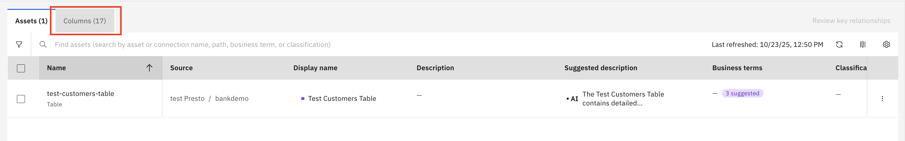 

The table now has metadata!

 

**Verify and Accept Suggested Descriptions**

AI can automatically generate **column descriptions** based on metadata and content patterns. These suggestions are indicated by an **AI** icon next to the description field.

- Review the **AI-suggested descriptions** for each column.
  You will see an **AI** icon next to any description that was generated by AI.

 

- Once you have verified the generated description, click the **AI** button and then click the **tick mark** (✔) next to the generated description to accept it.

 

- After accepting, the description will move from the **Suggested description** section to the main **Description** field.

 

**Verify and Manually Assign Business Terms (if not suggested)**

Where watsonx.data intelligence met confidence thresholds, it automatically assigned business terms, data classes, and classifications.
When the model fails to meet the enrichment threshold set, it will make a suggestion (in purple). Let's explore

 

> **Note:**
> If a business term is **already assigned** to a column, **skip it** and select another column **that does not have a business term assigned** to complete this step.

- Click on the purple **`1 suggested`** bubble next to a column (for example, `risk_score`) that **does not already have a business term assigned**.
- Select the **Governance** tab on the right side and review the suggestion.
- Click the **Assign** button to accept the suggested business term.

   

In the case where there may be ambiguity in the business term, the model may not make a suggestion.

- Hover over the **Business Term** column for a field (for example, `Address`) that **does not already have a business term** and select **View more**.
- Select the `Governance` tab on the right side and select the `+` button

   

- In the search bar, type `address`
- Select `Work Address` and `Assign`

  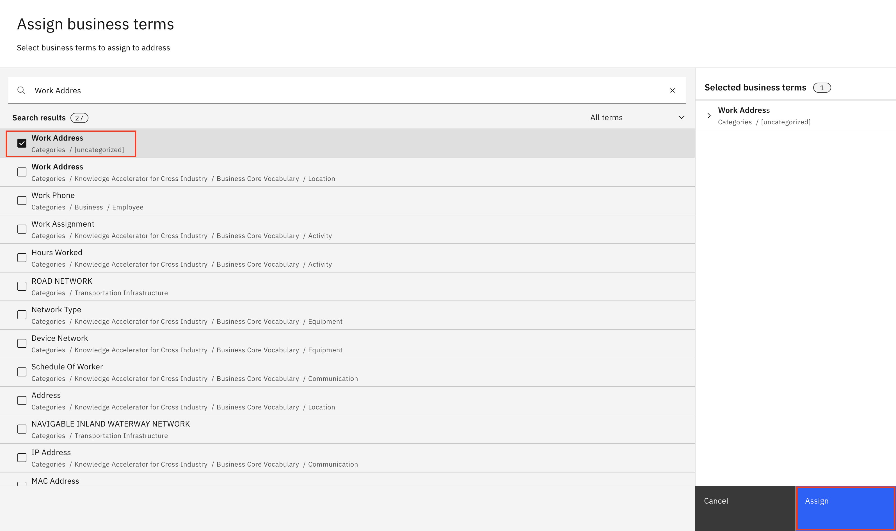 

A data steward would continue and assign values for all columns, but in the interest of time we are going to focus on what's needed to protect the data in the `SSN` and `Email Address` columns.

Now take a moment to explore the `Data Class` and `Classifications` metadata attributes that were assigned/suggested.

**Verify Data Classes**

Data protection rules require a criteria for the rule to fire on and can include user attributes and data asset properties.
For our lab, we are going to use the `Data class` attribute to classify the content in the columns to be protected.

- On the `SSN` row, review the assigned `Data Class` and set it to `US Social Security Number` if it was not automatically assigned.

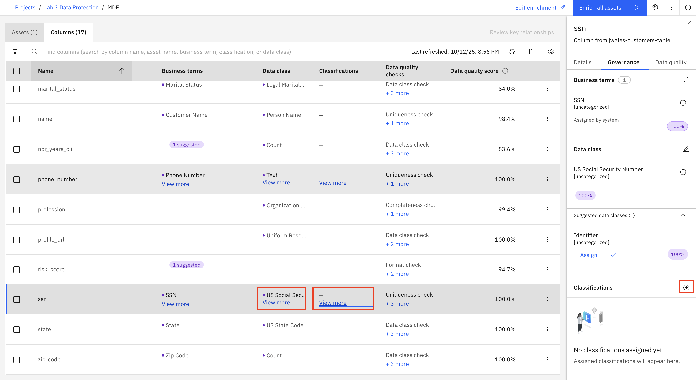 

- Optionally review and the `Classifications` and set to `Sensitive Personal Information`.

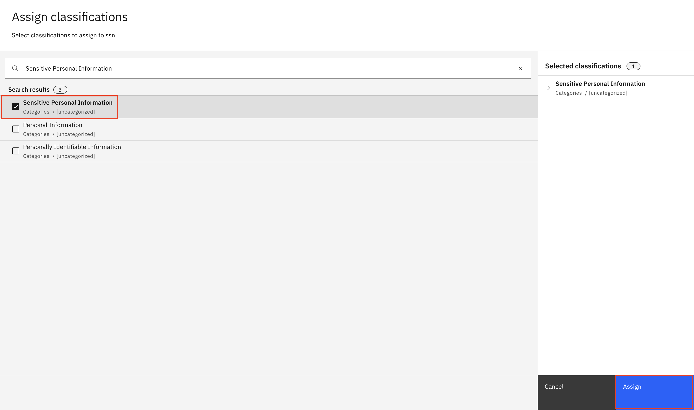 

- On the `email` row, review the assigned `Data Class` and set it to `Email Address` if it was not automatically assigned.

 

- Optionally review and the `Classifications` and set to ` Personally Identifiable Information`.

Once you have verified the **Description**, **Business Terms**, **Data Class**, and **Classification** for each column:

- Click on the **three dots (⋮)** at the end of the row.
- Select the **Mark as reviewed** option.

This indicates that the **data steward** has verified and approved the information for that column.

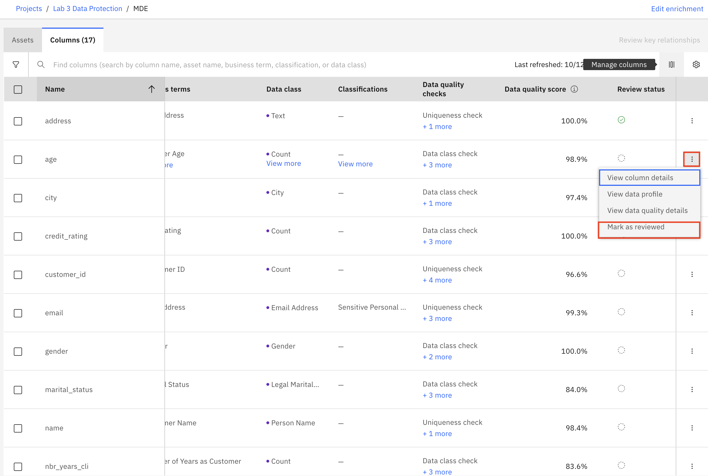 

When you are happy that your data is now properly identified and ready to be governed, you can add the enriched version back to the catalog

**Add Enriched data back to the Catalog**

- Navigate back to the asset view by clicking on the Asset tab

   

- Tick the checkbox next to the Data asset and click `Publish` in the blue bar

 

- Select the `ATT_CDO_Control_Plane_Enablement_Catalog` and select `Next`

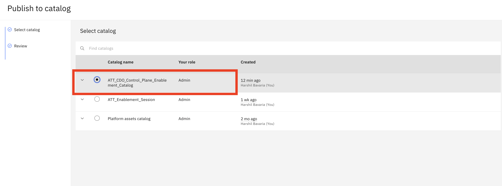 

- On Review Assets Page, select `Publish`
- This will take a few minutes and when finished you will see a message `Publish completed 1 asset has been published to Bootcamp Catalog`

<h2>6. Verify Data Quality SLA compliance information</h2>

Earlier in this lab, we reviewed how to create **SLA rules** to monitor data quality. Now, let's verify the **SLA compliance information** for our enriched dataset.

- From the **Projects** page, open the project you created earlier.
- Under the **All assets** section, click on your table (for example, `jwales-customers-table`).

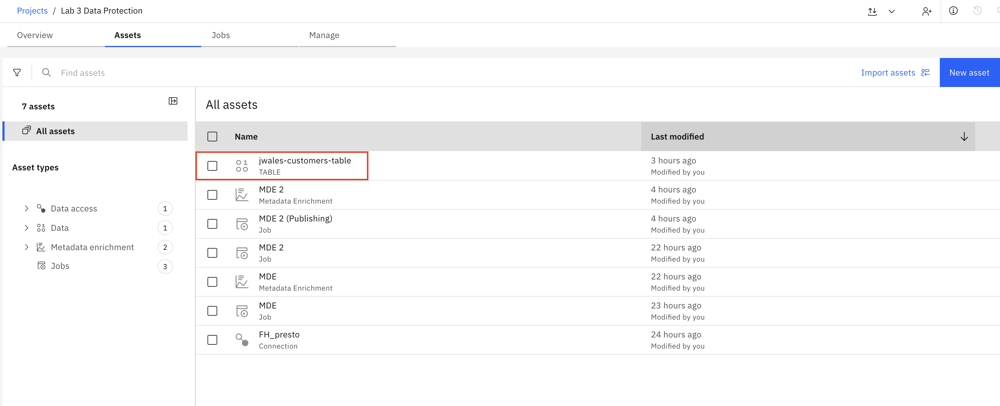 

- Navigate to the **Data Quality** tab.

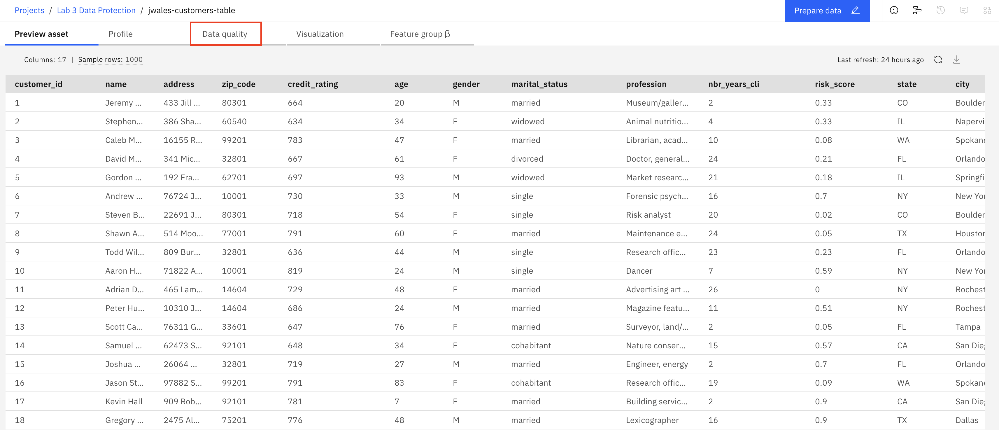 

- Scroll down to the **SLA rule compliance and remediation** section. Here, you can review the SLA rules that have been automatically associated with your dataset.
- Click on the `SLA-overall-score` rule to view detailed insights, including the **Expected score**, **Current score**, and any **Deviation** from the expected SLA criteria.

 

This step helps ensure that your data meets the established quality standards and that any violations can be identified and addressed through predefined remediation actions.

- From the Hamburger menu, select `Catalogs`, `View all Catalogs`
- Select the `Bootcamp Catalog` and verify the changes.

Before

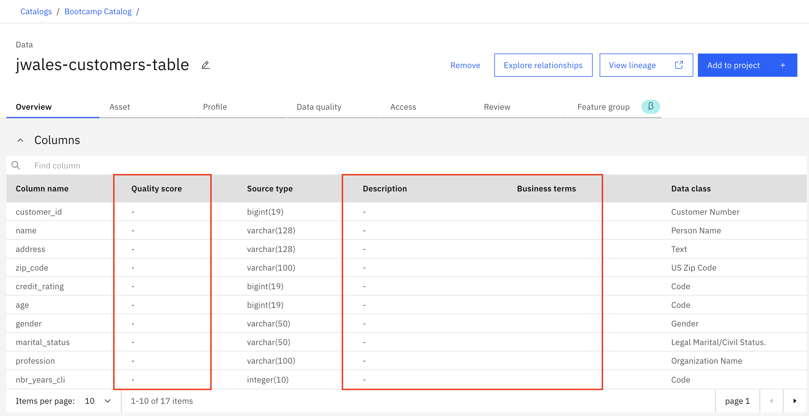 

After

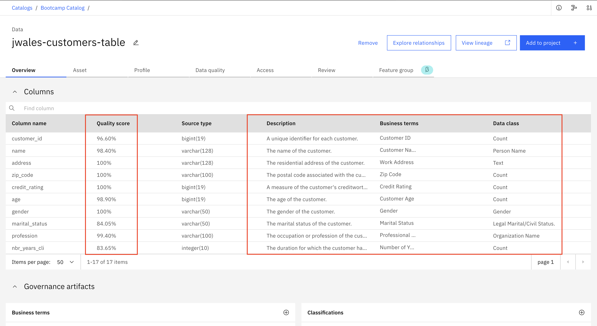 

<h2>7. Create Data Protection Rule in Cloud Pak for Data</h2>

Now that Data has been curated, it's time to apply data protection rules. For our use case, we want to protect Social Security numbers and email addresses from being viewable in the catalog.

Because we are working in a shared watsonx.data Intelligence environment, this step has already been done for you. Let's take a look at the rules that have been setup.

- Go to your `watsonx.data Intelligence` instance
- From the Hamburger menu, select `Governance`, `Rules`

  1. Preview the Protect US SSN and Email Rules

     For the lab, we've chosen to mask the SSN with the character X, and for the Email we will substitute data but could have also chosen to obfuscate or deny access instead.

      

     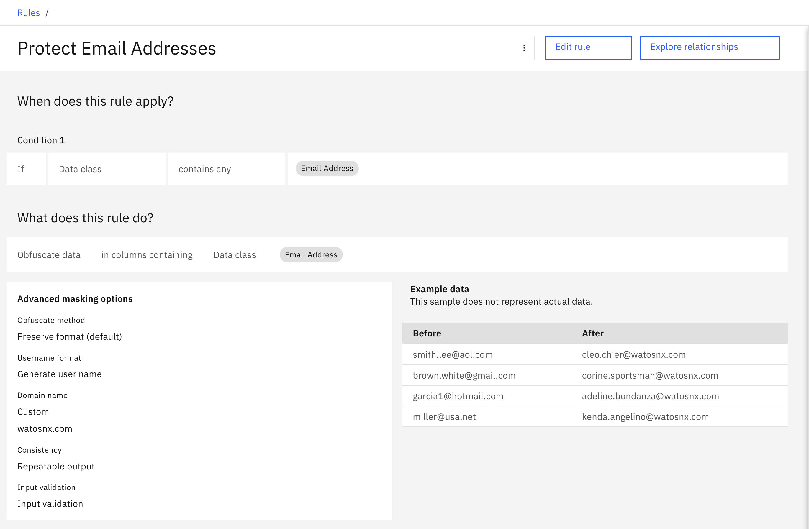 

<h2>8. Add Service Integration in watsonx.data to watsonx.data Intelligence</h2>

- Go to `watsonx.data` service instance
- From the Hamburger menu, select `Access Control`
- Select `Integrations` tab

   

- Click `Integrate service +` button
- Select `IBM Knowledge Catalog`
- Under `Storage catalogs`, select all catalogs
- Add the watsonx.data Intelligence endpoint for your catalog by prepending api to your host:
  https://api.dataplatform.cloud.ibm.com (for SaaS Dallas)https://api.eu-gb.dataplatform.cloud.ibm.com (for London)
- Click `Integrate`
- ❗️Note: The service will not be activated by default.
- Click 3 dots to the right of the service integration and select `Activate`

   

- Click `Confirm` when prompted
- The integration will restart the presto engine.

   

<h2>9. Add restricted user access to watsonx.data</h2>

Data protection rules are enforced for users who are not administrators of the data resource. For the lab, our business users will belong to the `Data_Scientist` user group.

<h3 id="91-add-access-to-infrastructure-components">9.1 Add access to Infrastructure Components</h3>

- From the Hamburger menu, select `Access control` from `watsonx.data`
- In `Infrastructure` Tab, Click `Add Access +`
- Select checkbox next to `Items` to select all and click Next

  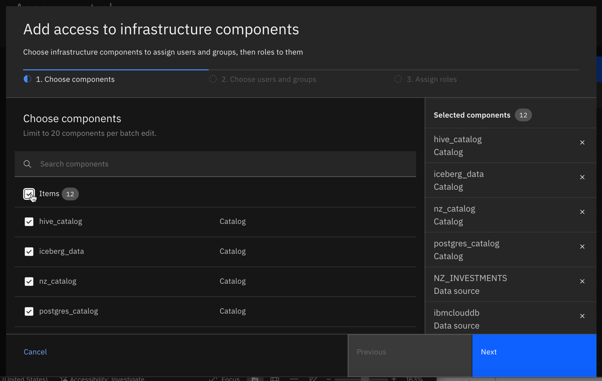 

- Add data_scientist, click Next

   

- Select the drop down and scroll to the right to select the appropriate roles for the restricted user group.

  - Select the `User` role for `Engines`
  - Select the `Reader` role for `storage`
  - Select the `User` role for `catalogs` you may have to scroll right to find them all

- Click Save

  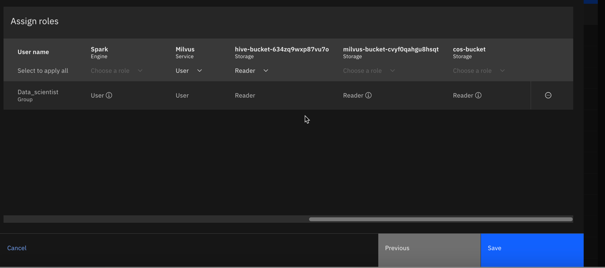 

<h3 id="92-add-policy-to-iceberg-data">9.2 Add Policy to iceberg data</h3>

- Switch to the `Policies` Tab

  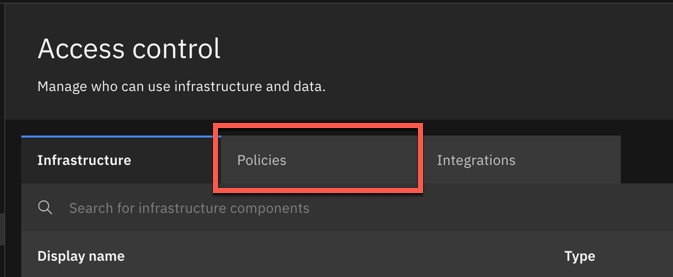 

- Click `Add Policy +`
- Name policy `postgres_allow`, and select `Policy status after creation` to `Active`, click Next
- Under Choose a resource to get started, Select all `postgres_catalog`
- Under Search tables enable `all` box
- Click Next
- Click `Add rule +`
- Under Details select Allow -> select all actions
- On the right, under Choose users or groups, click `Add +`
- Select `Data_Scientist` Group and select Add
- Click `Add`, `Add`, `Review` and `Create`

<h2>10. Verify Data Protection Rule is being enforced (Demonstration)</h2>

- To demonstrate the data protection rule is being enforced, we must login to the environment with a user who is not an owner of the data.
- For the enablement, this is any user who has been added to the Data_Scientist group.
- :Instructor to Demonstrate:

  - Login as restricted user
  - Go to `watsonx.data Intelligence` Instance
  - Open the Catalog
  - Open Data Asset from watsonx.data
  - Click `Asset` tab

     

In this lab you have seen how watsonx.data allows data stewards to enrich and catalogue data just like any other data in their enterprise.

Finished!

