Simplify Data Integration with IBM DataStage
Hands-on Lab Guide


## Contents

1. [Introduction](#introduction)
   1. [Use Case](#use-case)
2. [Accessing your lab project](#accessing-your-lab-project)
3. [Connect to your data](#connect-to-your-data)
   1. [Data Warehouse](#1-data-warehouse)
4. [Prepare and transform the data](#prepare-and-transform-the-data)
   1. [Add connected data](#1-add-connected-data)
      2 [Transform the Data](#2-transform-the-data)
5. [Share the results](#share-the-results)
6. [Set a job schedule](#set-a-job-schedule)
7. [Summary](#summary)

## DataStage

### Introduction

IBM watsonx.data integration is a unified platform that brings together a comprehensive set of data integration capabilities, including:

- Bulk and batch ETL/ELT (powered by DataStage)
- Real-time streaming (via StreamSets)
- Real-time replication (via Data Replication)
- Data observability (via Databand)
- Unstructured data integration (via DIUD)

While the platform name has evolved, DataStage remains the core engine behind the bulk and batch ETL/ELT functionality. It continues to offer the trusted performance, scalability, and design flexibility that clients have relied on for years.

This lab focuses specifically on the ETL/ELT capabilities within DataStage, delivered in a SaaS environment. Watsonx is an integrated ecosystem that brings a comprehensive set of additional integration capabilities. Clients benefit from continuity and can continue to use standalone DataStage deployments or modernize DataStage workloads to watsonx.data integration. The “design once, run anywhere” approach still applies, enabling flexible deployment across cloud and on-premises environments.

In short, while the branding and platform have evolved, the capabilities you know and trust in DataStage are still here, now enhanced and more connected than ever.

#### Use Case

As a data engineer, you have been assigned to the analytics project team tasked with doing deeper analysis and AI to determine what might be causing a significant increase in employee attrition over the last year.
Your company has employee data residing in different tables, stored within a DB2 Warehouse.
The analytics team has asked for your help with integrating all this employee data. You will use DataStage to extract the data from these sources, cleanse and transform it, and then load it to an output format that can be immediately used for analytics and AI.

#### Accessing your lab project

1. If you have not already done so, [Log in to IBM Cloud Pak for Data](https://dataplatform.cloud.ibm.com/). You will use **your personal** Cloud Pak for Data as a Service account in the **Dallas** region to do this lab.


2. Make sure you are in the Dallas location and using the "Data Fabric" environment:


3. You should now see project named "ATT_Enablement_YourFirst_YourLast" available for the lab.

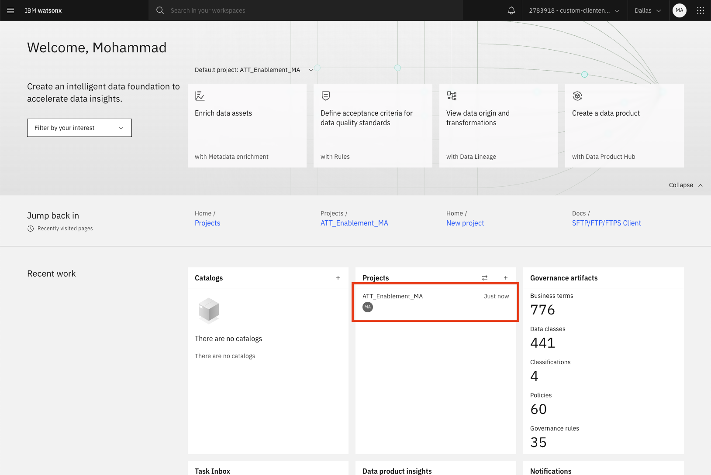

### Connect to your data

In this section of the lab, you will add the the data connection to your project that is needed for this lab, and utilize that connection in DataStage. There are two sets of data you will need to integrate, basic employee data, as well as the latest employee ranking results, both of which are stored in your team's Db2 Warehouse.

#### 1. Data Warehouse

To add the Data Warehouse platform connection, perform the following steps:

1. Click the Assets tab, then click New asset.


2. Click the Connect to a data source tile.


3. Type data warehouse into the search bar to narrow the search.
4. Click IBM Db2 Warehouse from the left side navigation, then click IBM Db2 Warehouse.
5. Click Next to choose the Db2 Warehouse connection.


The Create connection window should appear. Perform the following steps to complete the creation of the Data Warehouse connection:

6. Copy and paste the value into the **Name** field:

   ```
   Data Warehouse
   ```

7. Copy and paste the value into the **Description** field:

   ```
   Database that contains enterprise data needed by the business for analytics and AI.
   ```

8. Copy and paste the value into the **Database** field:

   ```
   BLUDB
   ```

9. Copy and paste the value into the **Hostname or IP address** field:

   ```
   db2w-ovqfeqq.us-south.db2w.cloud.ibm.com
   ```

10. The **Port** should be set to `50001` by default. Leave the default value.

Scroll down until you see the Credentials section.

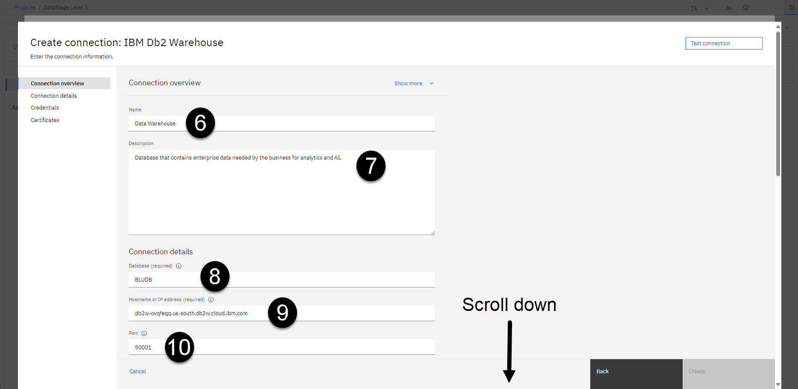

11. Click the **Authentication method** dropdown, and select **Username and password** from the list.

12. Copy and paste the value into the **Username** field:

    ```
    cpdemo
    ```

13. Copy and paste the value into the **Password** field:
    ```
    C!oudP@k4DataDem0s
    ```

Scroll down to the bottom of the window.


14. The Port is SSL-enabled checkbox should be selected by default. Leave it selected.
15. Click the Test connection button in the top right. A dialogue box that says The test was successful should appear.
16. After the connection has been tested successfully, click Create to create the connection.


### Prepare and transform the data

Now that you've added the data connection you need for the employee data, you can begin to prepare and transform the data so it's ready for use for the analytics pipeline you will build.

The HR team believes that there are many factors that may have contributed to employee attrition over the years; however, for this project, the HR team asked you to focus on employees by their ranking, and items that may contribute to their rank, such as bonuses, salary increases, sick days taken, and more. Your team wants to determine if any of these factors can help determine whether or not an employee will leave the company.

1. To create a new DataStage flow, click New asset.


2. Select the Transform and integrate data tile.


3. Enter a name for the flow such as Employee Ranking and optionally enter a description.
4. Click Create. A blank DataStage canvas will open for you to start working in.

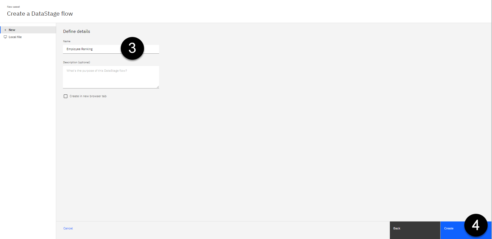

#### 1. Add connected data

The first thing you need to do is add the relevant employee data. You have determined that there are two tables you want to combine that are related to your employees' ranking results (EMPLOYEE_SUMMARY and RANKING_RESULTS).
To add these data sources to the canvas, follow these instructions:

1.  Click the Connectors twistie on the left side to expand the menu.
1.  Click and drag the Asset browser connector onto the canvas. This connector's details page opens.

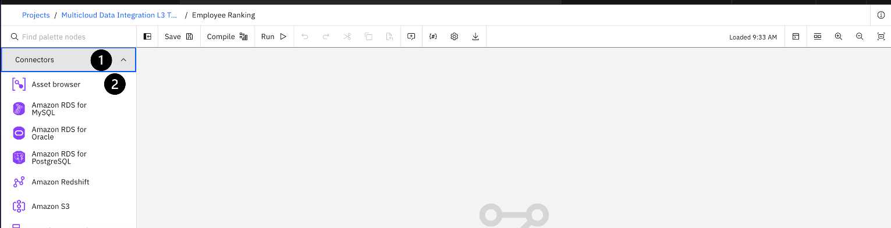

3.  Click Connection.
4.  Click Data Warehouse under Connections. Do not select the checkbox.
5.  Scroll down and select the EMPLOYEE category under Data Warehouse. Do not click the checkbox.
6.  Finally, select the EMPLOYEE_SUMMARY checkbox.
7.  Hover over the EMPLOYEE_SUMMARY tile and click the Preview icon (small eye icon) that appears after selecting EMPLOYEE_SUMMARY to preview the data before adding it to the canvas.

Note: You may have to scroll horizontally as each sub menu expands.

Note: It may take a little while to load all of the sub-menus.


8. Click the X icon to exit the EMPLOYEE_SUMMARY preview and return to the browser.


9. Click Add to add the EMPLOYEE_SUMMARY table to your flow.


10. You will see the EMPLOYEE_SUMARY asset you added.

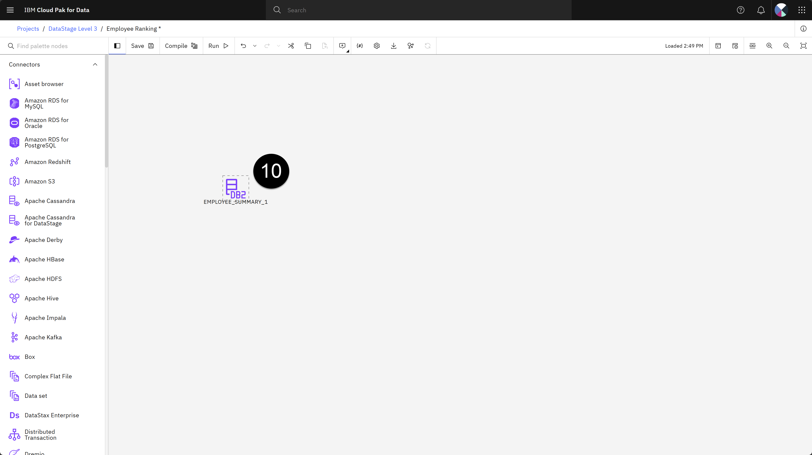

Next, you will follow similar steps using the Data Warehouse connection to add the most recent version of the RANKING_RESULTS table.

1. If the Connectors menu is not still expanded, click the Connectors twistie on the left.

2. Click and drag the Asset browser connector onto the canvas below EMPLOYEE_SUMMARY to open the details page.


3. Click Connection.
4. Click Data Warehouse. Do not select the checkbox.
5. Select the EMPLOYEE schema under Data Warehouse. Do not select the checkbox.
6. Select the RANKING_RESULTS checkbox.
7. Again, you can click the Preview icon (small eye icon) to preview the data before adding it to the canvas. There should be four columns of ranking data.
   Note: As with EMPLOYEE_SUMMARY above, you may have to scroll horizontally as each sub menu expands.

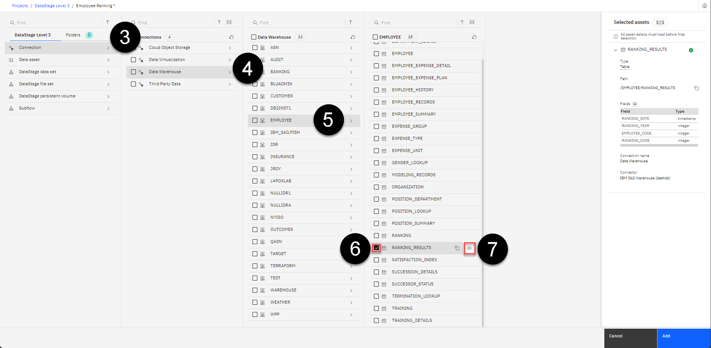

8. Click the X icon to exit the RANKING_RESULTS preview.


9. Click Add to add the RANKING_RESULTS table to your flow.

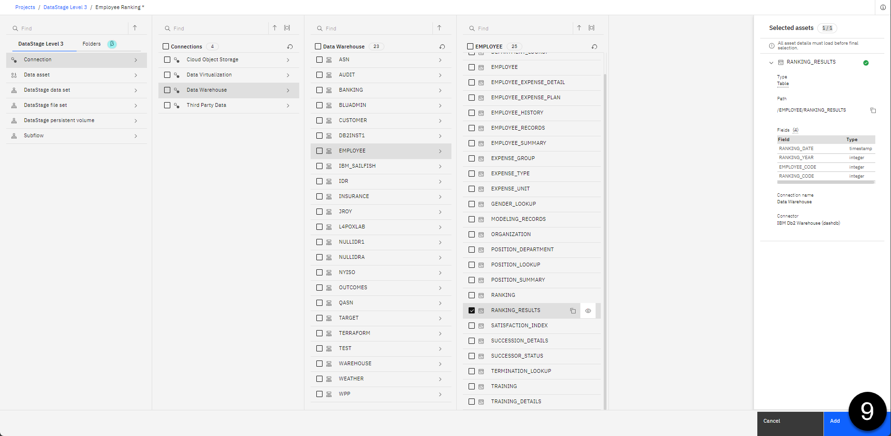

10. You should now see the RANKING_RESULTS table added to the flow.

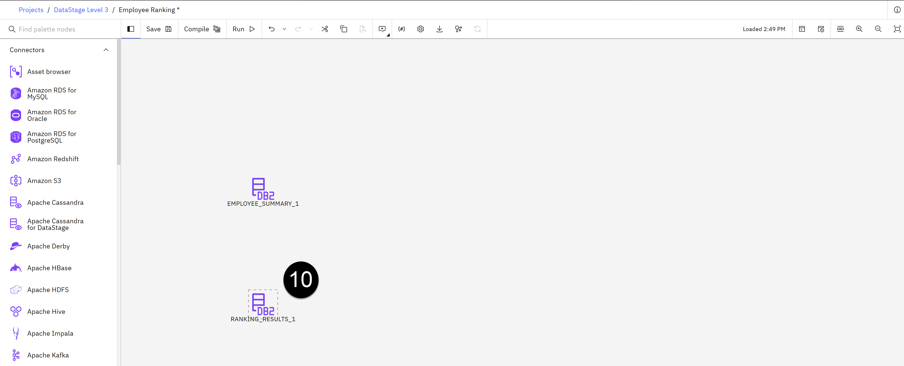

You've now added the data you need, and it is available for transformation within the flow.
Note: While both tables EMPLOYEE_SUMMARY and RANKING_RESULTS are taken from the same source, DataStage allows users to pull data from disparate sources into a single flow. Before updating the connected data properties, you need to add Peek stages so the output links for the column values can be edited. A Peek stage lets you print record column values either to the job log or to a separate output link as the stage copies records from its input data set.

1. Collapse the Connectors twistie, expand the Stages twistie and scroll down to the Peek stage.

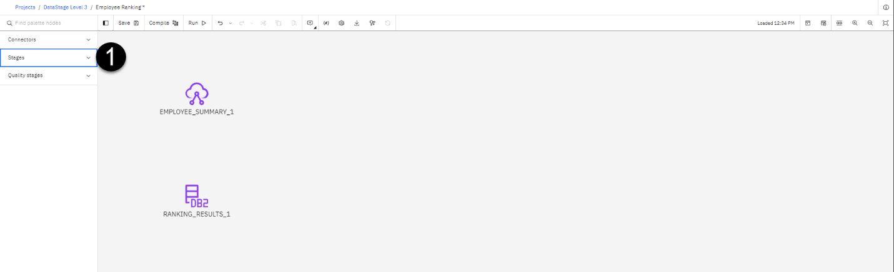

2. Click and drag the Peek stage (small rectangle with an eye in the middle) to the right of
   EMPLOYEE_SUMMARY_1. Repeat this drag and drop to the right of RANKING_RESULTS_1.
   Two Peek stages are needed because there can only be one input link for each, meaning, two links cannot
   be connected to 1 Peek.
3. Hover over the EMPLOYEE_SUMMARY_1 data connection and click the blue arrow that appears and
   drag right until you get to the Peek stage. You will see Link_1 appear between the data connection
   and the stage. Repeat this process for the RANKING_RESULTS data source.
   **Note:** The names of the specific connectors, stages and links (Peek_1 and Link_2 for example) may be different than the ones seen in the picture below).


2. Select the data you need
   After speaking with the rest of your team, you decided that not all of the data from each table is needed. To select only the necessary employee data, you will use a SQL select statement.

3. Double click EMPLOYEE_SUMMARY_1 to open the connector.

4. The Properties menu should be expanded. If it is not expanded, click Properties to expand the menu.
   Under Connection this shows it is the Data Warehouse connection.
5. In the Source section, click the Read method dropdown and select the Select statement option. This allows you to enter a SQL select statement to retrieve only the data you want.
6. Copy and paste this statement into the empty SQL box:

```SQL
(SELECT EMPLOYEE_CODE, MAX(SUMMARY_DATE) MAX_DATE,
TIMESTAMPDIFF(16,
CHAR(MAX(SUMMARY_DATE) - MIN(SUMMARY_DATE)) ) as Period_Total_days,
MIN(SALARY) Starting_salary,
MAX(SALARY) Ending_SALARY,
MAX(SALARY) - MIN(SALARY) increase,
SUM(CASE WHEN PAY_INCREASE = 0 THEN 0 ELSE 1 END) nb_increases,
SUM(BONUS * SALARY) BONUS,
SUM(CASE WHEN BONUS = 0 THEN 0 ELSE 1 END) nb_bonus,
SUM(VACATION_DAYS_TAKEN) VACATION_DAYS_TAKEN,
SUM(SICK_DAYS_TAKEN) SICK_DAYS_TAKEN
FROM EMPLOYEE.EMPLOYEE_SUMMARY E2
WHERE (SUMMARY_DATE >= '#Start_Year#-01-01 00:00:00'
AND SUMMARY_DATE < '#End_Year#-01-01 00:00:00')
GROUP BY EMPLOYEE_CODE)
```

When run, the SQL statement above selects and creates a set of columns. The columns that will be
generated in this table are shown below:

```
- EMPLOYEE_CODE
- MAX_DATE
- PERIOD_TOTAL_DAYS
- STARTING_SALARY
- ENDING_SALARY
- INCREASE
- NB_INCREASES
- BONUS
- NB_BONUS
- VACATION_DAYS_TAKEN
- SICK_DAYS_TAKEN
```

Parameters are inserted to pull data from whichever year you choose at runtime; these will be set later. 5. Select the Output tab to view the output columns for Link_1 (highlighted in blue).

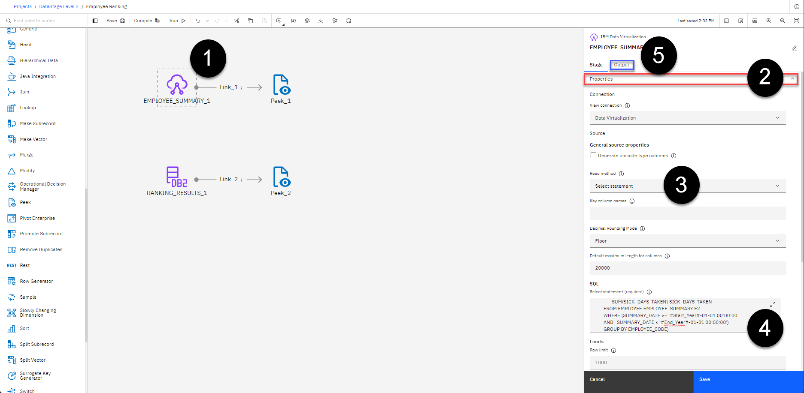

6. Select the Runtime column propagation checkbox. This will automatically create the columns that are being selected and added, so you do not need to manually input these column names.
7. Click Save to save these properties and exit.

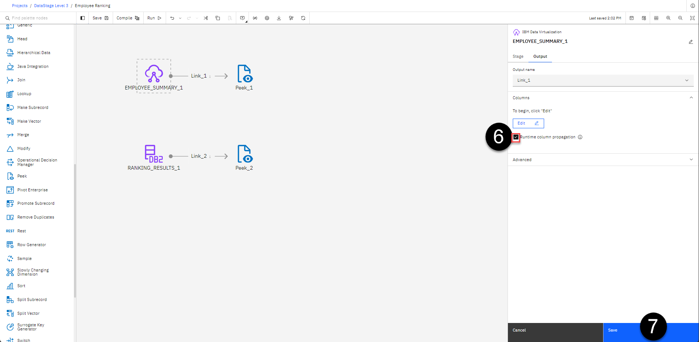

IMPORTANT: If there is a list of columns for EMPLOYEE_SUMMARY that appear in the Output tab, follow the steps below to delete them. Then, once they are deleted, you may save the changes as seen in step 7.

1. Click Edit under Columns.

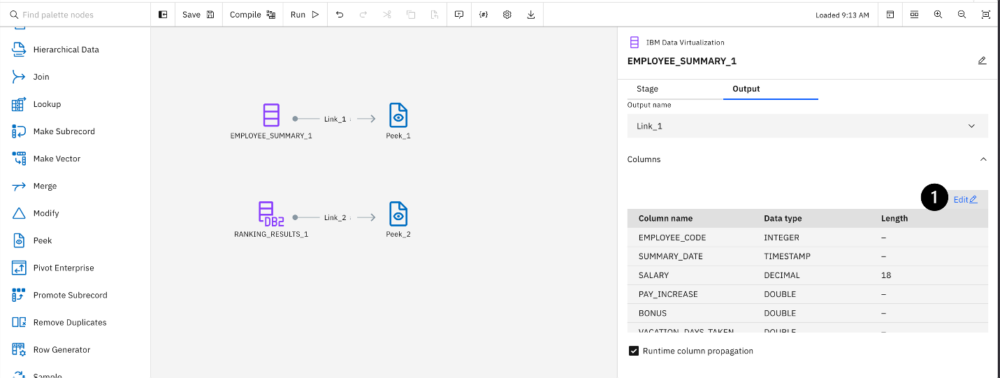

2. Select the checkbox next to Column name to select all 7 items.
3. Click the delete (trash can) icon to remove the columns.


4. Click Apply and return to go back to the stage properties.
   Note: You may be prompted to save after applying these changes. If this is the case, click save and proceed to the next step.


Next, follow the same steps to select the necessary data from RANKING_RESULTS.

1. Double click RANKING_RESULTS_1 to open the connector.
2. The Properties menu should be expanded. If it is not expanded, click Properties to expand the menu.
   Under Connection , 'Data Warehouse' connection will be displayed.
3. Under the Source section, click the Read method dropdown and change it to Select statement. This allows you to enter a SQL select statement to retrieve only the data you want.
4. Copy and paste this statement into the empty SQL box:

```SQL
(SELECT EMP.EMPLOYEE_CODE, RANKING_CODE
FROM EMPLOYEE.EMPLOYEE EMP LEFT OUTER JOIN
(SELECT RK.*
FROM EMPLOYEE.RANKING_RESULTS RK,
(SELECT TB0.EMPLOYEE_CODE,
MAX(TB0.RANKING_DATE) RANKING_DATE
FROM EMPLOYEE.RANKING_RESULTS TB0
WHERE RANKING_DATE < '#End_Year#-01-01 00:00:00'
GROUP BY TB0.EMPLOYEE_CODE
) TB1
WHERE RK.EMPLOYEE_CODE = TB1.EMPLOYEE_CODE
AND RK.RANKING_DATE = TB1.RANKING_DATE) RK1
ON EMP.EMPLOYEE_CODE = RK1.EMPLOYEE_CODE
)
```

When run, this statement selects the columns EMPLOYEE_CODE and RANKING_CODE. 5. Select the Output tab to view the output columns for Link_2 (highlighted in blue).

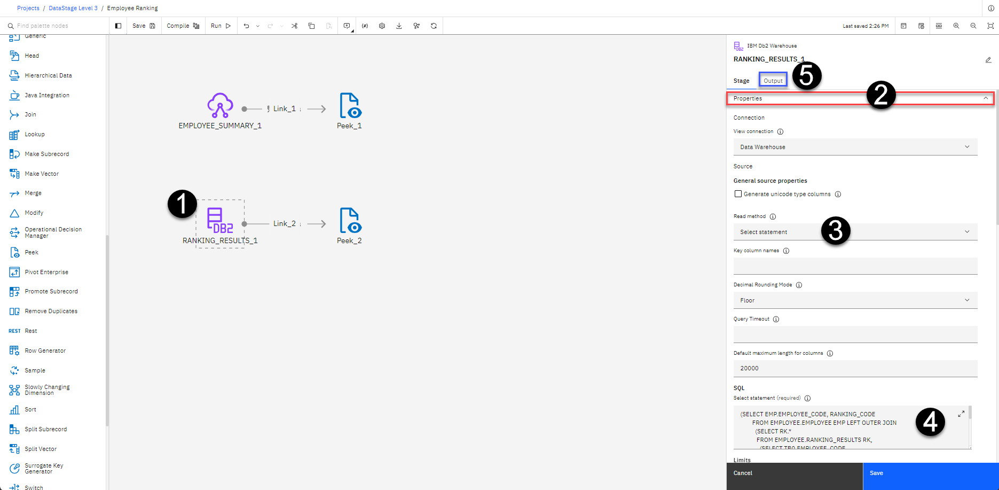

6. Select the Runtime column propagation checkbox. This will automatically create the columns that
   are being selected and added, so you do not need to manually input these column names.
7. Click Save to save these properties and exit.

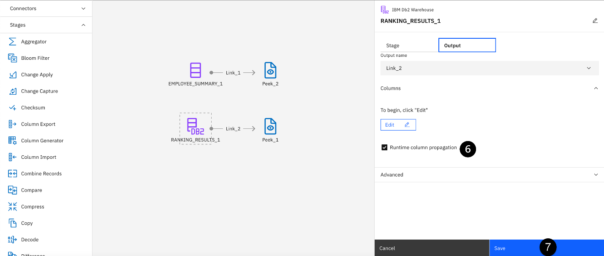

IMPORTANT! Again, if there is a list of columns for RANKING_RESULTS, follow the steps below to delete them. Once they have been deleted, you may save, as seen in step 7 . The steps to delete the list
of columns from EMPLOYEE_SUMMARY and RANKING_RESULTS are included to prevent duplicate columns from being created at the Peek stage.

1. Click Edit under Columns.

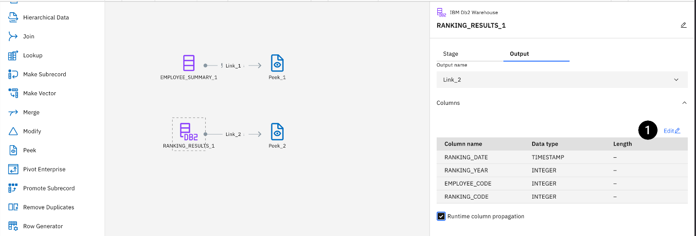

2. Select the checkbox next to Column name to select all items. 3. Click the delete (trash can) icon to remove the columns.

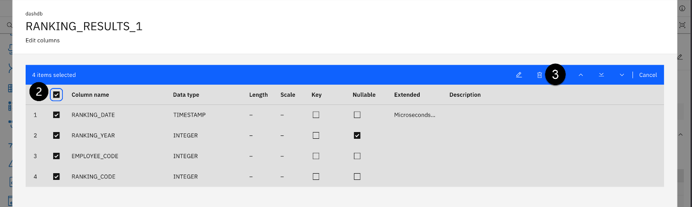

4. Click Apply and return to go back to the stage properties.
   Note: You may be prompted to save after applying these changes. If this is the case, click save and proceed to the next step.

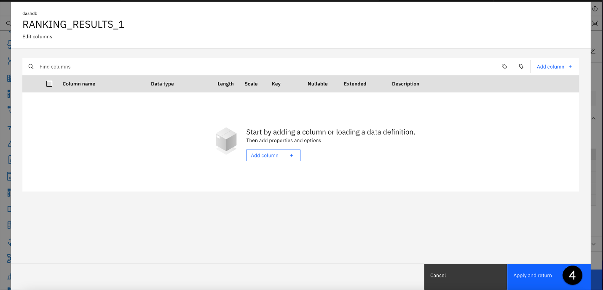

As mentioned earlier, parameters have been set in these select statements for ease of use in the future. At runtime, as data and years change, these values can be easily substituted based on these parameters.
To create the **Start_Year** and **End_Year** parameters, follow these steps:

1. Click the Add parameter (hashtag #) icon highlighted in red.

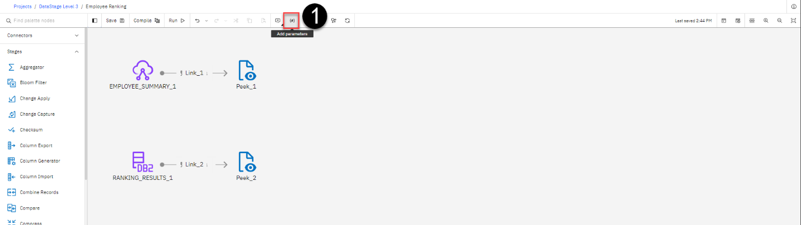

2. In the Flow parameters window, click Create parameter on the upper right side of this window.


3.  Enter these properties:
    Enter the following for **Name** :
    ```
    Start_Year
    ```
    Click the Type dropdown and select **Integer**.
    Enter the following for the **Default** value:
    ```
    2020
    ```
4.  Click Create to add the first parameter.

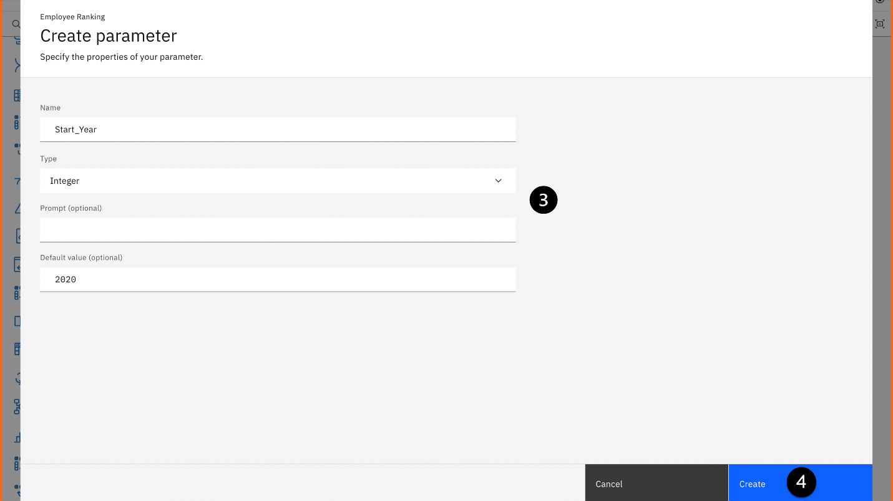

Repeat the steps above (2-4) to add a second parameter called **End_Year** with a Default value of **2021**. It
should look like the image below:


5. After both parameters have been added with the correct default values, click Return to canvas to go back to the flow.


#### 2. Transform the Data

To get this data ready for the analytics team, you will combine these new tables and sort the rows by employee rank. Then, you will have DataStage write the new Employee Ranking table to a sequential file.
To join the Peek stages, follow these instructions:

1. If Stages is not already open, click the Stages twistie to expand it.


2. Scroll down until you see the Join stage (two lines coming together to form an arrow) or search for **join** by typing it in the **Find palette nodes** search field. Click and drag
   the **Join** stage onto the canvas to the right of Peek_1 and Peek_2.
3. Hover over the Peek_1 stage and click the blue arrow that appears and drag right to Join_1. You will see Link_3 appear between the stage and the join. Repeat the same step for the other peek. Hover over Peek_2 and click the blue arrow that appears and drag right to Join_1. You will see Link_4 appear between the stage and the join.
   **IMPORTANT!** Make sure to check that columns are generated at runtime for the Peek stages as well by following these steps:
4. Double click on Peek_1 to open its properties.

5. Select the Output tab to view the output columns for Peek_1.
6. Select the Runtime column propagation checkbox.
7. Click Save to return to the flow.


Repeat steps 4-7 for Peek_2.

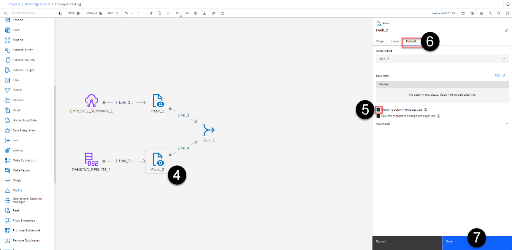

There must be a common column, or Join Key, for the two tables to be combined. In this case, it is EMPLOYEE_CODE.

1. Double click Join_1 to open the Stage properties.
2. Click Add key in the Join Keys (required) section.

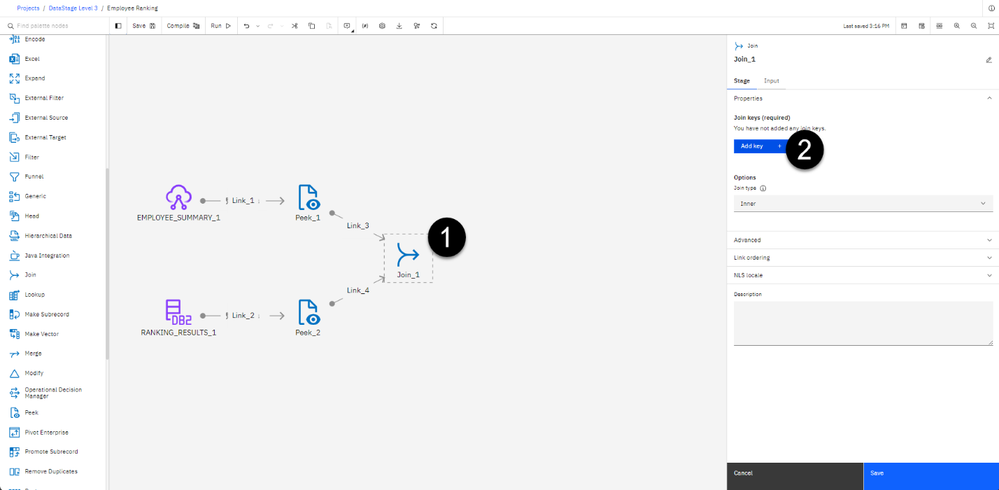

3. Join_1 should have no keys listed. Click Add key in the upper right.


4. If EMPLOYEE_CODE is not already displayed as the key name, type EMPLOYEE_CODE in the key name
   field. Then, click Apply.


5. EMPLOYEE_CODE will appear under the key list. Click Apply and return to go back to the stage
   properties.

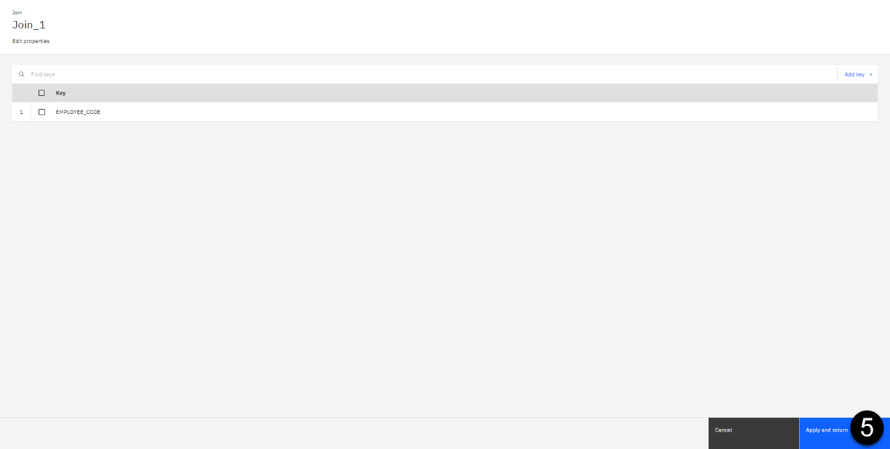

6. Click the Join type dropdown in the Options section and select Left outer. This type of join transfers
   all values from the left data set but transfers values from the right data set and intermediate data
   sets only where key columns match.
7. Click Save to return to the canvas.


The next step is to sort the employee data from lowest to highest ranking number. You will use the Sort stage to make sure your data is in the correct order when it is accessed later.

1. Click and hold your mouse to drag the Sort operator (three rectangles increasing in size from left to right) from the Stages menu on the left.
2. Unclick your mouse to drop the Sort_1 stage to the right of Join_1.
3. Hover over Join_1 and click the blue arrow that appears and drag right to Sort_1. You will see Link_5 appear between the join and sort.

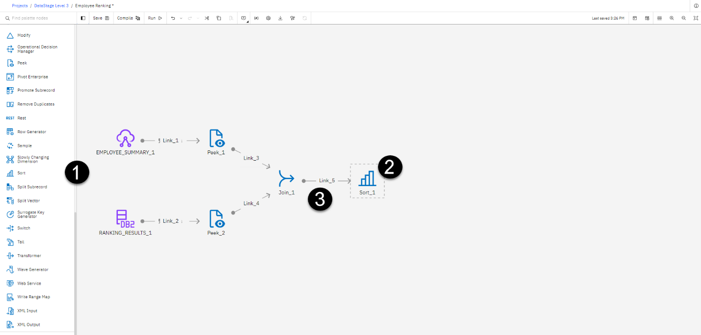

To sort employees by their ranking number, follow these steps: 4. Double click Sort_1 to open the stage properties.

5. Under Sorting keys, click Add key.

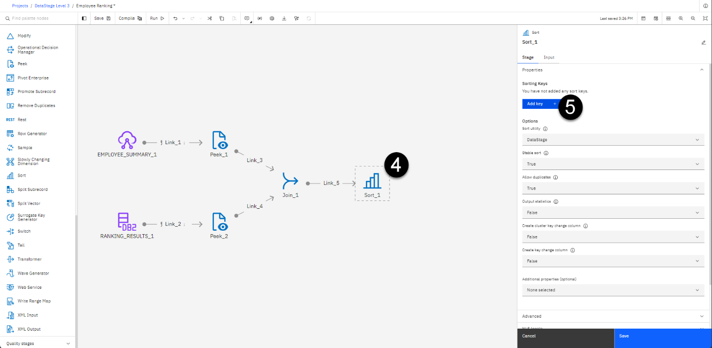

6. The keys list should be blank. Click Add key in the upper right.


In order to sort by a specific column, this column needs to be added as the sort key. Similar to the join, you can add a key name in top right.

1. Enter the following in the **Key** field:
   ```
   RANKING_CODE
   ```
2. Leave the **Sort key mode** as **Sort** since there was no previous sorting on this data.
3. Ensure the **Sort order** is set to **Ascending**.
4. Click Apply to add this sort key to the list.

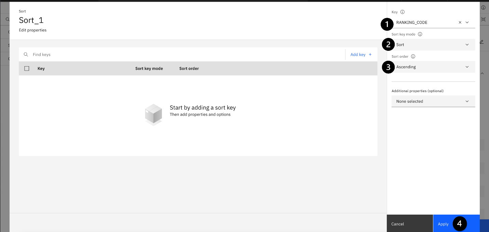

5. RANKING_CODE will appear in the sort key list. Click Apply and return to return to the stage
   properties.


6. Leave all other options as they are and click Save to return to the canvas.


Now that there is an output for the Join, make sure the Runtime column propagation is checked for Join_1.

1. Double click on Join_1.
2. Select the Output tab.
3. Select the Runtime column propagation checkbox.
4. Click Save to return to the flow.


### Share the results

Now that you've taken data from two different sources and transformed it to meet the needs of your team, you will write your DataStage flow to create a Comma-Separated values (CSV) file that can be used for further metadata enrichment and analysis.

1. If the Connectors twistie is not already open, click it to expand the drop-down.


2. Click and drag the Sequential file connection onto the canvas to the right of Sort_1.
3. Hover over Sort_1 and click the blue arrow that appears and drag right to Sequential_file_1. You will see Link_6 appear between the sort and sequential file.


4. Double click the Sequential file stage to open the stage properties.
5. Select the Input tab to see the input properties for the sequential file.


Next, you need to configure the necessary properties under the input tab to create a CSV (comma separated values) file.

1. Write or copy and paste the following into the File box:

   `Employee_Ranking.csv`

2. Select the Create data asset checkbox to enable this option.


3. Scroll down to the Options section. Click the First line is column names dropdown and select True. Then, click Save.

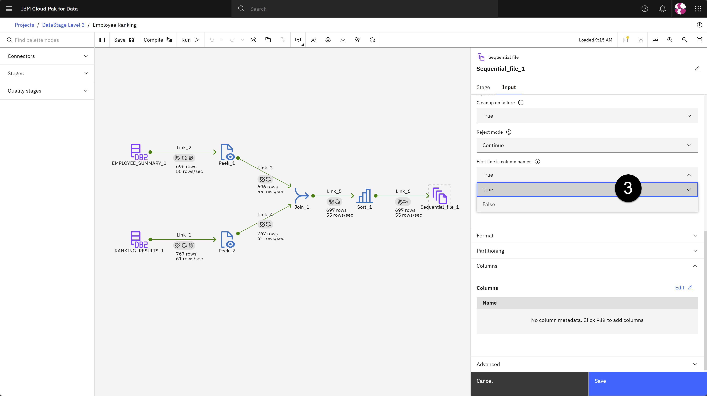

Now that there is also an output for the Sort, make sure the Runtime column propagation is checked for Sort_1.

1. Double click on Sort_1.
2. Select the Output tab.
3. Select the Runtime column propagation checkbox.
4. Click Save to return to the flow.

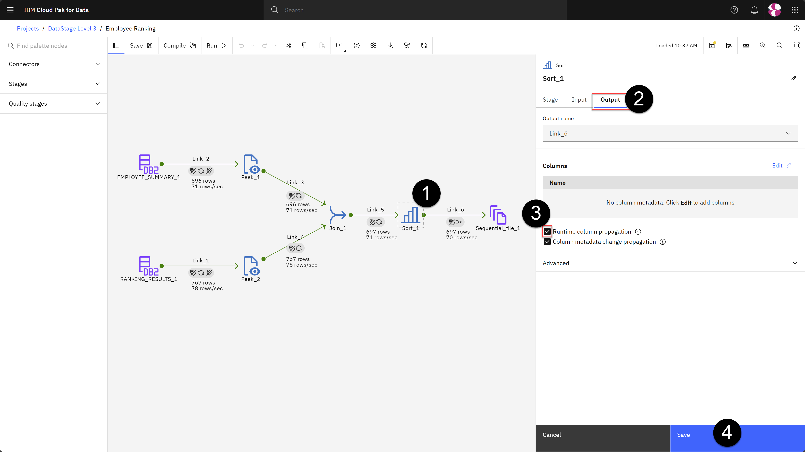

Now you are ready to compile and run your DataStage flow.

1. Click Compile from the options in the taskbar near the top of the window.


2. Once your flow has compiled successfully, click Run to run the job.


It will take a few minutes for the job to run. It will run with warnings which is ok for this lab. This will allow you to demonstrate the ability to work dynamically with the logs, which is a new benefit of DataStage Next Gen compared to Classic DataStage.

1. Click View Log to view a detailed log of the flow status and see any errors or warnings.

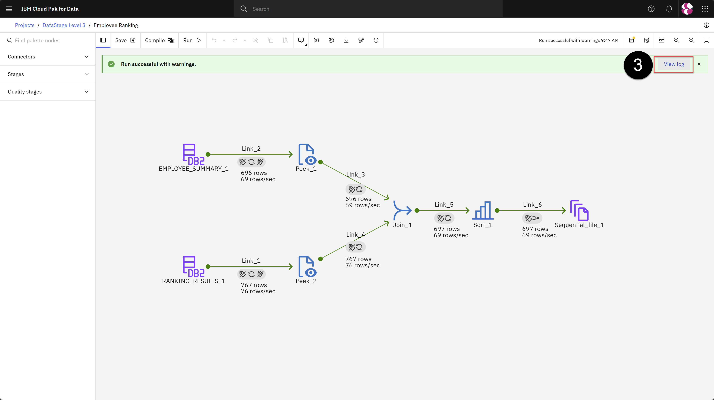

2. Click the Warning symbol (yellow triangle with an exclamation point).


Previously, with traditional DataStage, users had to manually look through the logs to find the information they needed. By clicking the yellow warning symbol, you are taken directly to the warning in the logs, and you can now also search the logs with the search bar. For clients on traditional DataStage, this new dynamic interaction with DataStage Next Gen introduces time efficiencies.

### Set a job schedule

Now that your flow has run successfully, this job is saved to your project. Many jobs can be created from one data flow. One reason you may want to create multiple jobs from a single flow is to run the jobs on different schedules or with different parameters.
Jobs can easily be scheduled within the project once they have been created. Historically, your team has been manually running jobs every time you need updated employee information, so this is yet another benefit of using DataStage for integration.

1. Click your unique project name to return to the Assets page.


2. Next to Assets, select the Jobs tab to open the list of jobs within your project.

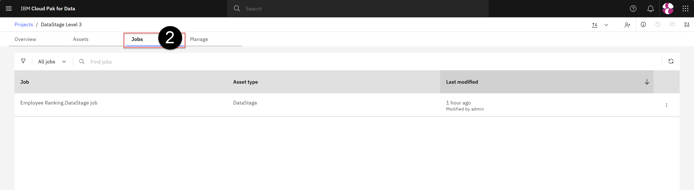

3. Click the DataStage job to open the job details.
   Note: In this screenshot, the name of the DataStage flow is Employee Ranking but yours may be different depending on what you named it when it was created.


The overview lists all completed and failed runs. To the right you can see that no schedule has been created
for this job. 4. Click the Edit Configuration icon (pencil icon) to start editing the job.


5. Click on the small pencil icon next to the Schedule section.


For this job, you want to have it run every Friday over the next 2 months. This will give you the most up-to-date information every week as employee data changes, and will help to determine a pattern. As your team project timeline changes, this schedule can be updated in the future.

6. Select the Run on schedule checkbox, to enable the job to be scheduled and start editing.
7. Select the Start of schedule checkbox and set the date for the closest Friday. Set the time for 12:00.
   Note: The dates will be different than shown. Use these screenshots as examples.
8. Select the Repeat the job checkbox since your team wants this as a recurring job.
9. Under Every, select weekly, on Friday and set the time for 12:00 again.
10. Select the End of schedule checkbox to enable the ability to select an end date.
11. Under End of schedule, choose a date 2-3 months away from the start time. Set the time for 12:00.
    **Note:** The time of 12:00 was chosen arbitrarily, so if that time has already passed, set the time to be the closest hour to your time (For example, if it is 3:45PM, you can select Friday at 4:00PM).
12. Click Next to get to the Notify window. You do not need to change any details on the Notify screen.


13. Click Next again to get to the Review and save window.

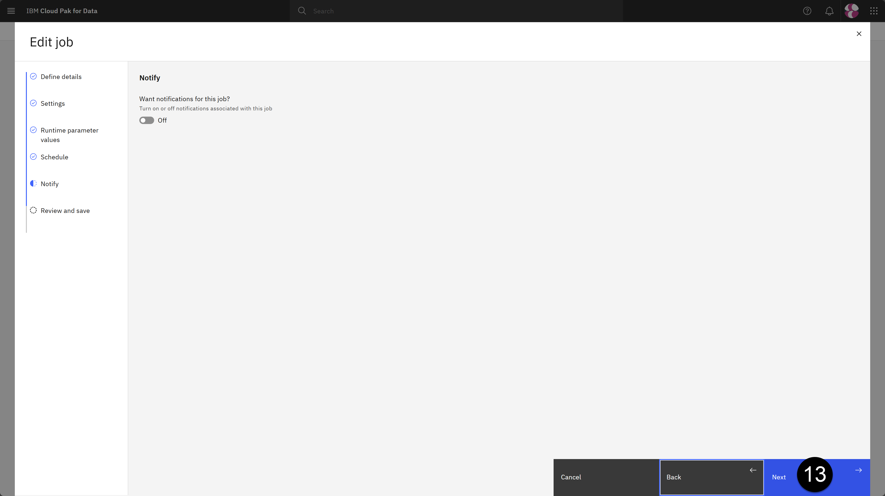

Here you can see the new job schedule was added, your runtime parameters that were set in DataStage,
settings, and notifications. No other changes will be made for this job.

14. Click Save to return to the job details page.

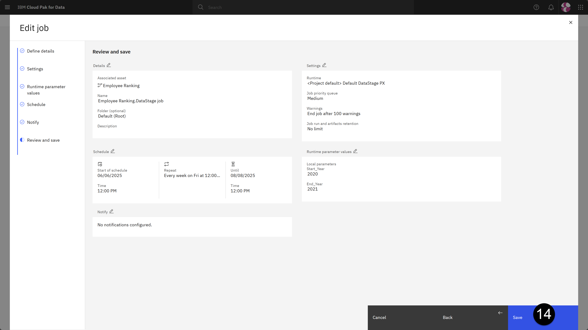

Now, you will look to see that the Sequential file was created successfully with the proper columns.

1. After saving the job details, click your project name from the breadcrumbs to get to the project
   details window.

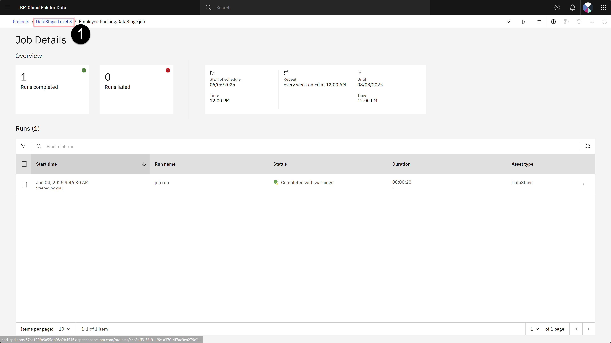

2. Click the Assets tab to view all project assets, including the new CSV file.
3. Click the file Employee_Ranking.csv to open it and view the data. You will see the columns, along
   with the joined and sorted data.


Now, with this new table, the data is ready for further enrichment and AI analysis.
Note: Some entries in the table have a RANKING_CODE of NULL, and since the table is sorted by that, all NULL values will appear first. To see the sorted data, continue scrolling until you see Ranking codes that are not NULL.


### Summary

✓ Congratulations on completing this lab!

You gained hands-on experience in the following integration areas:

- Created a project connection to a data warehouse using team credentials
- Utilized a data warehouse connection to integrate different types of data
- Performed transformations to select only the data that was necessary
- Saved data from a DataStage transformation as a CSV file for additional profiling and metadata enrichment
