# Data Lakehouse

> Note all of the  data used in the lab is generated and does not in any way reflect situation on the stock markets

- [Data Lakehouse](#data-lakehouse)
  - [1. Introduction](#1-introduction)
      - [Presto](#presto)
      - [Spark](#spark)
  - [2.  Prerequisites](#2--prerequisites)
  - [3. Data overview](#3-data-overview)
  - [4. Expected outcome](#4-expected-outcome)
  - [5. Presto Data Insertion](#5-presto-data-insertion)
    - [5.1  Open watsonx.ai Project (Labs Techzone Environment)](#51--open-watsonxai-project-labs-techzone-environment)
    - [5.2 Import Jupyter Notebook with the script from local folder](#52-import-jupyter-notebook-with-the-script-from-local-folder)
    - [5.3 Open and run the Jupyter Notebook](#53-open-and-run-the-jupyter-notebook)
    - [5.4 Review data in watsonx.data UI after Presto part of the lab (watsonx.data back-end Techzone Environment)](#54-review-data-in-watsonxdata-ui-after-presto-part-of-the-lab-watsonxdata-back-end-techzone-environment)
  - [6. Spark pre-processing: submit spark app in watsonx.data UI](#6-spark-pre-processing-submit-spark-app-in-watsonxdata-ui)
    - [6.1 Save spark script to COS bucket and generate payload json](#61-save-spark-script-to-cos-bucket-and-generate-payload-json)
    - [6.2 Open and run the Jupyter Notebook](#62-open-and-run-the-jupyter-notebook)
    - [6.3 Submit spark app in watsonx.data UI (watsonx.data back-end Techzone Environment)](#63-submit-spark-app-in-watsonxdata-ui-watsonxdata-back-end-techzone-environment)
    - [6.4 Check Status](#64-check-status)
    - [6.5 Review data in watsonx.data UI after spark processing](#65-review-data-in-watsonxdata-ui-after-spark-processing)

## 1. Introduction

The :dart: **purpose** of this Lab is to demonstrate:
- Workflow with hive and iceberg catalogs to handle different data tasks.
- Support for data federation so that data can be consumed from the source rather than making additional copies. 
- Using the fit for purpose engine (Spark) to Transform, aggregate and cleanse the data in-order to expose high quality data for Analytical and AI applications.

#### Presto
In `Presto data insertion` you will first :memo: register data located in hive bucket to hive catalog as external tables, then :inbox_tray: ingest some of the data into iceberg catalog (accounts table) associated with the presto engine. 

#### Spark
In the Spark steps `Spark pre-processing` you will prepare holdings table :clipboard: for 2024 and particular stocks based on tables offloaded in Lab 1 from Netezza. Then holdings for 2024 will be combined with holdings up to 2023 containing pre-defined set of stocks to get total `holdings_table` that will later be used along with `accounts_table` in Agentic Flow. Postgres `bankdemo.customers_table` is federated to watsonx.data `postgres_catalog` as part of the pre-requisites and does not require any additional changes and will be used AS IS in Agentic Flow.

## 2.  Prerequisites
- Completed  [Environment Setup](/env-setup/README.md)
- Completed Lab 1

## 3. Data overview

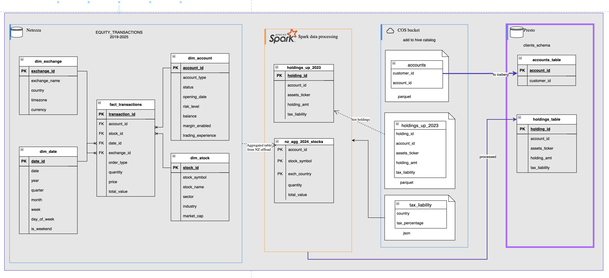

**:card_file_box: Sources of data**

- files in COS hive bucket
  - Go to your COS instance https://cloud.ibm.com/objectstorage/instances -> select bucket that starts with `hive` like `hive-1753085729998611476` -> search for `input_data_hive` directory, there you should find folders/files that were pre-uploaded for you by instructor, if not raise concerns:
    - `accounts_ht` contains the list of account ids and customer ids from the internal system dump;
    - `holdings_ht`contains information on accounts and their stock holdings (unique by account_id and asset_ticker) for the previous period up to 2023, where `asset_ticker` is stock symbol, `holding_amt` is the total amount of a particular stock and `tax_liability` is the remaining tax liability still owed;
    - `tax_liability_ht` contains country specific tax rate;
- watsonx.data schema
  - `iceberg_data.<SCHEMA_DWH_OFFLOAD>` contains data offloaded from Netezza;
  - `postgres_catalog.bankdemo.customers_table` is a federated postgres table that contains customer data.
  
## 4. Expected outcome

At the end of the lab you should have 2 tables in  `clients_schema_YourName_First3LettersOfSurname` prepared that will be later used by an agentic flow in Lab5.

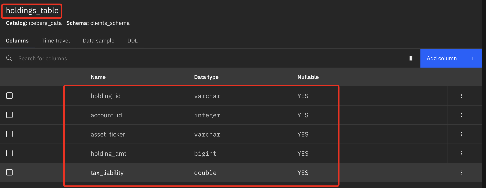

## 5. Presto Data Insertion 

### 5.1  Open watsonx.ai Project (Labs Techzone Environment)
1. Open watsonx.ai Studio Service - From [Cloud Resource list](https://cloud.ibm.com/resources) select `AI / Machine Learning` resources -> `watsonx.ai Studio` service -> open in `IBM watsonx`
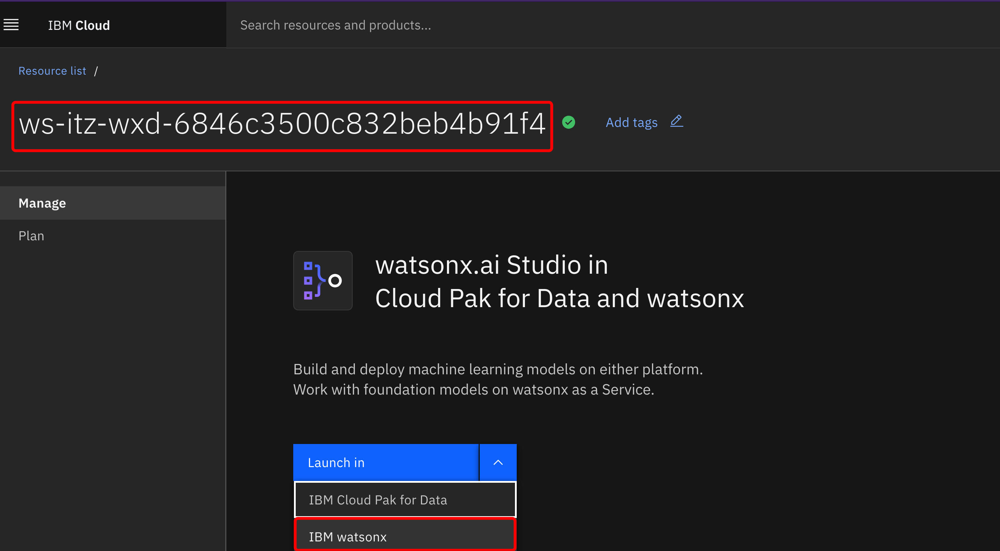 
2. Login and from the quick access page -> `Recent work` Select the project you created during [Environment Setup](/env-setup/README.md).

3. Check that you can see env.txt file in the list of all assets on `Assets` tab
, if not upload via data files
 
4. Check that Connections are available, we will be using them in the lab

### 5.2 Import Jupyter Notebook with the script from local folder

1. Go to project Assets, select `New asset +`:
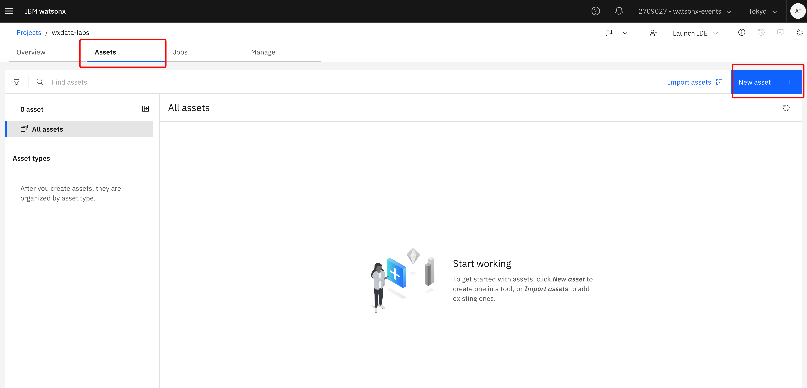

2. Select `Work with data and models in Python or R notebooks` asset type

3. Import Jupyter Notebook from local file:

4. Select `Lab2_Data_Lakehouse/wx-ai-lab2/1_presto_wxai.ipynb`
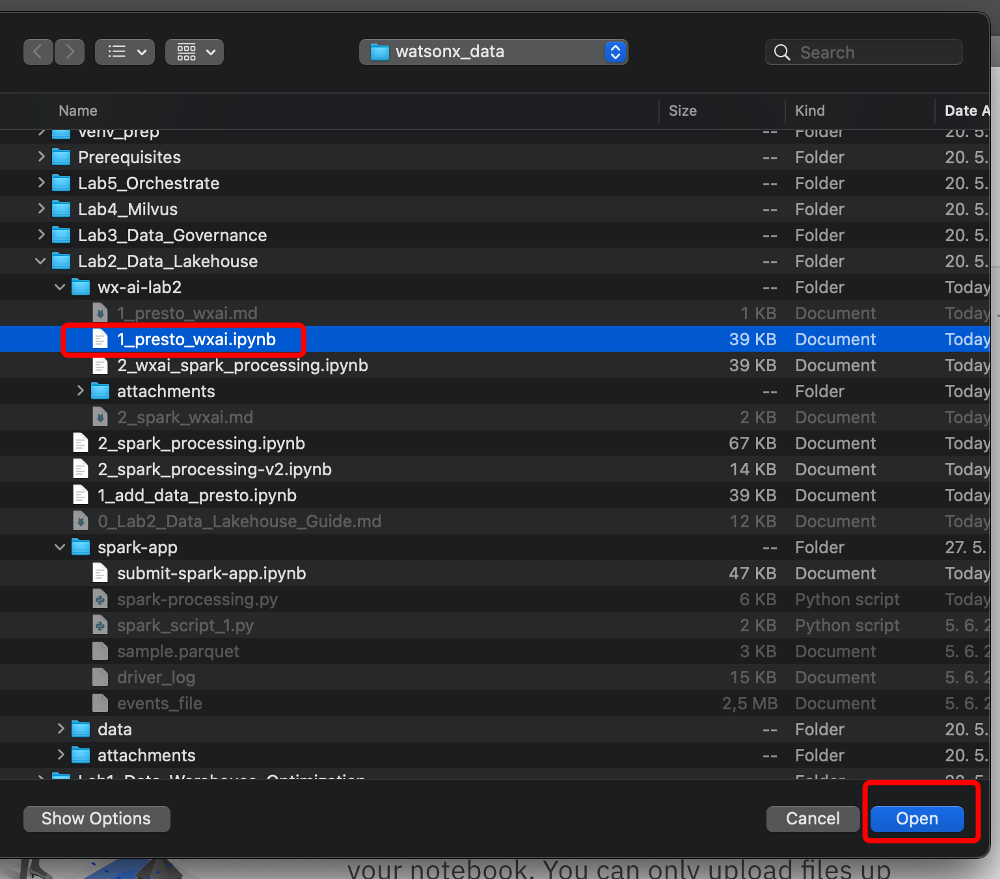

5. Append name with your initials: `-name-first3lettersSurname` and click `Create`

### 5.3 Open and run the Jupyter Notebook

1. It should open automatically right after creation, if not then from `Your Project` -> `Assets`:
    * click on the Jupyter Notebook
    * and then click on pencil to Edit, it will open Jupyter Notebook in edit mode
    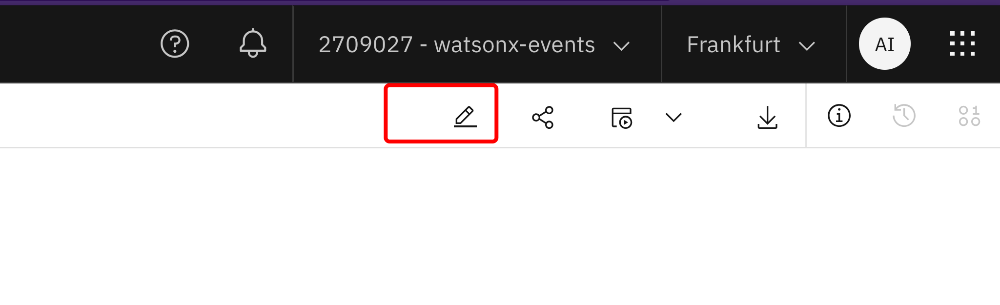 

2. Trust Jupyter Notebook in the right upper corner:
  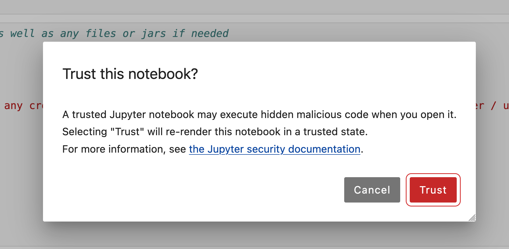
3. Add a Project Token to reach assets from the Project

     * Click on the second cell with import so it's active
     * Insert cell below by clicking on `+` sign
    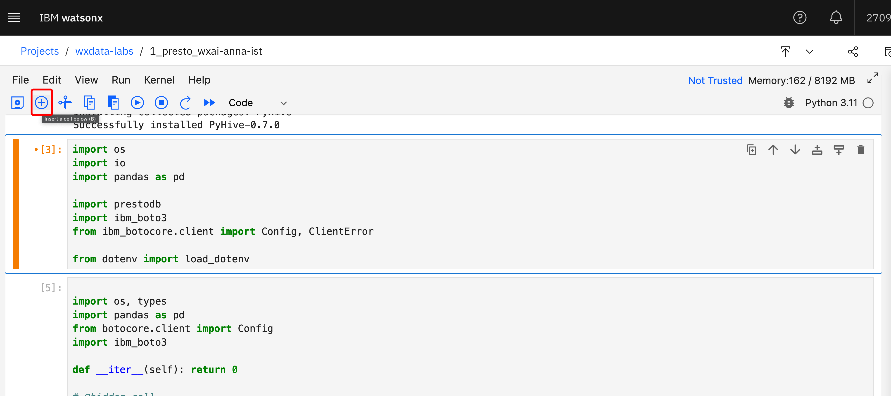
     * From the upper menu select 3 dots sign to insert a project token snippet:
    
     * So now it should look like this (sequence is important):
    
4. Run all cells consequtively starting from packages installations in the first cell and check outputs

### 5.4 Review data in watsonx.data UI after Presto part of the lab (watsonx.data back-end Techzone Environment)

1. In a different window, open watsonx.data Service 

2. From the Hamburger menu on the top left go to `Data manager`

3. Verify tables were added to `hive_catalog.input_data_hive_YourName_First3LettersOfSurname`
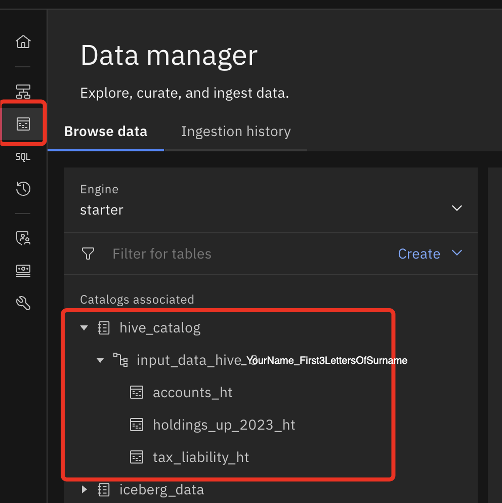 

4. Verify `accounts_table` was added to `iceberg_catalog.clients_schema_YourName_First3LettersOfSurname`

## 6. Spark pre-processing: submit spark app in watsonx.data UI 

### 6.1 Save spark script to COS bucket and generate payload json

1.  Return to the watsonx.ai Project you created during [Environment Setup](/env-setup/README.md)

2. Load Script to the Project:
     * From `Assets` Tab click `Import assets`
  
     * Select `Local file` -> `Data asset` -> `Browse`  
     * From local files under Lab2_Data_Lakehouse, select `/wx-ai-lab2/spark-processing.py` script and click `Open`
  
     * Once loaded, click `Done`
  
     * You should see the script in the list of assets available (`Data`)

  1. Import Jupyter Notebook [./wx-ai-lab2/2_prepare-spark-app-submission_wxai.ipynb](./2_prepare-spark-app-submission_wxai.ipynb) from local folder into the Project:
     * Go to project Assets, select `New asset +`:
  
      * Select `Work with data and models in Python or R notebooks` asset type
  

     * Import Jupyter Notebook from local file:

     * Select [./wx-ai-lab2/2_prepare-spark-app-submission_wxai.ipynb](./2_prepare-spark-app-submission_wxai.ipynb) from local folder

     * Append name with your initials: `-name-first3lettersSurname` and click `Create`
  

  ### 6.2 Open and run the Jupyter Notebook

  1. It should open automatically right after creation, if not then from `Your Project` -> `Assets`:
      * click on the Jupyter Notebook
      * and then click on pencil to Edit, it will open Jupyter Notebook in edit mode
       
  2. Trust Jupyter Notebook by clicking `Not Trusted` in the right upper corner and then `Trust`:
  

  3. Add a Project Token to reach assets from the Project
    * Click on the first cell with import so it's active
    * Insert cell below by clicking on `+` sign
    
    * From the upper menu select 3 dots sign to insert a project token snippet:
    
    * So now it should look like this (sequence is important):
    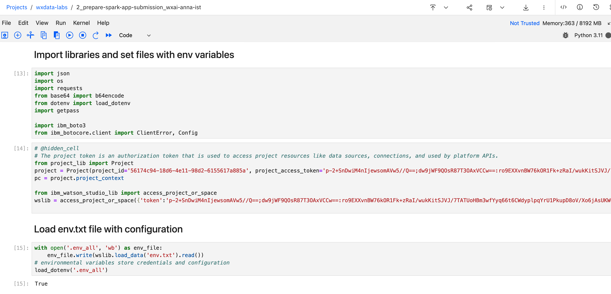

4. Run all cells consequitively starting from packages installations in the first cell and check outputs
   
  * :warning: The notebook will prompt for a Cloud API Key. When prompted, please paste the `watsonx.data back-end Cloud API key`  that was provided by the instructor and press `Enter`.  Do not use your client CLOUD_API_KEY here.   
  * A successful run will include the payload to your spark app submission in the last cell in json format.  
  * Copy the `payload` to your reference note, you will use it for your spark app submission.  

### 6.3 Submit spark app in watsonx.data UI (watsonx.data back-end Techzone Environment)
1. Return to watsonx.data Service.
2. From the Hamburger menu on the top left go to `Infrastructure manager` 
3. Click on the `Spark` engine
4. Go to `Spark history` tab and make sure that spark history server has started, if not start with the default configuration
5. Go to `Applications` Tab and click on `Create application +`
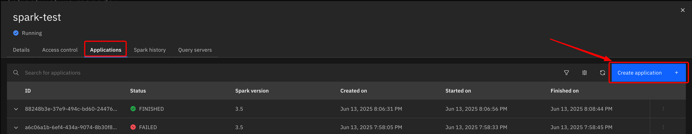
1. Go to `Payload` tab and paste the payload data (json output) from Jupyter Notebook (that you've saved to your Reference Note)

1. Go to `Inputs` Tab and in the right upper corner click in `Import from payload +`
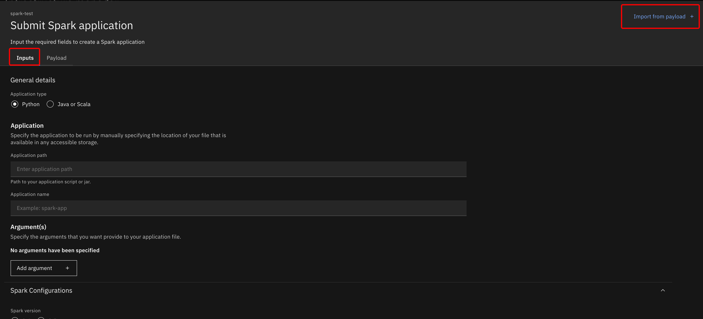
1. Fill in the remaining parameters: 
     * Application type - Python
     * Application name - `spark-processing`
     * Spark version - 3.5
  
1. Click `Submit application`

### 6.4 Check Status

1. A new app will appear in the Applications list.  
   * Take note of the `ID` of your Spark Job in the shared environment.  You will use this later to find your spark logs.
   * To update status, press on refresh sign in upper menu
 

2. Check event logs with detailed status of jobs in `Spark history`:
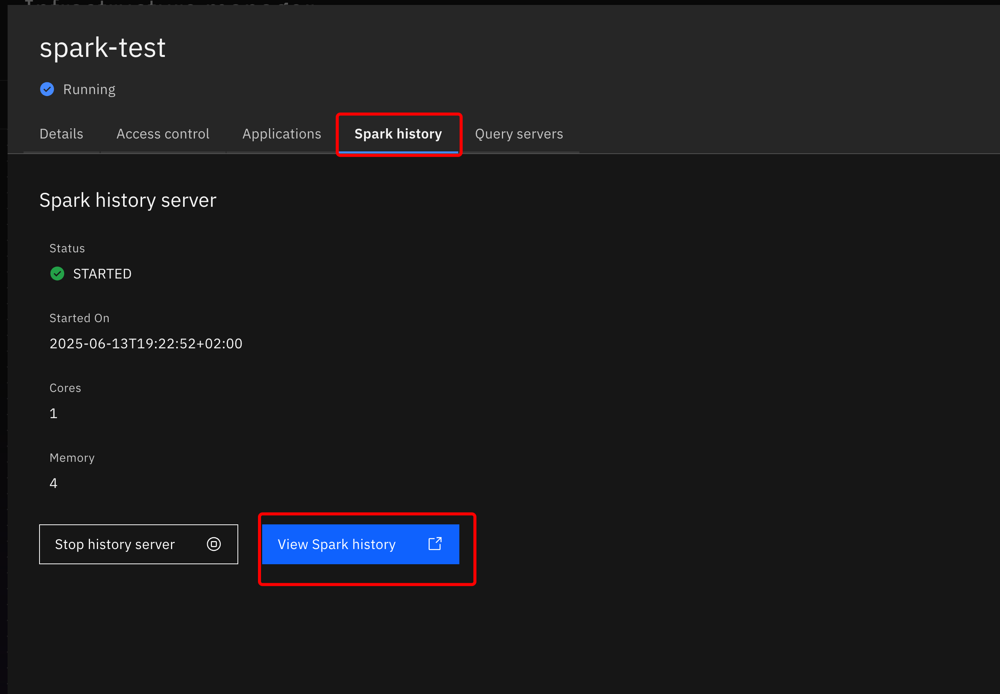
     * Click on the latest app
     * Explore Jobs, Stages, SQL/DataFrame

3. Optionally review detailed logs in Spark connected COS Bucket.  

  * Go to `Details` tab and find bucket listed under `Engine home` 

  * Reference env.txt for your actual bucket name, for example: `WXD_BUCKET="wxd2-bucket-gxcrxaku11w09z0"`
  * Open the Cloud Object Storage Service from watsonx.data back-end Techzone Environment.
  * Scroll down and open the bucket.  
  * In search bar, type `Spark` and switch to folder view.
  
  * Browse Spark folder: `spark` -> `spark engine id` -> `logs` -> find by your app id -> spark-driver log -> Download it
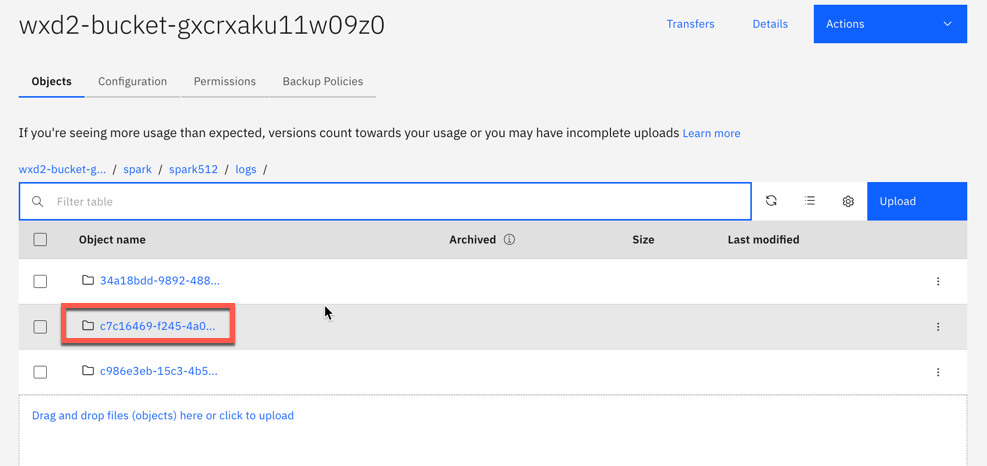

### 6.5 Review data in watsonx.data UI after spark processing

1. From the Hamburger menu on the top left go to `Data manager`

2. Verify `holdings_table` is available in `iceberg_data."clients_schema_YourName_First3LettersOfSurname"`

