## WORK IN PROGRESS

# Monitor Data Pipelines with IBM Databand

## Content

1. Introduction
2. Setup the Data Integration Flow
3. Sync DataStage with Databad
4. Getting started with Databand
5. Observing a job in Databnd
6. Testing job alerts in Databand
7. Alerting based on data interactions
8. Triggering the alert
9. Summary

The following material is meant to teach Lab Users about the additional monitoring andalerting capabilities that Databand brings to DataStage on Cloud Pak for Data as a Service (CP4DaaS). The DataStage flow we will be observing is found in the [Data Integration tutorial](https://dataplatform.cloud.ibm.com/docs/content/wsj/getting-started/df_data_integrate.html).

## Introduction

This flow combines anonymized mortgage applications data with the mortgage applicants' personally identifiable information to help lenders decide whether they should approve or deny mortgage applications. In this lab, you will be altering the flow by adding a new column to the output of the Transformer stage; the goal of this is to observe how Databand monitors schema changes and alerts users based on their preferences.

In this lab you will complete the following exercises:

- Uploading the Multicloud Data Integration flow to a CP4DaaS project
- Syncing DataStage/CP4DaaS to Databand
- Viewing the graphical representation of the observed DataStage job within Databand and the relevant information around this
- Reviewing the functionality of each individual stage
- Viewing dataset metrics and historical trends
- Editing DataStage job inputs and outputs
- Setting up alerts for DataStage jobs

Prerequisites

1. Download the DataStage file

Download this [zip file](https://ibm.seismic.com/Link/Content/DCPVPTFPjbR3B8THb9T8289XBM7j) and save it for use where you will create a new DataStage flow.

## [Set up the Data Integration Flow](https://cp4d-outcomes.feab05c7.public.multi-containers.ibm.com/integration/level-3/observability#set-up-the-data-integration-flow)

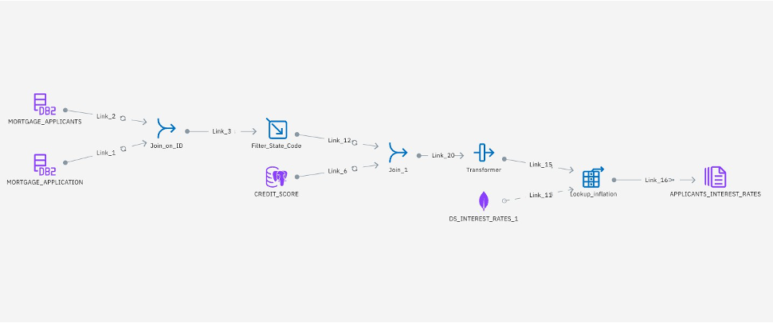

_This Next-Gen DataStage flow integrates data from a Db2 Warehouse on Cloud, Postgres Database, and MongoDB instance. This data is transformed via joining tables, filtering the records by State, calculating a level of debt, and ultimately assigning each individual mortgage applicant an appropriate mortgage rate._

To begin, perform the following steps:

1. If you have not already done so, [Log in to IBM Cloud Pak for Data](https://dataplatform.cloud.ibm.com/). You will use **your personal** Cloud Pak for Data as a Service account in the **Dallas** region to do this lab.

   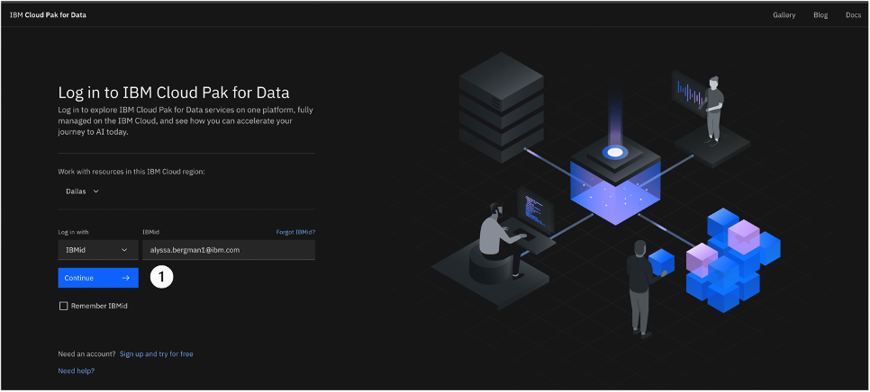

2. From the Cloud Pak for Data home screen, click **Work with data** to create a new project.

   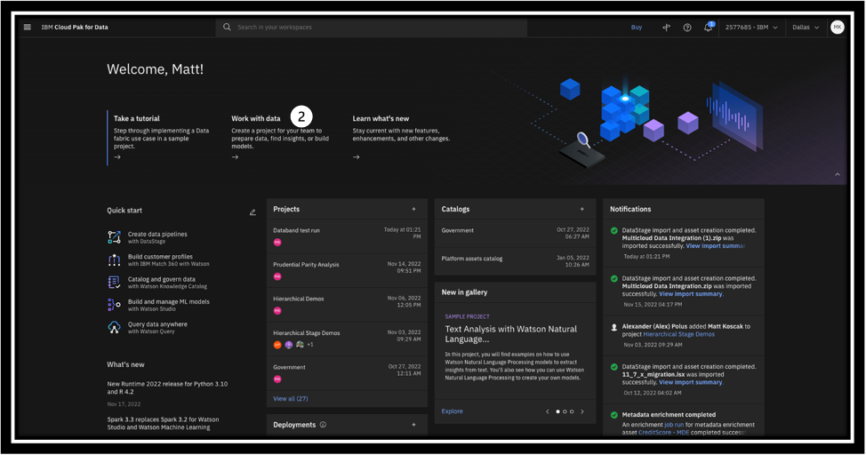

3. Click the **Create an empty project** tile.

   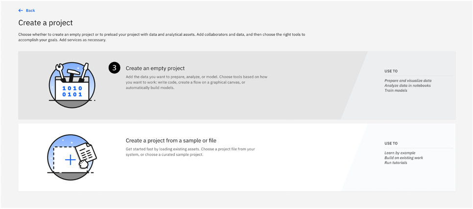

4. Name the project **Databand_YOUR_INITIALS** like the example above. Keep the settings as is (you can optionally add a description), and select a storage instance to use for the project.
   Then click **Create** .

   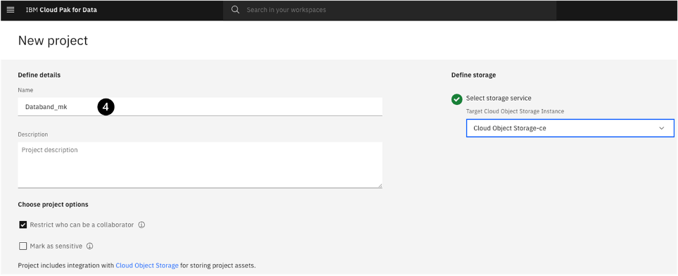

**Important** : If you did not provision a Cloud Object Storage Instance in the prerequisites, follow the instructions [here](https://cloud.ibm.com/docs/cloud-object-storage?topic=cloud-object-storage-provision) to create one.

5. Once this project is created, select the **Assets** tab in the project overview screen and click the blue **New asset** icon.

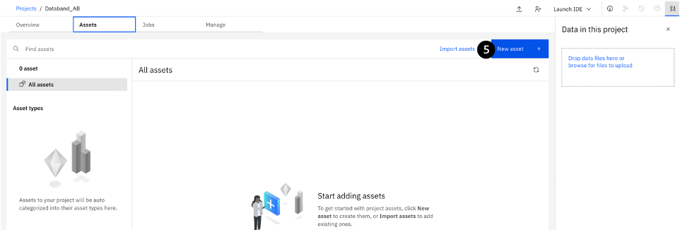

6. Scroll down to the **Graphical builders** section, and search for DataStage click on the Transform and integrate data tile

   

7. Select the **Local file** tab on the left-hand menu. Either drag and drop, or click **Browse** and upload the " **Multicloud Data Integration.zip** " file that you downloaded as a prerequisite to this lab.

   

8. Leave all the settings as-is, and press the blue **Create** button. Wait a few moments for the import process to complete.

After this import process completes, you will see three **Data Fabric Trial** connections, and a single **Multicloud Data Integration**
Parallel Job.

## [Sync DataStage with Databand](https://cp4d-outcomes.feab05c7.public.multi-containers.ibm.com/integration/level-3/observability#sync-datastage-with-databand)

1. Close the import screen by clicking the **x** in the top right corner. Open the DataStage flow titled **Multicloud Data Integration** by clicking on it.

   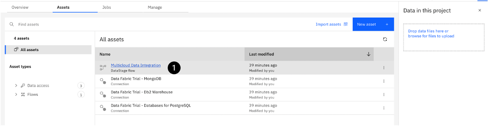

   Your DataStage flow should look like the one in **Figure A** (shown below).

   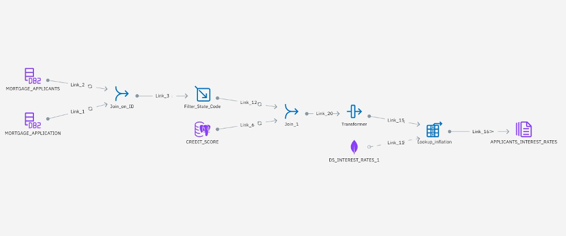

   At this point, your DataStage environment is ready to be integrated with Databand. Open a new web browser tab and go to your **IBM cloud**
   console by clicking [here](https://cloud.ibm.com/).

## [Getting started with Databand](https://cp4d-outcomes.feab05c7.public.multi-containers.ibm.com/integration/level-3/observability#getting-started-with-databand)

1. Open a new browser with the [Databand environment](https://ibm-sales-sandbox.databand.ai/app/dashboard).
   Log in using the credentials you were given after signup.

We will now create our DataStage Syncer within Databand. A syncer will
"sync" or integrate your DataStage environment with your Databand environment.

2. Select the **Integrations** tab on the left-hand menu.
3. Click the purple **Add Integration** button in the top right corner.

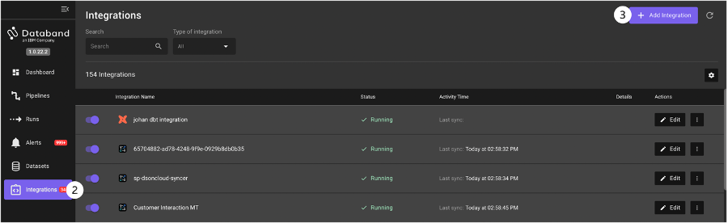

4. Select the **DataStage** tile under integration type.

5. Select **Cloud user** and click **Confirm** .

   

6. Create a unique syncer name (for example, YOUR_INITIALS_datastage syncer) and paste the API key that you saved into the **API key** field. Then click **Next** .

   

7. Select the **Databand_YOUR_INITIALS** project that you created at the beginning of this lab. Then click **Save** .

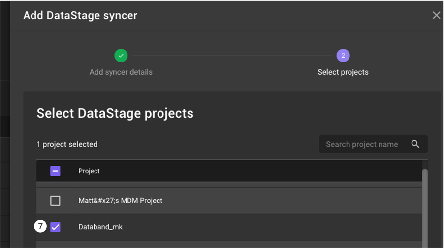

Before continuing, it's important to rename the source for the DataStage project. By default, the source name is the name of the account that owns that DataStage project. This is not very helpful since most people don't know their account ID off the top of their head.

1. Find your DataStage syncer. Select the **Integrations** tab in the left-hand menu.
2. Start typing the beginning of your unique syncer name in the **Search** bar.
3. Click **Edit** under the **Actions** column on the right side of your DataStage syncer.

   

This will open the edit pane for your DataStage integration.

4. Click **Next** to view your available projects.

5. If your Databand project is not already selected, select the **checkbox** to the left of the Databand project source you want to edit.
6. Click the **pencil** icon to the right of your Databand project to rename it.

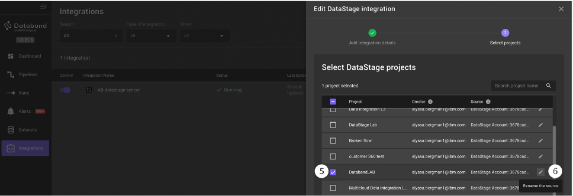

7. Change the **source** name to something unique that will help you identify the source later (for example, Alyssa B's Account).
8. Click **Save** .

We have successfully synced our Cloud Pak for Data as a Service project with the Multicloud Data Integration flow, with Databand, and changed the project source name to a unique identifier.

## [Observing a job in Databand](https://cp4d-outcomes.feab05c7.public.multi-containers.ibm.com/integration/level-3/observability#observing-a-job-in-databand)

1. Return to the browser tab with CP4DaaS. Open the Multicloud Data Integration flow (if not there), and click the **Run** button at the top.

The job may take a few minutes to run. Upon completion, you will see a green **Run successful with warnings** banner at the top. Once you see this, switch back to the Databand tab.

2. On the left-hand menu, select the **Pipelines** tab. You can identify your specific DataStage job / ETL (extract, transform, load) pipeline by looking at the **Project** column on this page, which displays the project name of your DataStage environment.
3. Click on the **Name** column of your specific project (for example, **Databand_mk** ).

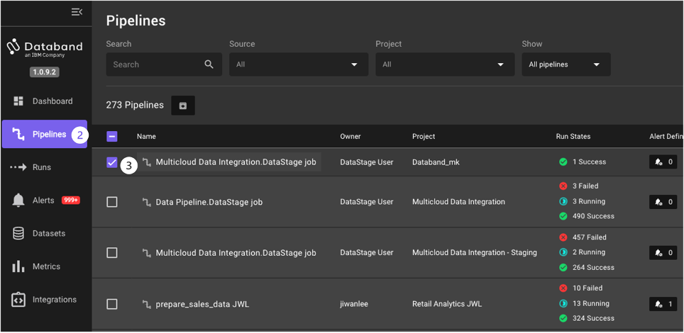

4. The new screen that pops up will be the **Run list** of each of the ETL pipeline (DataStage job) runs. This page displays the sequential list of runs for the DataStage job, the status of those runs, start and end time, alerts, errors, the number of successful/failed tasks, and the duration of those tasks.

You only ran this DataStage job once, so only one run will show. However, as you continue to run jobs throughout this lab, you will see this page fill up with each sequential run.

5. On this same screen, click on the **Run name** for this specific job run.

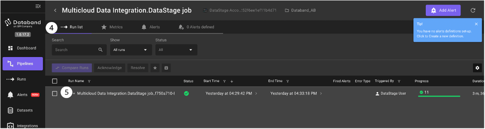

6. Resize the window pane showing the pipeline so you can see the entire flow by dragging the arrow pointing left to the left-hand side of the screen.

The screen will look like the screenshot below. You may have to drag and zoom the screen to center the job.

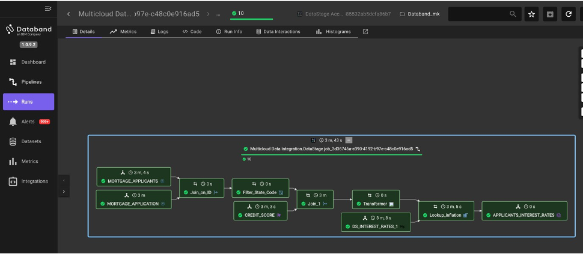

Databand shows a graphical representation of the DataStage job. Note that each stage is green, which means it ran successfully. Each individual stage contains the name of that stage, and a timestamp of how long it took each stage to run. Additionally, the top of this view shows the total time it took this job to run.

7. Next, click on the **MORTGAGE_APPLICANTS** stage.
8. Select the **Logs** tab on the top menu. Resize the view like you did earlier to see more of the log for the selected stage.

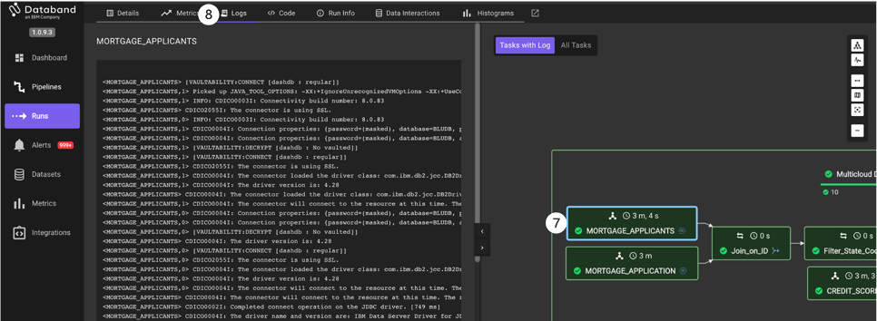

This view will show us the logs associated with that specific stage. Feel free to click on other stages to view those logs as well.

At this point, you have looked through some of the "step-through" functionality that Databand brings to observing our DataStage jobs.

Switch back to the browser tab hosting your DataStage environment and run the job 4 more times to generate more metrics and set some baselines for our Databand environment. This will make sense as we continue our lab and will simulate what a customer environment would look like where a job would run many times.

## [Testing job alerts in Databand](https://cp4d-outcomes.feab05c7.public.multi-containers.ibm.com/integration/level-3/observability#testing-job-alerts-in-databand)

1. After running the Multicloud Data Integration job four more times (you've now run this job a total of five times), go back to your Databand environment. Select the **Pipelines** tab on the left-hand menu, find your pipeline, drill into it, and take note of the **Run list** tab on the top menu.

2. Select the **Metrics** tab on the top menu. The default metric shown is the **Duration** of each run.

3. Now it's time to create your first alert. Click the purple **Add Alert** button in the top right corner of your screen.

The first step in creating a Databand alert is to create the "Alert definition". This is the logic behind your alert. Look at all the alert possibilities you can create within Databand. You can create an alert based on run metrics for your DataStage job such as successful or failure, run duration, specific task durations, missing data operations, and schema changes.

4. Since these jobs take around 2 or 3 minutes to run, you will create an alert if your job takes greater than 4 minutes. To create this alert, click the **Set up** button in the **Pipeline duration** tile.

5. Click on the **Operator** dropdown and select the **greater than** option. Note the other operators listed here, including **Percentage deviation** and **Anomaly** .
6. Enter 00:04:00 in the **Duration** box, which accepts hh:mm:ss as input, to designate the time of 4 minutes.

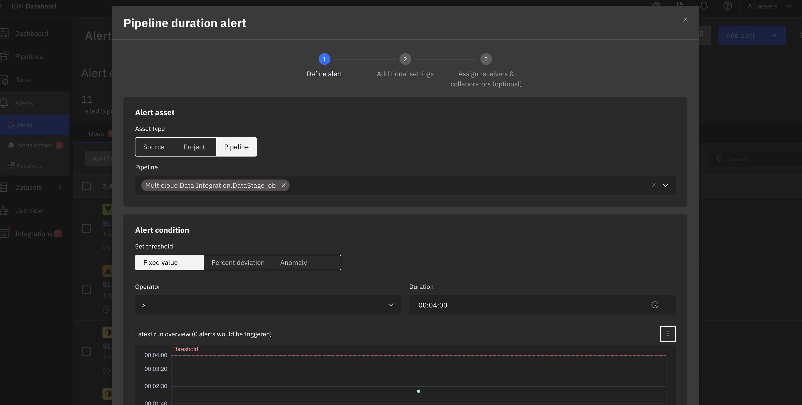

7. Scroll down to the **Additional settings** section and click on the **Low** box listed under the **Alert severity** section. This will alert the assigned individual group on how important this specific alert is. Since this alert will fire if a job is running slightly slower than normal, mark it as low severity.
8. Give this alert a name titled **Slow running job\__yourinitials_** (for example, Slow running job AB).
9. Make sure the logic of your alert definition matches the screenshots above, then click **Save** **alert** .

10. The next screen allows you to assign this alert to a receiver, which is a user or group of users that will be notified of this alert through Slack, email, or PagerDuty (this part is covered in the next portion of the lab.) For now, keep the alert within Databand. Click the **Done** button.

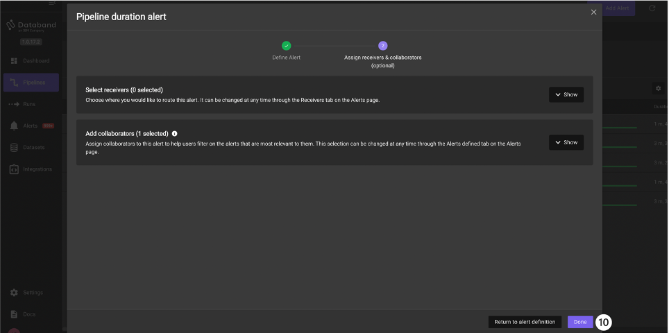

Take note of how helpful such alerting can be for monitoring the success, failure, and overall performance of our DataStage jobs.

## [Alerting based on data interactions](https://cp4d-outcomes.feab05c7.public.multi-containers.ibm.com/integration/level-3/observability#alerting-based-on-data-interactions)

For the final portion of this lab, you will view the data interactions of your job and create an alert based on those interactions. _This is one of the key value-adds of integrating Databand with your DataStage environment_ , as you can now alert users in near-real-time on many custom failures, job changes, delays, and much more.

1. If you are not already at the Run list page, return to the **Run list** tab by selecting Run list in the top menu bar.
2. Click into the top (first) **Run Name** .

3. Select the **Data Interactions** tab in the top menu. Use the resizer to focus on the left-hand side of the screen.

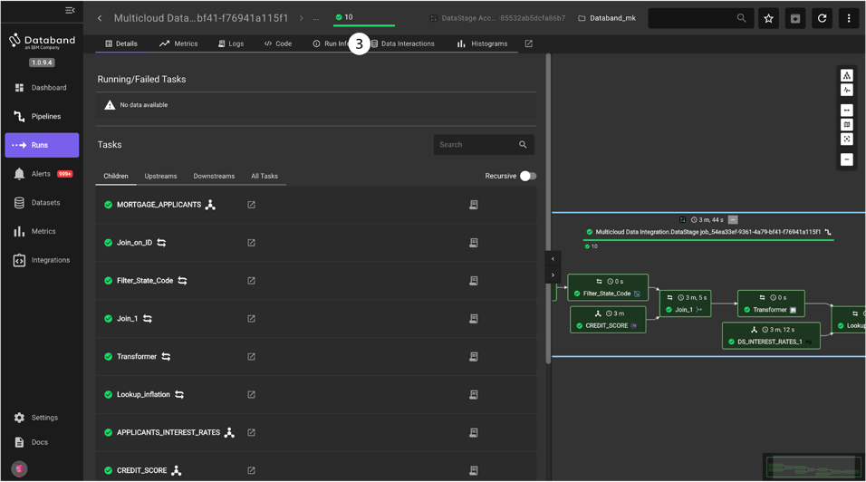

You can see the inputs and outputs (reads/writes) of the records and columns in each respective stage. You can see the source type, associated datasets, any issues that may have come up, information on the schema and records, and the associated stage. The total of these records is represented in the chart at the top of the screen. The chart at the top titled **Runs record history (all tasks)** as well as the column titled **History Trend** gives the user a view of the job's historical performance.

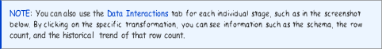

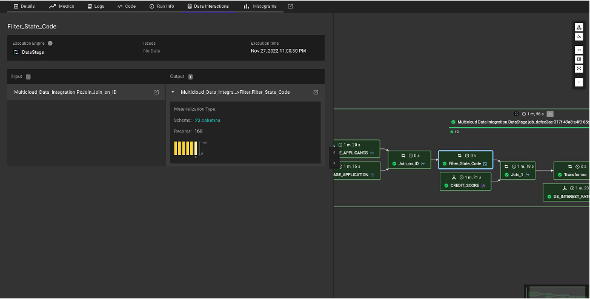

4. You will now create an alert around a schema change. Select the **Alerts** tab on the left-hand menu. This is where all Databand alerts are shown. Take a moment to look around this page to understand what information is shown to the user.
5. Click the purple **Add Alert** button in the top right corner. Here you can see (again) that you can create an alert on one pipeline (DataStage job), multiple pipelines, data quality and more.

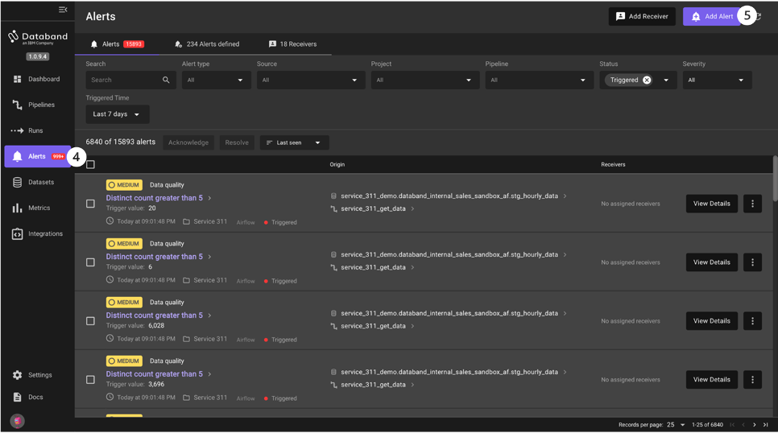

6. You are going to create an alert to monitor for a schema change and set the receiver to be Slack. Click **Set up** in the **Schema change** tile.

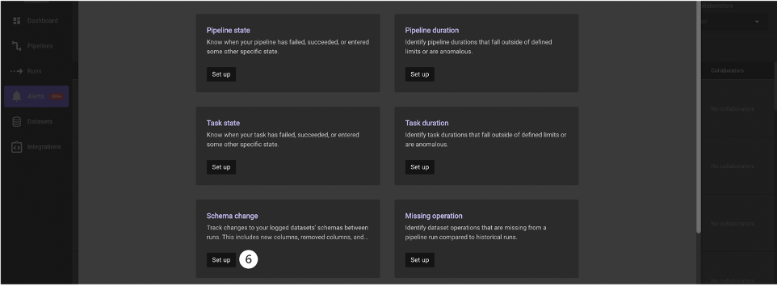

7. First, you have to specify your pipeline and create your alert definition. Click on the **Source** dropdown, type in the unique name you created earlier, and select the source that matches the one for your pipeline.
8. Your Multicloud Data Integration pipeline will appear; you can confirm it's yours with the project name underneath it. Select it by clicking the checkbox on the left.

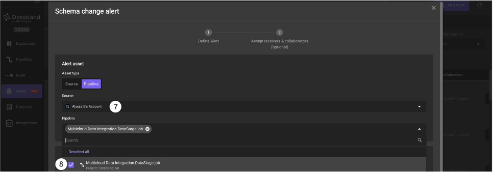

9. After selecting your specific job, select **High** as the severity in the **Alert severity** section.
10. Click **Save alert** .

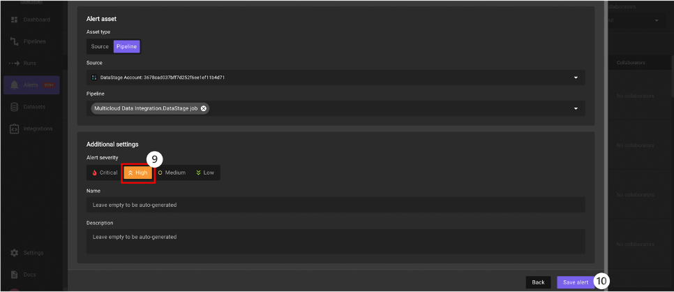

For this alert, you will set the receiver of the alert to be Email.

1. On left side Click on **Alerts** Select **Receivers**
2. Click on **Add receiver**

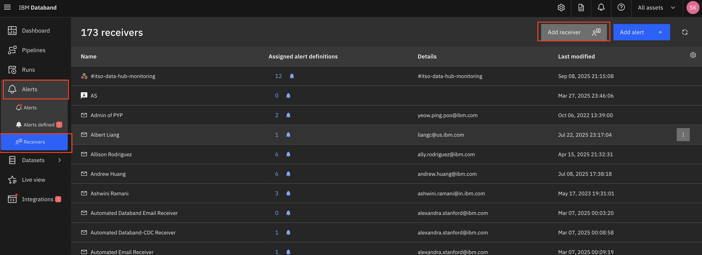

3. You will see **Receiver options** , Select **Email**
4. Provide **Receiver name** and **Email Address** where you want to receive notifications.
5. Click. on **Test Connection**, Connection should be successful.
6. Click on **Next**

7. Coose the alret you want to receive - Search with the name of the Alert and Select the Alert.
8. Save and Exit

### [Triggering the alert](https://cp4d-outcomes.feab05c7.public.multi-containers.ibm.com/integration/level-3/observability#triggering-the-alert)

Switch back to your Cloud Pak for Data DataStage environment where you will purposefully introduce a schema change. This schema change will trigger your schema alert we just made in Databand.

1. Double click on the **Transformer** stage to open its settings.

2. Select the **Output** tab.
3. Click the **Add column** button on the right.
4. Name your new column **RELIABILITY_SCORE** . It will add the new column to the end of the **Column name** field.
5. Next, click the **pencil** icon in the **Derivation** column, then click the **Calculator** icon to edit the expression. In this field, use the sum of the **YRS_AT_CURRENT_ADDRESS** column and the **YRS_WITH_CURRENT_EMPLOYER** column.

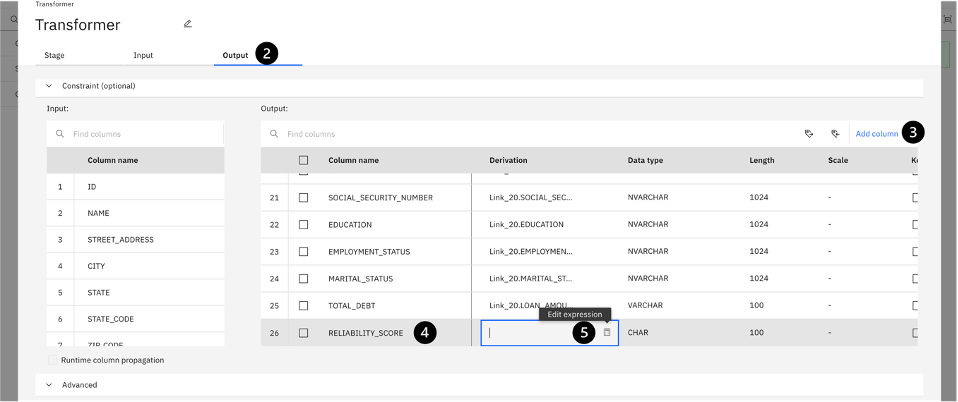

6. To create this expression, locate the two columns under the **Input columns** twistee. Double click **YRS_AT_CURRENT_ADDRESS** , insert a plus symbol (+) and then double click **YRS_WITH_CURRENT_EMPLOYER** . Notice how the expression is populated to the **Expression Builder** window on the right. Your expression should look like the screenshot above.
7. Click **Apply and return** and then **Save and return** to save the changes you just made.

Run the job (click the run icon at the top) and wait for a few minutes until the job completes and the alert is triggered. When the alert is triggered, you will see an email in your provided email address.

8. Your email message of triggered Alert.
9. You may click on the Alert details from the Runs to see the Analysis.

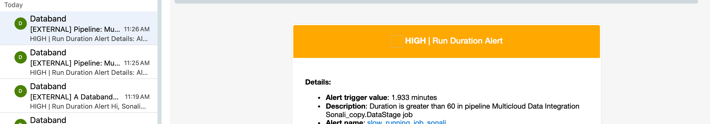

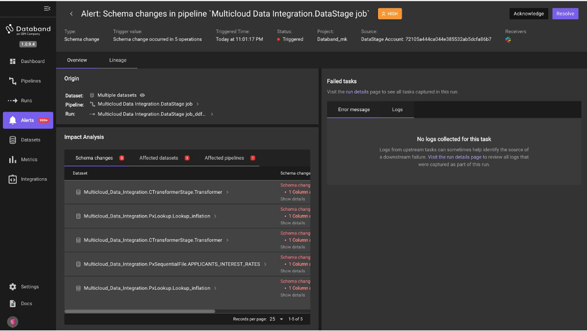

You can see the impact analysis of this alert. Specifically, you can see what schema changes happened in the Datastage job, what datasets were affected, and the pipelines (DataStage Jobs) that were affected. You can also see all this information graphically in the **Lineage** tab.

This alert was generated in near-real time as the pipeline was run. This is another important benefit of using Databand for observability. Being able to identify issues as the pipeline runs helps improve data quality quicker, instead of retroactive inspections and potentially missing issues for days, weeks, and even months.

## [Summary](https://cp4d-outcomes.feab05c7.public.multi-containers.ibm.com/integration/level-3/observability#summary)

Congratulations on completing this lab! You gained hands-on experience in the following integration areas:

- Syncing DataStage/CP4DaaS to Databand
- Observing the graphical representation of the DataStage job within Databand and the relevant information around this
- Viewing dataset metrics and historical trends
- Editing DataStage job inputs and outputs
- Creating and setting up alerts for DataStage jobs in Databand

This concludes the DataStage and Databand Hands on Lab.
