#  Environment Setup

- [Environment Setup](#environment-setup)
  - [1. Getting Started](#1-getting-started)
    - [1.1 Download the Classroom Repo](#11-download-the-classroom-repo)
    - [1.2 Access the enablement environment](#12-access-the-enablement-environment)
    - [1.3 Login to your individual Cloud environment](#13-login-to-your-individual-cloud-environment)
    - [1.4 Verify you are in the right instance.](#14-verify-you-are-in-the-right-instance)
    - [1.5 Open a Text Editor of your choice](#15-open-a-text-editor-of-your-choice)
    - [1.6 Accessing DataBand](#16-accessing-databand)
    - [1.7 Accessing Datastage](#17-accessing-datastage)
  - [2. Configuring the Environment](#2-configuring-the-environment)
    - [2.1 Create an API key](#21-create-an-api-key)
    - [2.2 Create a project token](#22-create-a-project-token)
    - [2.3 Create a User API Key](#23-create-a-user-api-key)
    - [2.4 Get Deployement Space ID](#24-get-deployement-space-id)
    - [2.5 Prepare env.txt](#25-prepare-envtxt)
    - [2.6 Upload env.txt to the watsonx.ai Studio project](#26-upload-envtxt-to-the-watsonxai-studio-project)
  - [3. Review connections in the watsonx.ai Studio project](#3-review-connections-in-the-watsonxai-studio-project)


## 1. Getting Started

### 1.1 Download the Classroom Repo 

- Clone the repository. `git clone repo_url`


### 1.2 Access the enablement environment

For completing this enablement you will need access the following services.
* watsonx.data (Shared back-end Environment)
* Cloud Object Storage (COS) 
* watsonx.data Intelligence
* watsonx.ai Studio & Runtime
* watsonx Orchestrate
* IBM DataBand
* IBM DataStage

To access the environments, look for email messages from IBM Cloud <noreply@cloud.ibm.com> inviting you to join the accounts where your environments are located.  

In each email, Click on the `HERE` link to accept the invitation
(Highlighted in the screenshot below.)

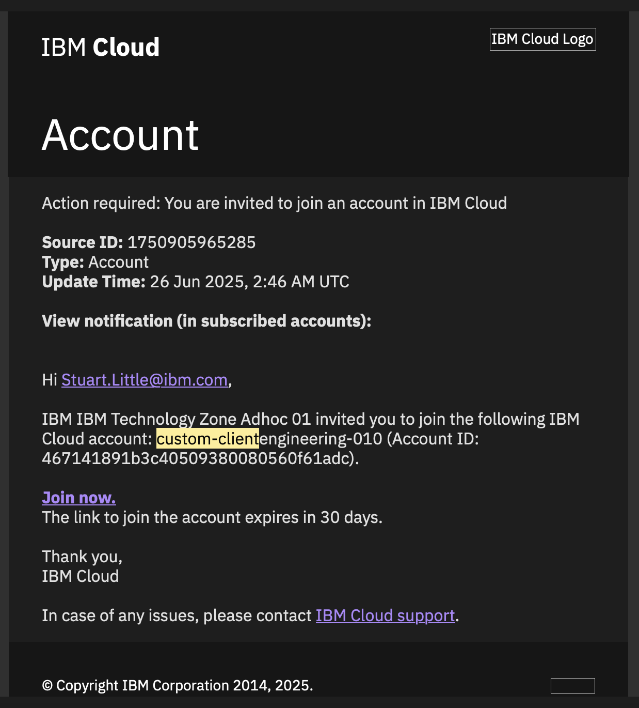

Option: If you miss the email or don't receive it for any reason, you
can find the invitation on your IBM Cloud account:
<https://cloud.ibm.com/notifications?type=account>

Please select the **Join Now** link.

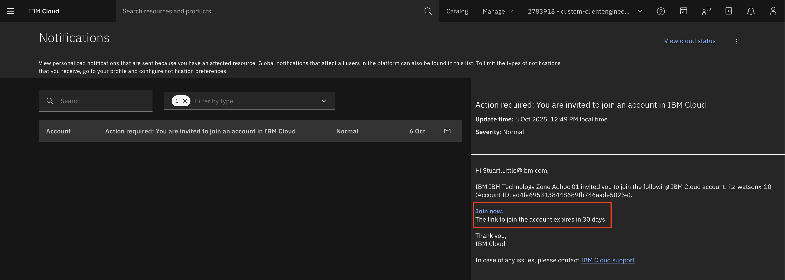

*You might have earlier worked with the same cloud account / have access to it and you are able to see it in the list of your accounts in IBM Cloud. In that case, select it and check the list of available services for the current reservtion (based on the Group ID and Environment id in IBM Cloud).*

### 1.3 Login to your individual Cloud environment 

* Go to: <https://cloud.ibm.com/resources>

* Login with your IBM credentials

### 1.4 Verify you are in the right instance. 

Check at the top right that you are in the right instance –
**custom-clientengineering-010** 

If it does not show the right name of the instance, you can select it from the drop-down.

<font color="red">**CAUTION:**</font>  The instance at the top right tends to change to your default personal account every time you switch/go back to a new page. Thus, it's always good to check the top right corner **every time** you switch to a new page.

### 1.5 Open a Text Editor of your choice 

Open a text-based notepad to use as a ready reference for the lab.  The labs will have call outs to copy information that will be needed for future configuration steps.

Examples: Notepad on Windows, TextEdit on Mac or use `.txt` file in VSCode.  

### 1.6 Accessing DataBand

To access DataBand:

* Check your email for an invitation or access link.
* Set your password when prompted. Be sure to note it down or remember it, as you’ll need it for future logins.


### 1.7 Accessing DataStage

To access DataStage:

* Ensure you are in the correct account on IBM Cloud by checkng the top-right dropdown and selecting `2783918 - custom-clientengineering-010`
* Go to IBM Cloud → Resource list.
* Under AI/Analytics, locate your DataStage instance.
* Click on it and launch in IBM Cloud Pak for Data.


 

## 2. Configuring the Environment

### 2.1 Create an API key

From the IBM Cloud interface use the top menu
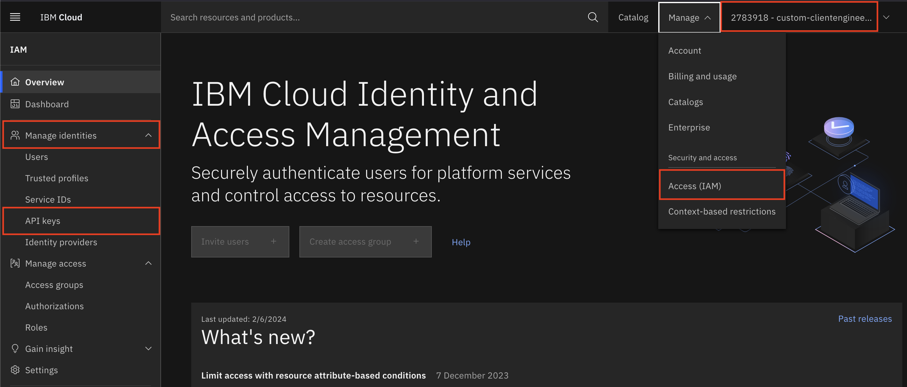
* Manage -> Access IAM 
* From the Left Navigation click Manage Identities -> API Keys
* Click on the Create button
* Name you key **lab-api-key** and click Create with the defaults
* Copy the key to your text Reference (you will use in a future step)
* Download the file to your laptop / desktop.

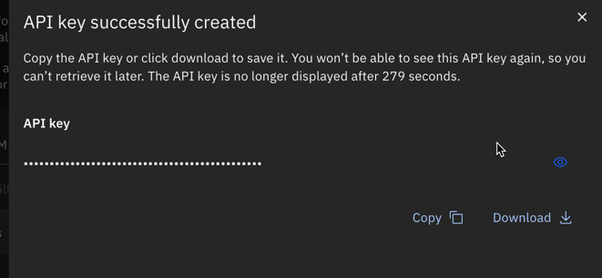


1. Log in to watsonx <a name="log-in-to-watsonx"></a>
---
Go to `IBM Cloud` -> `Resource list` -> In `AI/ Machine Learning` resources find `watsonx.ai Studio` instance and click on it -> Launch in IBM watsonx


2. Check that you are in the right account and location <a name="check-instance"></a>
---
You should now be taken to the watsonx home screen. Check at the top right that you are in the right account and location (specified for your Labs account). If it does not show the right name of the account, you can select it in the dropdown. 

If you do not know your account, go to the IBM Cloud and select the reservation from the list. https://cloud.ibm.com/. Look for your recently created reservation and click on "Open this environment". Scroll down and look for a reservation name that looks similar to this:  `2783918 - custom-clientengineering-010`. 

**Note:** The account at the top right tends to change to your default personal account every time you switch/go back to a new page. Thus, it's always good to check the top right corner every time you switch to a new page.

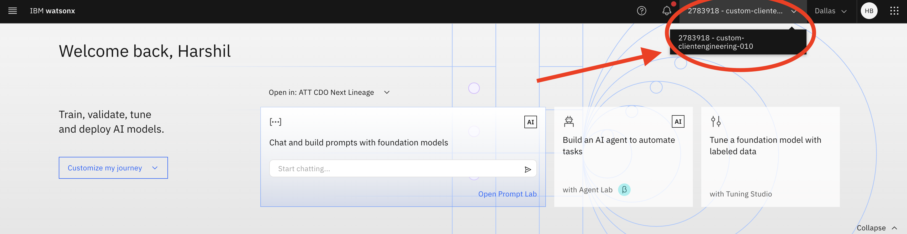


### 2.2 Create a project token 

The Project token will be used by the notebook for accessing the assets in the project programatically. 

1. Go to the `Manage` tab
2. Under `Access Control` click on the `Access tokens` tab 
3. If you do not have a token, create one by selecting `New access token`
  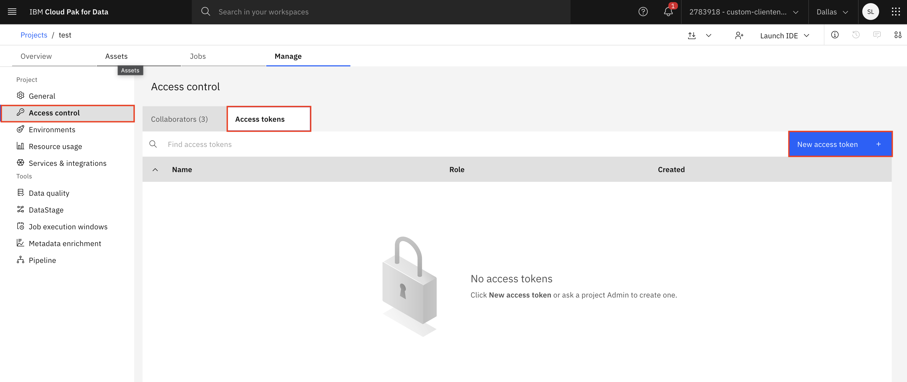
4. Give it a name, select `Editor` for `Access Role` and select `Create`  
   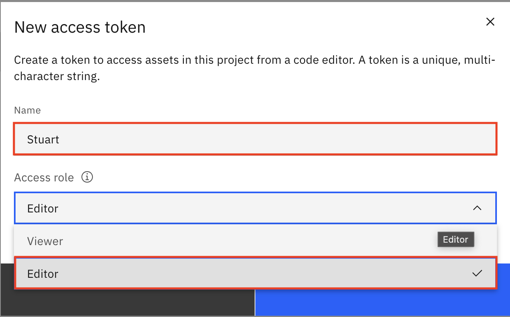

### 2.3 Create a User API Key 

The User API Key is a prerequisite for successful remote deployment and accessing deployments from other services (e.g. watsonx Orchestrate). This key is different from the Cloud API key you previously created.  If you have one already, you are all set.  If you do not, follow the steps below to create it.

1. Go to `Profile and settings` for a given user (upper right corner with user initials) -> `User API Key` Tab:
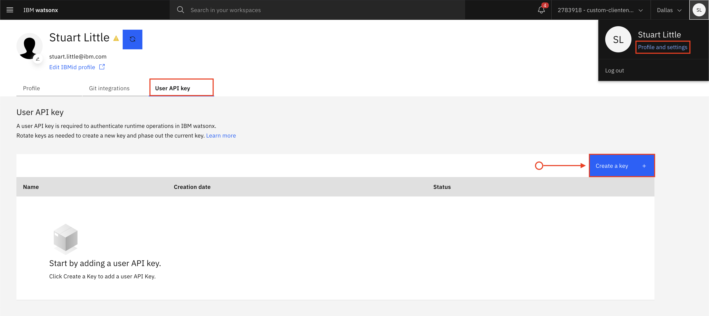

1. Click `Create a key +` if you do not have one.

### 2.4 Get Deployement Space ID
---
1.  In the watsonx.ai Studio Hamburger menu, go to `Deployments`
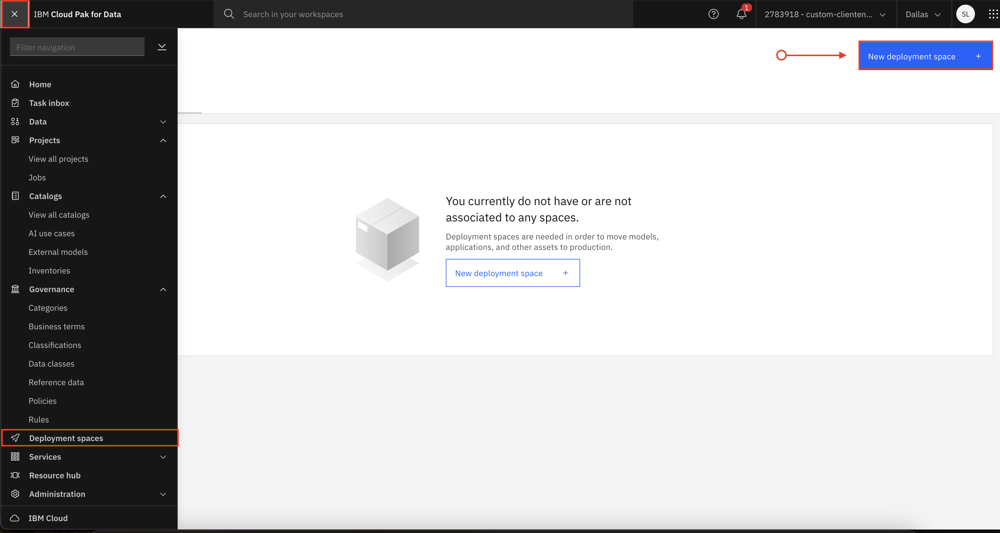

2. Click on the assigned Deployment Space. From `Manage` tab copy `Space GUID` to the reference note as Deployment space id
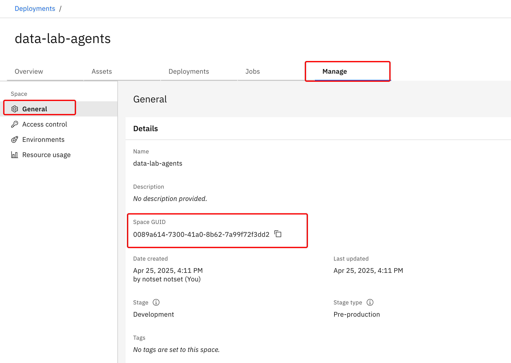

### 2.5 Prepare env.txt

1. Copy the template [env.example](../env.example) in the root folder with the name env.txt and open it in any text editor of your choice.

    ```
    cp "./env.example" "./.env.txt"
    ```

1. Update env.txt as follows
    ```
    # Spark Engine ID 
    SPARK_ENGINE_ID="spark825"

    # cloud user id / Update with your IBMID, usually your email  
    CLOUD_USER_ID = ""

    # COS buckets 
    HIVE_BUCKET="hive-tor-bucket"
    WXD_BUCKET="milvus-tor-bucket"
    MILVUS_BUCKET="milvus-tor-bucket"
    INPUT_BUCKET="input-data-tor-bucket"

    # watsonx data catalogs -> Should not need to change unless provided by instructor
    HIVE_CATALOG="hive_catalog"
    ICEBERG_CATALOG="iceberg_data"


    # watsonx.data schemas -> Update schemas names to add your name and first 3 letter from surname
    SCHEMA_DWH_OFFLOAD = "netezza_offload_YourName_First3LettersOfSurname"
    SCHEMA_DATA_H = "input_data_hive_YourName_First3LettersOfSurname"
    SCHEMA_DATA_I = "clients_schema_YourName_First3LettersOfSurname"


    # watsonx.ai ->  Copy from your Reference Note
    WATSONX_URL = "https://us-south.ml.cloud.ibm.com"
    WATSONX_PROJECT_ID = ""
    WATSONX_DEPLOYMENT_SPACE_ID = ""

    # parameters for milvus ingestion -> Should not need to change 
    SIMILARITY_METRIC="L2"
    SENTENCE_TRANSFORMER = "sentence-transformers/all-MiniLM-L6-v2"
    TEXT_SPLITTER_CHUNK_SIZE=1000
    TEXT_SPLITTER_CHUNK_OVERLAP=200
    TEXT_SPLITTER_SEPARATORS='[" \n", "\n"]'
    TEXT_REPLACEMENTS='{"✔": "ok"}'
    TEXT_SPLITTER_TYPE="RecursiveCharacterTextSplitter"
  
### 2.6 Upload env.txt to the watsonx.ai Studio project
:warning: Make sure you have all values filled in `env.txt` before uploading it to your project.
> This file contains all the necessary configuration that will be uploaded into your kernel as environmental variables.  

* Go to your Project in watsonx.ai by selecting the Hamburger menu -> Projects -> YourProject
* Go to the `Assets` tab
* Click on numbers in the right upper corner to upload data files
  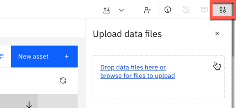

* Drag and drop your `env.txt` file to the dedicated area
* Check that you can see this file in the list of all assets on `Assets` tab
  


## 3. Review connections in the watsonx.ai Studio project
  Verify you have 2 connections using the recommended naming conventions (so we can use it in code)
   * ATT_Enablement_cos_connection
   * ATT_Enablement_watsonx_data_presto

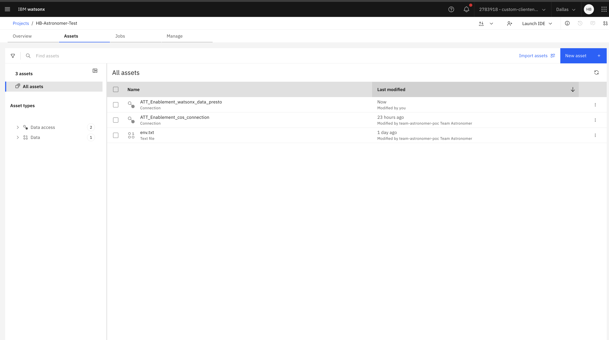

**Congratulations!  You are ready for the labs.**

Return back to [Labs/README.md](../Labs/README.md)